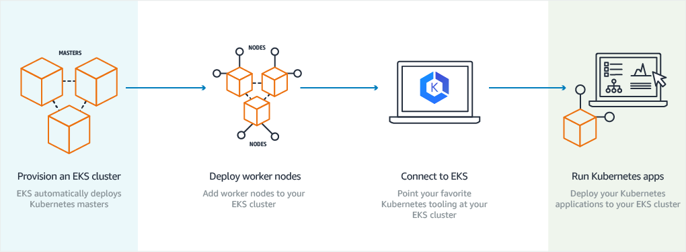

# Section 02: EKS - Create Cluster using `eksctl`

## 04. Introduction

There are 3 CLIs we can use to manage our AWS EKS clusters, we need three CLIs:

1. AWS CLI: to control multiple AWS services via the command line and automate them through scripts
2. `kubectl`: to control k8s clusters and objects using this tool
3. `eksctl`: is used for creating and deleting clusters on AWS EKS. We can create, autoscale and delete node groups. We can even create fargate profiles using eksctl. In short, it is a very powerful too for managing EKS cluster on AWS.

## 05. Install AWS CLI

We will follow [this guide](https://docs.aws.amazon.com/cli/latest/userguide/getting-started-install.html). For MacOS:

1. Download the package file:

```shell
curl "https://awscli.amazonaws.com/AWSCLIV2.pkg" -o "AWSCLIV2.pkg"
```

2. Run the standard macOS installer program, specifying the downloaded `.pkg` file as the source. Use the `-pkg` parameter to specify the name of the package to install, and the `-target /` parameter for which drive to install the package to. The files are installed to `/usr/local/aws-cli`, and a symlink is automatically created in `/usr/local/bin`. You must include `sudo` on the command to grant write permissions to those folders.

```shell
sudo installer -pkg ./AWSCLIV2.pkg -target /
```

3. Verify that the CLI was installed successfully:

```shell
$ which aws
/usr/local/bin/aws

$ aws --version
aws-cli/2.27.41 Python/3.11.6 Darwin/23.3.0
```

### Configure AWS-CLI using Security Credentials

Open AWS Management Console:

1. Click on your account (top-right)
2. Click on `security credentials`
3. Click on `create access key`
4. Use case: `Command Line Interface`. Check the confirmation
5. Description tag value: `my-cli-token`
6. Copy _access key_ and _secret access key_.

Now configure the `aws` cli:

```shell
$ aws configure
> Access Key: my-access-key
> Secret Access Key: my-secret-access-key
> Default region name: us-east-1
> Default output format: json
```

Verify if we have successfully configured it:

```shell
aws sts get-caller-identity
```

We'll get a response like:

```shell
{
    "UserId": "AIDAXXXXXXXXXXXXXXXXXXXX",
    "Account": "123456789012",
    "Arn": "arn:aws:iam::123456789012:user/username"
}
```

## 06. Install `kubectl` CLI

You can insall using the underlying package manager of your OS e.g.:  
For ubuntu:

```shell
sudo apt install kubectl
```

For MacOS:

```shell
brew install kubectl
```

The catch is that, to use k8s version `1.32`, you need `kubectl` version `1.32`. Same applies for k8s version `1.26`, `1.24` and so on. To install a specific `kubectl` version compatible with your k8s cluster, [explore these docs](https://docs.aws.amazon.com/eks/latest/userguide/install-kubectl.html).

Once done, you can verify your `kubectl` version via:

```shell
kubectl version --client
```

## 07. Install `eksctl` CLI

For MacOS, you need to have `brew` already installed. [You can then](https://github.com/eksctl-io/eksctl#third-party-installers-not-recommended):

```shell
brew tap weaveworks/tap
brew install weaveworks/tap/eksctl
```

You can verify your installation via:

```shell
eksctl version
```

## 08. EKS Cluster Introduction

There are four core objects in an EKS Cluster:

1. EKS Control Plane: Contains k8s master components like `etcd`, `kube-apiserver`, `kube-controller`. It is a managed service by AWS.
2. Worker Nodes & Node Groups: Group of EC2 instances where we run our application workloads.
3. Fargate Profiles (Serverless): Instead of EC2 instances, we run our application workloads on Serverless Fargate profiles.
4. VPC (Virtual Private Cloud): With AWS VPC, we follow secure networking standards which will allow us to run production workloads on EKS. We could run our cluster on a public subnet, but ideally, for a secure cluster, it should be behind a private subnet.

### 08.1 How does EKS Work?



1. We first provision our EKS cluster using `eksctl`
2. Deploy worker nodes and add them to our cluster using `eksctl`
3. Now connect to EKS using `kubectl`
4. We can now run k8s apps on our EKS Cluster

### 08.2 EKS Cluster - Core Objects Detailed

**EKS Control Plane:**

- EKS runs a single tenant k8s control plane for each cluster, and control plane infrastructre is **not shared** across clusters or AWS accounts.
- This control plane consists of at least two API server nodes and three etcd nodes that run across **three Availability Zones within a Region**
- EKS **automatically detects and replaces unhealthy** control plane instances, restarting them across Availability Zones withing the Region as needed.

**Worker Nodes & Node Groups:**

- Worker machines in k8s are called nodes. These are EC2 instances.
- EKS worker nodes run in our AWS account and connect to our cluster's control plane via the **cluster API server endpoint.**
- A node group is **one or more EC2 instances** that are deployed in an EC2 autoscaling group.
- All instances in a node group must:
  - Be the **same instance type**
  - Be **running the same AMI**
  - Use the **same EKS worker node IAM role**
- By using the `eksctl`, most of these requirements are taken care of.

**Fargate Profiles:**

- AWS Fargate is a technology that provides **on-demand, right-sized compute capacity** for containers.
- With Fargate, we **no longer** have to provision, configure, or scale groups of virtual machines to run containers.
- Each pod running on Fargate has its **own isolation boundary** and does not share the underlying kernel, CPU resources, memory resources, or Elastic Network Interface with another pod.
- AWS specially built **Fargate Controllers** that recognizes the pods belonging to fargate and schedules them on Fargate profiles.
- We will see more in our Fargate learning section.

**VPC:**

- EKS uses AWS VPC network policies to **restrict traffic** between control plane components within a single cluster.
- Control plane components for a EKS cluster **cannot view or receive** communication from other clusters or other accoutns, except as authorized with k8s RBAC policies.
- This **secure and highly available configuration** makes EKS reliable and recommended for **production workloads**.

## 09. Create EKS Cluster

### Step 01: Create cluster without nodes

Let's create the cluster using the `eksctl` CLI. this may take 15 to 20 minutes. Add `--without-nodegroup` as without this option, `eksctl` will automatically create nodes in the cluster. We want to do this separately:

```shell
eksctl create cluster --name=eksdemo1 \
                   --region=us-east-1 \
                   --zones=us-east-1a,us-east-1b \
                   --without-nodegroup
```

Let's get the list of clusters

```shell
eksctl get clusters
```

A kube config is also saved at `~/.kube/config`. We can test it out with:

```shell
kubectl cluster-info

kubectl get nodes
```

## 10. Create EKS Managed Node Group & IAM OIDC Provider

### Step 02: Setup IAM OIDC provider

- To enable and use AWS IAM roles for K8s service accounts on our EKS cluster, we must create & associate OIDC identity provider.
- To do so using `eksctl` we can use the below command.
- Use latest `eksctl` version.

The below your EKS cluster to use IAM roles for service accounts (IRSA), which allows Kubernetes pods to assume AWS IAM roles securely without storing AWS credentials:

```shell
# Setup IAM OIDC provider for a cluster to enable IAM roles for pods
eksctl utils associate-iam-oidc-provider \
        --region region-code \
        --cluster my-cluster-name \
        --approve
```

For our `eksdemo1` cluster:

```shell
eksctl utils associate-iam-oidc-provider \
        --region us-east-1 \
        --cluster eksdemo1 \
        --approve
```

### Step 03: Create EC2 Keypair

- Create a new EC2 keypair with a name like `kube-demo`.
- This keypair will be used in creating the EKS NodeGroup
- This will help us to login to the EKS Worker Nodes using the Terminal.

To do this:

1. Go to _Services_ -> _Compute_ -> _EC2_ -> _Network & Security_ -> _Key Pairs_:
2. Create key pair:
   - Name: `kube-demo`
   - File format: `.pem`
   - Key pair type: choose your preferred RSA or ED25519

### Step 04: Create Node Group with additional Add-Ons in Public Subnets

- These addons will create the respective IAM poilcies for us automatically within our Node Group role

```shell
eksctl create nodegroup --cluster=eksdemo1 \
                     --region=us-east-1 \
                     --name=eksdemo1-ng-public1 \
                     --node-type=t3.medium \
                     --nodes=2 \
                     --nodes-min=2 \
                     --nodes-max=4 \
                     --node-volume-size=20 \
                     --ssh-access \
                     --ssh-public-key=kube-demo \
                     --managed \
                     --asg-access \
                     --external-dns-access \
                     --full-ecr-access \
                     --appmesh-access \
                     --alb-ingress-access
```

The options are as follows:

- `--asg-access`: enable IAM policy for cluster-autoscalers
- `--external-dns-access`: enable IAM policy for external-dns
- `--full-ecr-access`: enable full access to ECR
- `--appmesh-access`: enable full access to AppMesh
- `--alb-incress-access`: enable full access for alb-ingress-controller

We can verify whether we are okay with:

```shell
$ kubectl get nodes

NAME                            STATUS   ROLES    AGE     VERSION
ip-192-168-28-99.ec2.internal   Ready    <none>   3m      v1.32.9-eks-ecaa3a6
ip-192-168-32-68.ec2.internal   Ready    <none>   2m59s   v1.32.9-eks-ecaa3a6
```

To get more details:

```shell
kubectl get nodes -o wide
```

## 11. Verify EKS Cluster Nodes

### Step 05: Perform verfications

**Verify NodeGroup subnets confirm EC2 instances are in Public Subnet**:

- Go to Services -> Containers -> EKS -> `eksdemo1`
- Click on Compute tab -> Node groups -> `eksdemo1-ng1-public`
- In the details tab, under the `Subnets` section, you should see the subnets.
- Click on one of the subnets
- Click on **Route Table** Tab
- We should see the internet route via Internet Gateway (0.0.0.0/0 -> igw-xxxxxxxx)

**Verify Cluster, NodeGroup in EKS Management Console**:

- Go to Services -> Containers -> EKS -> `eksdemo1`
  - Click on `Overview`/`Details` tab, you should see the **API Server endpoint**:
  - You should also see the `OpenID Connect provider URL`
- Click on Compute tab -> Node groups -> `eksdemo1-ng1-public`
- Under the _Details_ tab -> _Autoscaling group name_ -> click `eks-eksdemo1-ng-public1-abcdefghijk`

Let's verify that networking is okay:

- Go to Services -> Containers -> EKS -> `eksdemo1`
- Click on the `Networking` tab

**List Worker Nodes**:

```shell
# List EKS clusters
eksctl get cluster

# List NodeGroups in a cluster
eksctl get nodegroup --cluster=<clusterName>

# List Nodes in current kubernetes cluster
kubectl get nodes -o wide

# Our kubectl context should be automatically changed to new cluster
kubectl config view --minify
```

**Verify Worker Node IAM ole and list of Policies**:

- Go to Services -> Compute -> EC2 -> <worker-node-id>
- Click on _Security_ tab -> Click on: IAM Role

**Verify Security Group ASsociated to Worker Nodes**:

- Go to Services -> Compute -> EC2 -> <worker-node-id>
- Click on _Security tab_ and view security groups -> click on one security group which contains the word **remote** in it  
  In inbound rules, you should see `SSH`
- In addition, add an additional rule to allow all inbound public traffic `0.0.0.0/0`. **We will need this to use NodePort services**.

**View CloudFormation Stacks**:

- Go to Services -> _Management & Governance_ -> CloudFormation -> Stacks
- You should see two stacks that we have created today:
  - eksctl-eksdemo1-cluster: click on this then -> Events Tab
  - eksctl-eksdemo1-nodegroup-eksdemo1-ng-public1
- `eksctl` automatically posts content to the CloudFormation API

**Verify NAT Gateway (outbound)**:

- For access to the internet to fetch docker images and such in your worker nodes in the private subnet:
- Go to Services -> _Networking & Content Delivery_ -> _VPC_ -> _Virtual private cloud_ -> _NAT Gateways_

**SSH into Worker Node using the `kube-demo` keypair**:

- Go to Services -> Compute -> EC2 -> <worker-node-id> -> Copy public IP of node

```shell
ssh -i kube-demo.pem ec2-user@<public-ip-of-worker-node>
```

## 12. EKS Cluster Pricing

EKS is not free. In short, no free-tier for EKS. It is in our best interest to start and delete the cluster as and when needed.

**EKS Cluster Pricing is as follows**:

- We pay `$0.10` per hour for each AWS EKS cluster control plane`
- Per day: `$2.4`
- For 30 days: `$72`

**EKS Worker Nodes Pricing - EC2**:
You pay for AWS resources (e.g. EC2 instances or EBS Volumes):

- T3 Medium Server in N.Virginia
  - `$0.0416` per hour
  - Per day: `$0.9984` - Approximately `$1`
  - Per month: `$30` per 1 t3.medium server
- Reference: https://aws.amazon.com/ec2/pricing/on-demand/
- In short, if we run 1 EKS cluster and 1 t3.medium worker node **continuously** for 1 month, our bill is going to be around `$102` to `$110`.
- If we take 5 days to complete this course, and if we run 1 EKS cluster and 2 t3.medium worker nodes continuously, it will cost us approximately around `$25`.

**EKS Farget Profile**:

- AWS Fargate pricing is calculated based on the **vCPU and memory** resources used from the time you start to download your container image until the EKS Pod terminates.
- **Reference:** https://aws.amazon.com/fargate/pricing/
- Amazon EKS support for AWS Fargate is available in us-east-1, us-east-2, eu-west-1, and ap-northeast-1.

> Note:
>
> 1. Ensure you delete and recreate the cluster and worker nodes as and when needed.
> 2. We can't stop our EC2 instances which are in k8s cluster unlike regular EC2 instances. So we need to delete the worker nodes (Node Group) if we are not using it during our learning process.

## 13. EKS Delete Cluster

### Prerequisites

#### Note 1: Rollback any Security Group Changes

- When we create a EKS cluster using `eksctl`, it creates the worker node security group with only port 22 access.
- When we progress through the course, we will be creating many **NodePort Services** to access and test our applications via the browser.
- During this process, we need to add an additional rule to this automatically created security group, allowing access to our applications we have deployed.
- So the point we need to understand here is when we are deleting the cluster using `eksctl`, its core components should be in the same state which means we must rollback the change we have done to the security group before deleting the cluster.
- In this way, the cluster will get deleted without any issues, else we might have issues and we need to refer to cloudformation events and manually delete few things.

#### Note 2: Rollback any EC2 Worker Node Instance Role - Policy Changes

- When we are doing `EBS Storage Section with EBS CSI Driver` we will add a custom policy to worker node IAM role.
- When you are deleting the cluster, first roll back that change and delete it.
- This way, we don't face any issues during cluster deletion.

### Deleting the Node Group & Cluster

We can delete a nodegroup separately using the below `eksctl delete nodegroup` command:

```shell
# List EKS Clusters
eksctl get clusters

# Capture Node Group name
eksctl get nodegroup --cluster=<clusterName>
eksctl get nodegroup --cluster=eksdemo1

# Delete Node Group
eksctl delete nodegroup --cluster=<clusterName> --name=<nodegroupName> --disable-eviction
eksctl delete nodegroup --cluster=eksdemo1 --name=eksdemo1-ng-public1 --disable-eviction
```

We can delete the cluster using `eksctl delete cluster`:

```shell
eksctl delete cluster <clusterName>
eksctl delete cluster eksdemo1
```
