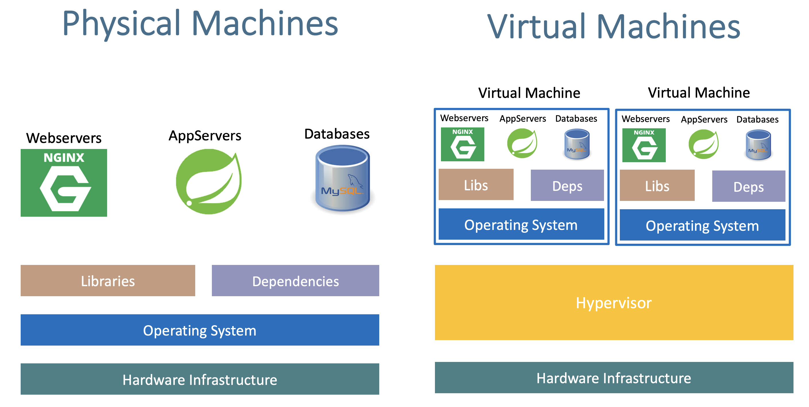
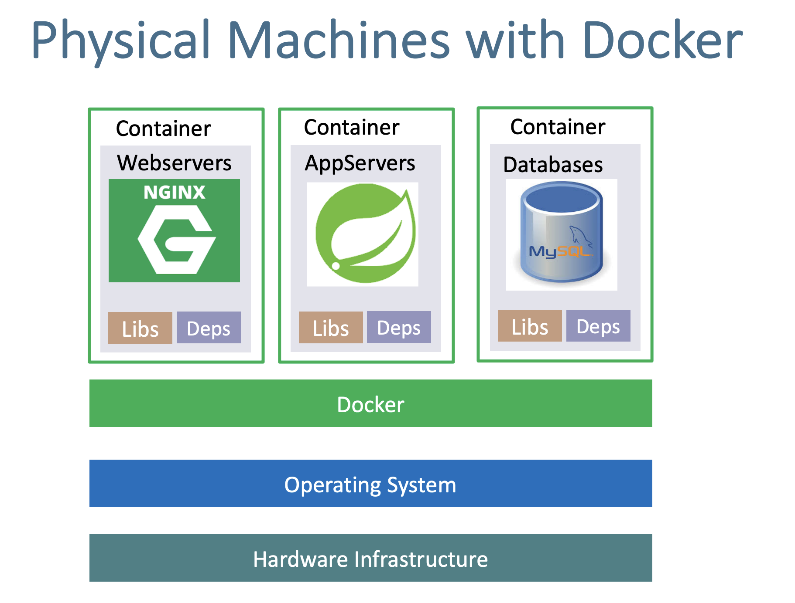
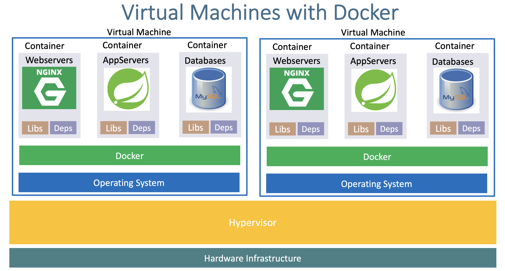

# Section 03: Docker Fundamentals

- Code: https://github.com/stacksimplify/docker-fundamentals
- Slides: https://github.com/stacksimplify/docker-fundamentals/tree/master/otherfiles/presentation

## 16. Introduction

What are:

- Docker Daemon
- Docker Client?
- Docker Images?
- Docker Containers
- Docker Registry/Hub?

### What problems are there in traditional infra?

- Installation & Configuration
  - Time consuming
  - Need to perform installation and configuration on every server and every environment (dev, qa, staging, production)
- Compatibility & Dependency
  - Need to keep resolving issues related to libraries and dependencies
- Inconsistencies across environments
  - Very hard to track changes across Dev/QA/Staging and Production environments and they end up with inconsistencies
- Operational support
  - Need more resources to handle operational issues on day to day basis: server support (HW/SW), patching releases, etc.
- Developer Environments
  - When a new developer joins the team, time it takes to provision his dev env in traditional approach is time consuming.

In a physical machine deployment, your libraries, dependencies and services are installed on the host machine. With virtual machines, a hypervisor enables you to run OSs on the host, then you can deploy your services on a virtual machine with its on OS.


When deploying on a physical machine with docker, our libs are isolated in the docker containers so the physical machine is not "polluted".


We can take it further and deploy docker in virtual machines that run on a host's hypervisor.


### Advantages of using Docker

Why Containers?

- Flexible: Even the most complex applications can be containerized
- Lightweight: containers leverage and share the host kernel, making them much more efficient in terms of system resources than virtual machines
- Portable: you can build locally, deploy to the cloud and run anywhere
- Loosely coupled: Containers are highly self-sufficient and encapsulated, allowing you to replace or upgrade one without disrupting others.
- Scalable: You can increase and automatically distrubute container replicas across a datacenter
- Secure: They apply aggresive constraints and isolations to processes without any configuration required on the part of the user.

## 17. Docker Architecture & Terminology

**Docker Daemon**

- The Docker daemon (`dockerd`) listens for Docker API requests and manages Docker objects such as images, containers, networks and volumes.

**Docker Client**

- Docker client can be present on either Docker Host or any other machine
- The client (`docker`) is the primary way that many Docker users interact with Docker.
- When you use commands such as `docker run`, the client sends these commands to `dockerd` (Docker Daemon) which carries them out
- The docker comand uses the **Docker API**.
- The docker client can communicate with more than one daemon.

**Docker Images**

- An image is a _read-only template_ with instructions for creating a Docker container.
- Often, _an image is based on another image_, with some additional customization.
- For example, we may build an image which is based on the ubuntu image, but installs the Apache web server and our application, as well as the configuration details needed to make our application run.

**Docker Containers**

- A container is a _runnable instance_ of an image
- We can _create, start, stop, move, or delete_ a container using the Docker API or CLI.
- We can _connect_ a container to one or more networks, attach storage to it, or even create a new image based on its current state.
- When a container is _removed_, any changes to its state that are not stored in _persistent storage disappear_.

**Docker Registry or Docker Hub**

- A docker registry _stores_ Docker images
- _Docker Hub_ is a public registry that anyone can use, and Docker is configured to look for images on Docker Hub by default.
- We can even run our own _private registry_.
- When we use the _docker pull_ or _docker run_ commands, the required images are pulled from our configured registry.
- When we use the _docker push_ command, our image is pushed to our configured registry.

## 18. Docker Installation

Docker Installation link:

- https://docs.docker.com/install/

Docker Desktop on Windows:

- https://docs.docker.com/docker-for-windows/

Docker Desktop on MAC:

- https://docs.docker.com/docker-for-mac/

## 19. Docker - Pull Docker Image from Docker Hub and Run it Locally

1.  Verify docker version and also login to docker hub

```shell
docker version
docker login
```

2. Pull image from Docker Hub

```shell
docker pull stacksimplify/dockerintro-springboot-helloworld-rest-api:1.0.0-RELEASE
```

3. Run the downloaded docker image and access the application

```shell
docker run --name app1 -p 85:8080 -d stacksimplify/dockerintro-springboot-helloworld-rest-api:1.0.0-RELEASE
http://localhost/hello
```

4. List running containers

```shell
docker ps
docker ps -a

# Only container IDs
docker ps -a -q
```

5. Connect to a container terminal

```shell
docker exec -it <container-name> /bin/sh
```

6. Container stop, start

```shell
docker stop <container-name>
docker start <container-name>
```

7. Remove container

```shell
docker stop <container-name>
docker rm <container-name>
```

8. Remove image

```shell
docker images
docker rmi <image-id>
```

## 20. Docker - Build Docker image locally, Test and Push it to Docker Hub

Ensure you have a docker hub account in https://hub.docker.com

Run the base Nginx container:

```shell
docker run --name mynginxdefault -p 85:80 -d nginx
docker ps
docker stop mynginxdefault
```

Create an `index.html` file with:

```html
<!doctype html>
<html lang="en">
  <head>
    <meta charset="UTF-8" />
    <meta name="viewport" content="width=device-width, initial-scale=1.0" />
    <title>c3n7</title>
  </head>
  <body>
    Welcome to c3n7 - NGINX-V1 - Customer Image
  </body>
</html>
```

Create a `Dockerfile` and copy our customized index.html:

```Dockerfile
FROM nginx
COPY index.html /usr/share/nginx/html
```

Build Docker image and run it

```shell
docker build -t c3n7/mynginx_image1:v1 .
docker run --name=mynginx1 -p 85:80 -d c3n7/mynginx_image1:v1

# Replace your docker hub account ID
# docker build -t <you-docker-hub-id>/mynginx_image1:v1
# docker run --name mynginx1 -p 85:80 -d <you-docker-hub-id>/mynginx_image1:v1
```

Tag & push the docker image to docker hub

```shell
docker images
docker tag c3n7/mynginx_image1:v1 c3n7/mynginx_image1:v1-release

docker push c3n7/mynginx_image1:v1-release
```

## 21. Docker - Essential Commands

The below are the list of essential commands that we need

| Command                                    | Description                                |
| :----------------------------------------- | :----------------------------------------- |
| `docker ps`                                | List all running containers                |
| `docker ps -a`                             | List all containers (stopped & running)    |
| `docker stop <container-id>`               | Stop a running container                   |
| `docker start <container-id>`              | Start a stopped container                  |
| `docker restart <container-id>`            | Restart a running container                |
| `docker port <container-id>`               | List port mappings of a specific container |
| `docker rm <container-id\|name>`           | Remove a stopped container                 |
| `docker rm -f <container-id\|name>`        | Forcefully remove a container              |
| `docker pull <hub-id>/<image>:<tag>`       | Pull an image from Docker Hub              |
| `docker exec -it <container-name> /bin/sh` | Connect to container and execute commands  |
| `docker rmi <image-id>`                    | Remove a Docker image                      |
| `docker logout`                            | Logout from Docker Hub                     |
| `docker login -u <username> -p <password>` | Login to Docker Hub                        |
| `docker stats`                             | Display live container resource usage      |
| `docker top <container-id\|name>`          | Display running processes in container     |
| `docker version`                           | Show Docker version information            |
