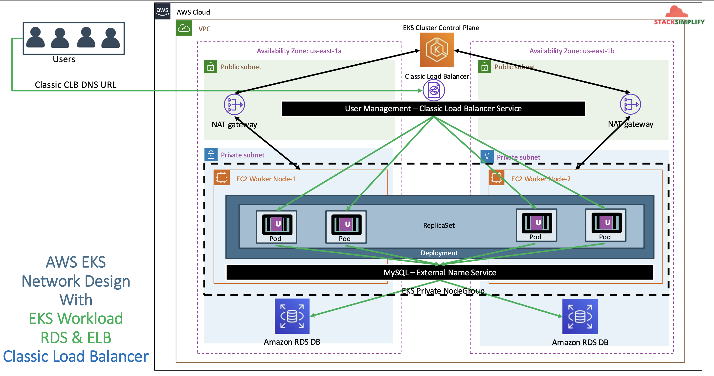

# EKS with AWS Load Balancers - Classic & Network Load Balancers

## 80. AWS Load Balancers Introduction

AWS provides Elastic Load Balancing in 4 flavours:

- Classic Load Balancer (Deprecated)
- Network Load Balancer
- Application Load Balancer (The default)
- Gateway Load Balancer

References:

- https://aws.amazon.com/compare/the-difference-between-the-difference-between-application-network-and-gateway-load-balancing/#summary-of-differences-alb-vs-nlb-vs-glb--16u8drs

We are going to explore a classic load balancer in this section, instead of using a `NodePort` service.

- The EKS Node Group and EKS Control Plane are in the public subnets.
- Ideally, we would want to have our control plane to support nodegroups in a private subnets

Our structure will look like:

- In AWS Cloud
- In our VPC
- Our Control Plane will create two Availability zones (`us-east-1a` and `us-east-2a`)
- Each node in each AZ will have 2 subnets (public and private)
- Our EC2 worker nodes will now exist in our private subnet.
- Our EKS Cluster Control Plane will access The EC2 Worker Nodes via NAT gateways in the public subnets
- The private subnets will also have our RDS DB



## 81. Create EKS Private Node Group

- We are going to create a node group in VPC Private Subnets
- We are going to deploy workloads on the private node group. Access to these will be via a load balancer in the public subnet.

Delete existing public node group in EKS cluster:

```shell
eksctl get nodegroup --clutser=<cluster-name>
eksctl get nodegroup --cluster=eksdemo1

# delete node group - replace node group and cluster name
eksctl delete nodegroup <nodegroup-name> --cluster <cluster-name>
eksctl delete nodegroup eksdemo1-ng-public1 --cluster eksdemo1
eksctl delete nodegroup eksdemo1-ng-public1 --cluster eksdemo1 --disable-eviction
```

Create Private Node Group in a Cluster

- Key option is `--node-private-networking`

```shell
eksctl create nodegroup --cluster=eksdemo1 \
                        --region=us-east-1 \
                        --name=eksdemo1-ng-private1 \
                        --node-type=t3.medium \
                        --nodes-min=2 \
                        --nodes-max=4 \
                        --node-volume-size=20 \
                        --ssh-access \
                        --ssh-public-key=kube-demo \
                        --managed \
                        --asg-access \
                        --external-dns-access \
                        --full-ecr-access \
                        --appmesh-access \
                        --alb-ingress-access \
                        --node-private-networking
```

Verify if node group created in private subnets

- External IP Address should be none if our worker nodes created in private subnets

```shell
kubectl get nodes -o wide
```

Subnet table verification - outbound traffic goes via NAT Gateway. Verify the node group subnet routes to ensure it created in private subnets:

- Go to Services -> EKS -> `eksdemo` -> Compute -> `eksdemo1-ng1-private`
- Click on Associated subnet in **Details** tab (any subnet will do)
- We should see that internet route via NAT Gateway (0.0.0.0/0 -> nat-xxxxx)

## 82. EKS with Classic Load Balancers Demo

Copy over these files from the other section:

```
01-mysql-externalname-service.yaml
02-secrets.yaml
03-user-management-deployment.yaml
```

Create the AWS Classic Load Balancer `04-classic-load-balancer.yaml`:

```yaml
apiVersion: v1
kind: Service
metadata:
  name: clb-usermgmt-restapp
  labels:
    app: usermgmt-restapp
spec:
  type: LoadBalancer # default clb
  selector:
    app: usermgmt-restapp
  ports:
    - port: 80
      targetPort: 8095
```

Deploy all manifests:

```shell
kubectl apply -f 82-clb/

# list services (verify newly created CLB service)
kubectl get svc

# verify pods
kubectl get pods
```

Verify if new CLB deployment:

- Go to Services -> Compute -> EC2 -> Load Balancing -> Load Balancers
  - CLB should be created
  - Copy DNS Name
- Go to Services -> Compute -> EC2 -> Load Balancing -> Target Groups
  - Verify the health status, we should see active

Access Application:

```shell
# Access Application
http://<CLB-DNS-NAME>/usermgmt/health-status
```

Clean-Up:

```shell
# delete all objects created
kubectl delete -f 82-clb/

# verify current k8s objects
kubectl get all
```

## 83. EKS with Network Load Balancers Demo

Introduction

- It functions at the fourth layer of the Open Systems Interconnection (OSI) model.
- It can handle millions of requests per second.
- After the load balancer receives a request from a client, it selects a target from a target group in the default action.
- It attempts to send the request to the selected target using the protocol and port that you specified.

Create AWS NLB manifest `04-network-load-balancer.yaml`

```yaml
apiVersion: v1
kind: Service
metadata:
  name: nlb-usermgmt-restapp
  labels:
    app: usermgmt-restapp
  annotations:
    service.beta.kubernetes.io/aws-load-balancer-type: nlb # to create network load balancer
spec:
  type: LoadBalancer
  selector:
    app: usermgmt-restapp
  ports:
    - port: 80
      targetPort: 8095
```

Deploy all manifest:

```shell
# deploy all manifests
kubectl apply -f 83-nlb

# list services (verify newly created NLB Service)
kubectl get svc

# verify pod
kubectl get pods
```

Verify if new NLB deployment:

- Go to Services -> Compute -> EC2 -> Load Balancing -> Load Balancers
  - NLB should be created
  - Copy DNS Name
- Go to Services -> Compute -> EC2 -> Load Balancing -> Target Groups
  - Verify the health status, we should see active

Access Application:

```shell
# Access Application
http://<NLB-DNS-NAME>/usermgmt/health-status
```

Clean-Up:

```shell
# delete all objects created
kubectl delete -f 83-nlb/

# verify current k8s objects
kubectl get all
```
