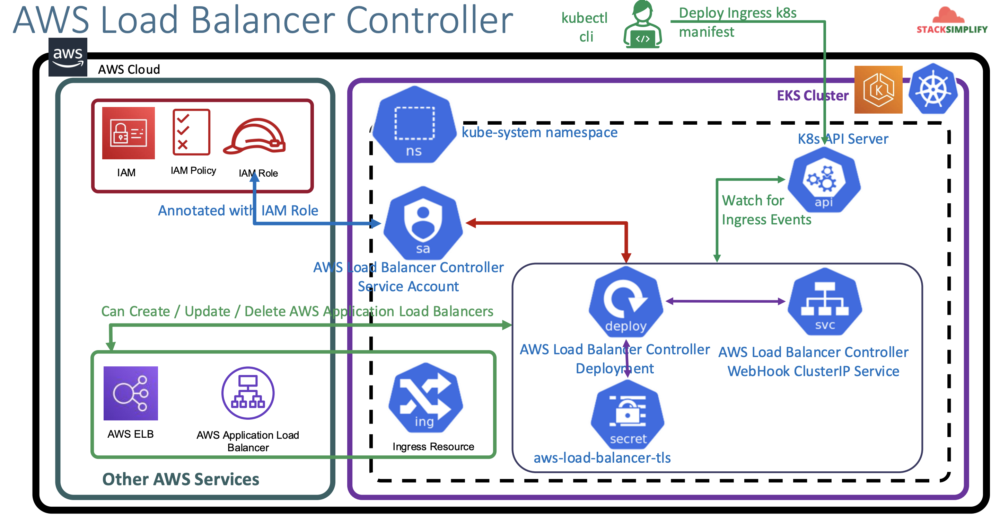

# ALB Ingress - Install AWS Load Balancer Controller Install on AWS EKS Cluster

## 85. We are we going to learn - AWS LBC Ingress

We are going to build 14 demos:

1. AWS Load Balancer Controller Install
2. Ingress Basics
3. Ingress Context Path Routing
4. Ingres SSL
5. Ingress SSL Redirect
6. External DNS Install
7. Ingress + External DNS
8. K8s Service + External DNS
9. Ingress Name based Virtual Host Routing
10. SSL Discovery - Host
11. SSL Discovery - TLS
12. Ingress Groups
13. Ingress Target Type - IP
14. Ingress Internal ALB

Reference:

- https://github.com/stacksimplify/aws-eks-kubernetes-masterclass/tree/master/08-NEW-ELB-Application-LoadBalancers

## 86. Ingress Introduction Part 2

Introduction:

- ALB is a _super advanced, next generation Load Balancer_ in AWS
- Has support for _Path-based_ routing (`/app1`, `/app2`, `/usermgmt`)
- Support for _Host-based_ routing (`apps.karani.com`, `users.karani.com`)
- Support for _routing based on fields in the request_ (HTTP Headers, HTTP Methods, Query Parameters and Source IP Address)
- Support for _redirecting requests from one URL to another_
- Support for _returning a custom HTTP response_.
- Support for _registring Lambda functions_ as targets.
- Support for the _Load balancer to authenticate users_ of your applications through their corporate or social identities before routing requests.
- Support for _containerized_ applications
- Support for _monitoring the health_ of each service independently, as health checks are defined at the target group level
- Support for registering targets by IP address, including targets _outside the VPC_ for the load balancer.
- **Alb is the latest and greatest** load balancer with many good features.

### ALB Ingress Controller - ALBIC

Was rebranded to **AWS Load Balancer Controller**:

- ALBIC triggers the creation of an **Application Load Balancer** ALB and the necessary supporting _AWS Resources_ whenever an Ingress resource is created on the cluster with the _kubernetes.io/ingress.class: alb_ notation.
- The ALB Ingress Controller supports **two traffic modes**
  - Instance
  - IP
- When you are using `Fargate` profiles, and don't have nodes (EC2 instances), use `Ip Mode` because `Fargate` does not support `NodePort` services.
- When you are using `Node Group`s, you can use both Instance and IP Target types.
- Documentation reference:
  - https://kubernetes-sigs.github.io/aws-load-balancer-controller/latest/#aws-load-balancer-controller
  - https://kubernetes-sigs.github.io/aws-load-balancer-controller/v2.2/guide/ingress/annotations/#target-type

Instance Mode:

- Registers nodes within your cluster as targets for the ALB
- Traffic reaching the ALB is _routed to NodePort for your service_ and then proxied to your pods
- This is the _default traffic mode_
- You can _explicitly specify it_ with the `alb.ingress.kubernetes.io/target-type: instance`

IP Mode:

- Registers pods as targets for the ALB
- Traffic reaching the _ALB is directly routed to pods_ for your service
- You must specify the `alb.ingress.kubernetes.io/target-type: ip` annotation to use this traffic mode.


The controller manages the configurations of the resources it creates, and we do not recommend out-of-band modifications to these resources because the controller may revert the manual changes during reconciliation. We recommend to use configuration options provided as best practice, such as ingress and service annotations, controller command line flags, IngressClassParams, and Gateway API resources.

1. The controller watches for ingress events from the API server. When it finds ingress resources that satisfy its requirements, it begins the creation of AWS resources.
2. An ALB (ELBv2) is created in AWS for the new ingress resource. This ALB can be internet-facing or internal. You can also specify the subnets it's created in using annotations.
3. Target Groups are created in AWS for each unique Kubernetes service described in the ingress resource.
   - `PodC` works with Traffic Mode: IP. Good to apply in fargate.
   - `PodA` and `PodB` work with Traffic Mode: Instance
4. Listeners are created for every port detailed in your ingress resource annotations. When no port is specified, sensible defaults (80 or 443) are used. Certificates may also be attached via annotations.
5. Rules are created for each path specified in your ingress resource. This ensures traffic to a specific path is routed to the correct Kubernetes Service.

Along with the above, the controller also...

- deletes AWS components when ingress resources are removed from k8s.
- modifies AWS components when ingress resources change in k8s.
- assembles a list of existing ingress-related AWS components on start-up, allowing you to recover if the controller were to be restarted.

## 87. Introduction to AWS Load Balancer Controller

- The **AWS ALB Ingress Controller** has been renamed to **AWS Load Balancer Controller**

AWS ALB Ingress Controller

- Could provision only Application Load Balancer (ALB)
- Doesn't support latest ingress version (from k8s `1.22` onwards)
- No development releases, will be deprecated

AWS Load Balancer Controller

- Can provision both ALB and Network Load Balancer (NLB)
- Supports latest & greatest from ingress perspective

What are involved in this ALBC:

- An ALBC service account is provisioned in the `kube-system-namespace`
- This system account has an associated `IAM Policy` and `IAM Role`
- The ALBC Deplyment is provisioed with a related ClusterIP Service and secret with tls details (`aws-load-balancer-tls`)



## 88. Verify Pre-requisites

Reference:

- https://github.com/stacksimplify/aws-eks-kubernetes-masterclass/tree/master/08-NEW-ELB-Application-LoadBalancers/08-01-Load-Balancer-Controller-Install
- https://docs.aws.amazon.com/eks/latest/userguide/aws-load-balancer-controller.html
- [AWS Load Balancer Controller Tutorial (TLS): AWS EKS Kubernetes Tutorial - Part 6](https://youtu.be/5XpPiORNy1o)

Introduction:

1. Create IAM Policy and make a note of Policy ARN (Amazon Resource Names)
2. Create IAM Role and k8s Service Account and bind them together
3. Install AWS Load Balancer Controller using Helm3 CLI
4. Understand the IngressClass concept and create a default ingress class

### Pre-requisites

Pre-requisite 1: `eksctl` and `kubectl` to be latest:

```shell
# verify eksctl version
eksctl version

# For installing or upgrading latest eksctl version
https://docs.aws.amazon.com/eks/latest/userguide/eksctl.html

# verify EKS cluster version
kubectl version --short
kubectl version
# Important Note: You must use a kubectl version that is within one minor version difference
# of your Amazon EKS cluster control plane. For example, a 1.20 kubectl client works with
# Kubernetes 1.19, 1.20 and 1.21 clusters.

# For installing kubectl cli
# https://docs.aws.amazon.com/eks/latest/userguide/install-kubectl.html
```

Pre-requisite 2: create eks cluster and worker nodes (if not created)

```shell
# Create Cluster (Section-01-02)
eksctl create cluster --name=eksdemo1 \
                      --region=us-east-1 \
                      --zones=us-east-1a,us-east-1b \
                      --without-nodegroup
                    #   --version="1.21" \


# Get List of clusters (Section-01-02)
eksctl get cluster

# Template (Section-01-02)
eksctl utils associate-iam-oidc-provider \
    --region region-code \
    --cluster <cluter-name> \
    --approve

# Replace with region & cluster name (Section-01-02)
eksctl utils associate-iam-oidc-provider \
    --region us-east-1 \
    --cluster eksdemo1 \
    --approve

# Create EKS NodeGroup in VPC Private Subnets (Section-07-01)
eksctl create nodegroup --cluster=eksdemo1 \
                        --region=us-east-1 \
                        --name=eksdemo1-ng-private1 \
                        --node-type=t3.medium \
                        --nodes-min=2 \
                        --nodes-max=4 \
                        --node-volume-size=20 \
                        --ssh-access \
                        --ssh-public-key=kube-demo \
                        --managed \
                        --asg-access \
                        --external-dns-access \
                        --full-ecr-access \
                        --appmesh-access \
                        --alb-ingress-access \
                        --node-private-networking
```

Pre-requisite 3: verify cluster, node groups and configure `kubectl` cli if not configured:

```shell
# verify eks cluster
eksctl get cluster

# verify eks node groups
eksctl get nodegroup --cluster=eksdemo1

# verify if any IAM Service Accounts present in EKS Cluster
eksctl get iamserviceaccount --cluster=eksdemo1
# No iamserviceaccounts found

# configure kubeconfig for kubectl
eksctl get cluster # to get cluster name
aws eks --region <region-code> update-kubeconfig --name <cluster-name>
aws eks --region us-east-1 update-kubeconfig --name eksdemo1

# verify eks nodes in eks cluster using kubectl
kubectl get nodes

# verify using AWS Management Console
# 1. EKS EC2 Nodes (verify subnet in networking tab)
# 2. EKS Cluster
```

## 89. Create IAM Policy, IAM Role, k8s service account and annotate it with I

Create IAM policy for the AWS Load Balancer Controller that allows it to make calls to AWS APIs on your behalf

- We will download the latest `iam_policy.json` [from the main branch of git repo](https://github.com/kubernetes-sigs/aws-load-balancer-controller)

```shell
# delete files before download
rm iam_policy_latest.json

# download IAM latest Policy
curl -o iam_policy_latest.json https://raw.githubusercontent.com/kubernetes-sigs/aws-load-balancer-controller/refs/heads/main/docs/install/iam_policy.json

## Download specific version
curl -o iam_policy_v2.3.1.json https://raw.githubusercontent.com/kubernetes-sigs/aws-load-balancer-controller/v2.3.1/docs/install/iam_policy.json

# create IAM Policy using policy downloaded
aws iam create-policy \
        --policy-name AwsLoadBalancerControllerIAMPolicy \
        --policy-document file://iam_policy_latest.json

## Sample Output
$ aws iam create-policy \
>     --policy-name AWSLoadBalancerControllerIAMPolicy \
>     --policy-document file://iam_policy_latest.json
{
    "Policy": {
        "PolicyName": "AwsLoadBalancerControllerIAMPolicy",
        "PolicyId": "ANPAZUQG4EA3KOGZJO2XV",
        "Arn": "arn:aws:iam::662513131574:policy/AwsLoadBalancerControllerIAMPolicy",
        "Path": "/",
        "DefaultVersionId": "v1",
        "AttachmentCount": 0,
        "PermissionsBoundaryUsageCount": 0,
        "IsAttachable": true,
        "CreateDate": "2026-01-29T11:04:57+00:00",
        "UpdateDate": "2026-01-29T11:04:57+00:00"
    }
}
```

> Note:  
> If you view the policy in the AWS Management Console, you may see warnings for ELB. These can be safely ignored because some of the actions only exist for ELB v2. You do not see warnings for ELB v2.

Make a note of the Policy ARN as we are going to use it

```
Policy ARN
arn:aws:iam::662513131574:policy/AwsLoadBalancerControllerIAMPolicy
```

Create an IAM role for the AWS LoadBalancer Controller and attach the role to the k8s service account

- Applicable only with `eksctl` managed clusters.
- This command will create an AWS IAM Role
- This command will also create a k8s Service Account in the k8s cluster
- In addition, this command will bind an IAM role created and the k8s service account created

Create IAM Role using eksctl

```shell
# verify if there's any existing service account
kubectl get sa -n kube-system
kubectl get sa aws-load-balancer-controller -n kube-system
# Observation: nothing with name `aws-load-balancer-controller` should exist

# Template
eksctl create iamserviceaccount \
              --cluster=eksdemo1 \
              --namespace=kube-system \
              --name=aws-load-balancer-controller \
              --attach-policy-arn=arn:aws:iam::662513131574:policy/AwsLoadBalancerControllerIAMPolicy \
              --override-existing-serviceaccounts \
              --approve
```

Sample output:

```
51 [ℹ]  1 iamserviceaccount (kube-system/aws-load-balancer-controller) was included (based on the include/exclude rules)
2026-01-29 14:19:51 [!]  metadata of serviceaccounts that exist in Kubernetes will be updated, as --override-existing-serviceaccounts was set
51 [ℹ]  1 task: {
    2 sequential sub-tasks: {
        create IAM role for serviceaccount "kube-system/aws-load-balancer-controller",
        create serviceaccount "kube-system/aws-load-balancer-controller",
    } }
51 [ℹ]  building iamserviceaccount stack "eksctl-eksdemo1-addon-iamserviceaccount-kube-system-aws-load-balancer-controller"
51 [ℹ]  deploying stack "eksctl-eksdemo1-addon-iamserviceaccount-kube-system-aws-load-balancer-controller"
52 [ℹ]  waiting for CloudFormation stack "eksctl-eksdemo1-addon-iamserviceaccount-kube-system-aws-load-balancer-controller"
23 [ℹ]  waiting for CloudFormation stack "eksctl-eksdemo1-addon-iamserviceaccount-kube-system-aws-load-balancer-controller"
24 [ℹ]  created serviceaccount "kube-system/aws-load-balancer-controller"
```

Verify using `eksctl` cli:

```shell
# get IAM Service Account
eksctl get iamserviceaccount --cluster eksdemo1

# sample output
NAMESPACE       NAME                            ROLE ARN
kube-system     aws-load-balancer-controller    arn:aws:iam::662513131574:role/eksctl-eksdemo1-addon-iamserviceaccount-kube--Role1-W8uBn8azq18c
```

Verify CloudFormation Template `eksctl` createed & IAM Role:

- Go to Services -> _Management & Governance_ -> _CloudFormation_
- CFN Template Name (click it): `eksctl-eksdemo1-addon-iamserviceaccount-kube-system-aws-load-balancer-controller`
- Click on _Resources_ tab
- Click on _Physical ID_ to open the IAM Role
- Verify it has `AwsLoadBalancerControllerIAMPolicy` associated

Verify k8s service account using `kubectl`:

```shell
# verify if any existing service account exists
kubectl get sa -n kube-system
kubectl get sa aws-load-balancer-controller -n kube-system
# observation: we should see a new service account created

kubectl describe sa aws-load-balancer-controller -n kube-system
```

We can see that the newly created role ARN is added in `Annotations` confirming that the AWS IAM role is bound to the service account:

```shell
Name:                aws-load-balancer-controller
Namespace:           kube-system
Labels:              app.kubernetes.io/managed-by=eksctl
Annotations:         eks.amazonaws.com/role-arn: arn:aws:iam::662513131574:role/eksctl-eksdemo1-addon-iamserviceaccount-kube--Role1-W8uBn8azq18c
Image pull secrets:  <none>
Events:              <none>
```

## 90. Install AWS Load Balancer Controller using HELM

Install Helm if not installed:

```shell
# install helm (if not installed)
brew install helm

helm version
```

Install AWS Load Balancer Controller

- **Important note 1**: If deploying the controller to Amazon EC2 nodes that have restricted access to the Amazon EC2 Metadata Service (IMDS), or if you're deploying to Fargate, add the following flags to the cmd that you run:
- So as to not worry about it, we are just going to add them anyway.

```shell
--set region=region-code \
--set vpcId=vpc-xxxxx
```

To install the ALBC:

```shell
# add the eks-charts repository
helm repo add eks https://aws.github.io/eks-charts

# update your local repo to make sure you have the most recent charts
helm repo update

# install the AWS Load Balancer Controller
## template
helm install aws-load-balancer-controller eks/aws-load-balancer-controller \
             -n kube-system \
             --set clusterName=<cluster=name> \
             --set serviceAccount.create=false \
             --set serviceAccount.name=aws-load-balancer-controller \
             --set region=<region-code> \
             --set vpcId=<vpc-xxxxx> \
             --set image.repository=public.ecr.aws/eks/aws-load-balancer-controller

## Replace Cluster Name, Region Code, VPC ID, Image Repo Account ID and Region Code
helm install aws-load-balancer-controller eks/aws-load-balancer-controller \
             -n kube-system \
             --set clusterName=eksdemo1 \
             --set serviceAccount.create=false \
             --set serviceAccount.name=aws-load-balancer-controller \
             --set region=us-east-1 \
             --set vpcId=vpc-07eedc73f5d0b8b8c \
             --set image.repository=public.ecr.aws/eks/aws-load-balancer-controller
```

Sample output:

```
NAME: aws-load-balancer-controller
LAST DEPLOYED: Thu Jan 29 14:58:44 2026
NAMESPACE: kube-system
STATUS: deployed
REVISION: 1
DESCRIPTION: Install complete
TEST SUITE: None
NOTES:
AWS Load Balancer controller installed!
```

## 91. Verify AWS LBC Deployment and WebHook Service

### Verify that the controller is installed:

Run:

```shell
kubectl -n kube-system get deployment
kubectl -n kube-system get deployment aws-load-balancer-controller
kubectl -n kube-system describe deployment aws-load-balancer-controller
```

Sample Output:

```shell
$ kubectl get deployment -n kube-system aws-load-balancer-controller
NAME                           READY   UP-TO-DATE   AVAILABLE   AGE
aws-load-balancer-controller   2/2     2            2           27s
```

Verify AWS Load Balancer Controller Webhook service created:

```shell
kubectl -n kube-system get svc
kubectl -n kube-system get svc aws-load-balancer-webhook-service
kubectl -n kube-system describe svc aws-load-balancer-webhook-service
```

Sample output:

```shell
$ kubectl -n kube-system get svc aws-load-balancer-webhook-service
NAME                                TYPE        CLUSTER-IP     EXTERNAL-IP   PORT(S)   AGE
aws-load-balancer-webhook-service   ClusterIP   10.100.53.52   <none>        443/TCP   61m
```

Verify labels in service and selector labels in deployment:

```shell
kubectl -n kube-system get svc aws-load-balancer-webhook-service -o yaml
kubectl -n kube-system get deployment aws-load-balancer-controller -o yaml
```

Observation:

1. Verify `spec.selector` label in `aws-load-balancer-webhook-service`
2. Compare it with `aws-load-balancer-controller` Deployment `spec.selector.matchLabels`
3. Both values should be same which traffic coming to `aws-load-balancer-webhook-service` on port 443 will be sent to port 9443 on `aws-load-balancer-controller` deployment related pods.

## 92. LBC Service Account and TLS Cert Internals

Verify AWS Load Balancer Controller logs

```shell
# list pods
kubectl get pods -n kube-system

# review logs for AWS LB Controller
kubectl -n kube-system logs -f <POD-Name>

# review logs for AWS LB Controller POD-1
kubectl -n kube-system logs -f aws-load-balancer-controller-56f4ddbf98-4npjl

# review logs for AWS LB Controller POD-2
kubectl -n kube-system logs -f aws-load-balancer-controller-56f4ddbf98-z4mr4
```

Verify AWS Load Balancer Controller k8s service account - Internals

```shell
# list service account and its secret
kubectl -n kube-system get sa aws-load-balancer-controller
kubectl -n kube-system get sa aws-load-balancer-controller -o yaml
kubectl -n kube-system get secret
kubectl -n kube-system get secret <get_from_previous_command - secrets.name> -o yaml
kubectl -n kube-system get secret aws-load-balancer-tls -o yaml

## Decoce ca.crt using below two websites
# https://www.base64decode.org/
# https://www.sslchecker.com/certdecoder

## Decode token using below two websites <can't find it in ALBC 3.0.0>
# https://www.base64decode.org/
# https://jwt.io/
# Observation:
# 1. Review decoded JWT Token

# List deployment in YAML format
kubectl -n kube-system get deploy aws-load-balancer-controller -o yaml
# Observation:
# 1. Verify "spec.template.spec.serviceAccount" and "spec.template.spec.serviceAccountName" in "aws-load-balancer-controller" Deployment
# 2. We should find the Service Account Name as "aws-load-balancer-controller"

# List Pods in YAML format
kubectl -n kube-system get pods
kubectl -n kube-system get pod <aws-load-balancer-controller-pod-name> -o yaml
kubectl -n kube-system get pod aws-load-balancer-controller-56f4ddbf98-4npjl -o yaml

# Observation:
# 1. Verify "spec.serviceAccount" and "spec.serviceAccountName"
# 2. We should find the Service Account Name as "aws-load-balancer-controller"
# 3. Verify "spec.volumes". You should find something as below, which is a temporary credentials to access AWS Services
# CHECK-1: Verify "spec.volumes.name = aws-iam-token"
#   - name: aws-iam-token
#     projected:
#       defaultMode: 420
#       sources:
#       - serviceAccountToken:
#           audience: sts.amazonaws.com
#           expirationSeconds: 86400
#           path: token
# CHECK-2: Verify Volume Mounts
#     volumeMounts:
#     - mountPath: /var/run/secrets/eks.amazonaws.com/serviceaccount
#       name: aws-iam-token
#       readOnly: true
# CHECK-3: Verify ENVs whose path name is "token"
#     - name: AWS_WEB_IDENTITY_TOKEN_FILE
#       value: /var/run/secrets/eks.amazonaws.com/serviceaccount/token
```

Verify TLS Certs for AWS Load Balancer Controller - Internals:

```shell
# List aws-load-balancer-tls secret
kubectl -n kube-system get secret aws-load-balancer-tls -o yaml

## Verify the ca.crt and tls.crt in below websites
# https://www.base64decode.org/
# https://www.sslchecker.com/certdecoder

# Make a note of Common Name and SAN from above
# Common Name: aws-load-balancer-controller
# SAN: aws-load-balancer-webhook-service.kube-system, aws-load-balancer-webhook-service.kube-system.svc

# List Pods in YAML format
kubectl -n kube-system get pods
kubectl -n kube-system get pod <AWS-Load-Balancer-Controller-POD-NAME> -o yaml
kubectl -n kube-system get pod aws-load-balancer-controller-65b4f64d6c-h2vh4 -o yaml | less
# Observation:
# 1. Verify how the secret is mounted in AWS Load Balancer Controller Pod
# CHECK-2: Verify Volume Mounts
#     volumeMounts:
#     - mountPath: /tmp/k8s-webhook-server/serving-certs
#       name: cert
#       readOnly: true
# CHECK-3: Verify Volumes
#   volumes:
#   - name: cert
#     secret:
#       defaultMode: 420
#       secretName: aws-load-balancer-tls
```

## 93. Uninstall Load Balancer Controller Command SHOULD NOT BE EXECUTED

- This step should not be implemented.
- This is just put it here for us to know how to uninstall aws load balancer controller from EKS Cluster

```shell
# Uninstall AWS Load Balancer Controller
helm uninstall aws-load-balancer-controller -n kube-system
```

## 94. Introduction to Kubernetes Ingress Class Resource

We can have ingresses such as:

- AWS **EKS** ALB Ingress Controller
- **NGINX** Ingress Controller
- **AKS** Application Gateway Ingress Controller

Consider:

- If we have _multiple ingress controllers_ running in our k8s cluster, how do we _identify_ to which Ingress Controller our _Ingress Resource/Service_ should be associated to?
- We deploy it via a Kubernetes Object with `Kind: IngressClass`
- https://kubernetes.io/docs/concepts/services-networking/ingress-controllers/

It can look like:

```yaml
apiVersion: networking.k8s.io/v1
kind: IngressClass
metadata:
  name: my-aws-ingress-class
  annotations:
    ingressclass.kubernetes.io/is-default-class: "true"
spec:
  controller: ingress.k8s.aws/alb
```

- Whenever we use a `IngressClass` kind, it will be associated with the controller `controller: ingress.k8s.aws/alb`.

### What does `ingressclass.kubernetes.io/is-default-class: "true"` do?

If you have `IngressClass`:

```yaml
apiVersion: networking.k8s.io/v1
kind: IngressClass
metadata:
  name: my-aws-ingress-class
#   annotations:
#     ingressclass.kubernetes.io/is-default-class: "true"
spec:
  controller: ingress.k8s.aws/alb
```

And you have this `Ingress` Resource:

```yaml
apiVersion: networking.k8s.io/v1
kind: Ingress
metadata:
  name: ingress-nginxapp1
  labels:
    app: app1-nginx
  annotations:
    alb.ingress.kubernetes.io/load-balancer-name: app1ingress
    alb.ingress.kubernetes.io/scheme: internet-facing
spec:
  ingressClassName: my-aws-ingress-class # Ingress class
  defaultBackend:
    service:
      name: app1-nginx-nodeport-service
      port:
        number: 80
```

- If `IngressClass` is not defined as `is-default-class:true`, then in the `Ingress` resource we need to define the `spec.ingressClassName` in Ingress Resource

## 95. Deploy Ingress and Verify

Create a `01-ingressclass-resource.yaml`:

```yaml
apiVersion: networking.k8s.io/v1
kind: IngressClass
metadata:
  name: my-aws-ingress-class
  annotations:
    ingressclass.kubernetes.io/is-default-class: "true"
spec:
  controller: ingress.k8s.aws/alb

## Additional Note
# 1. You can mark a particular IngressClass as the default for your cluster.
# 2. Setting the ingressclass.kubernetes.io/is-default-class annotation to true on an IngressClass resource will ensure that new Ingresses without an ingressClassName field specified will be assigned this default IngressClass.
# 3. Reference: https://kubernetes-sigs.github.io/aws-load-balancer-controller/v2.3/guide/ingress/ingress_class/
```

Create the `IngressClass` resource:

```shell
# create ingressclass resource
kubectl apply -f 95-ingress-class

# verify ingressclass resource
kubectl get ingressclass

# describe ingressclass resource
kubectl describe ingressclass my-aws-ingress-class
```
