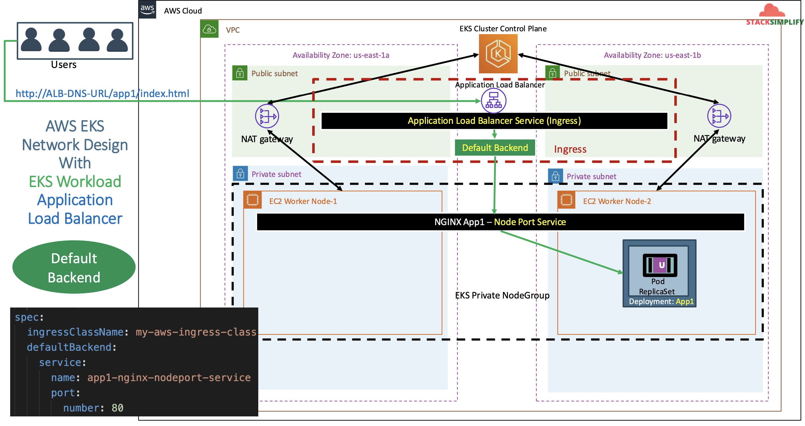
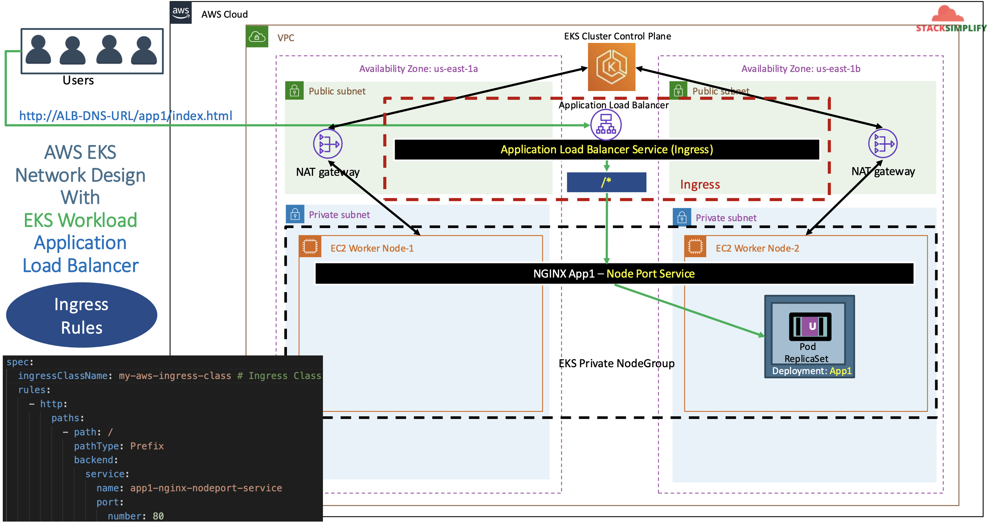

# ALB Ingress - Basics using AWS Application Load Balancer

## 96. Introduction to Ingress Basics

We are going to explore:

- Ingress Annotations: Load balancer settings that we configer
- Ingress Spec / Class Name: Which ingress controller to use
- Ingress Spec: we can define ingress routing rules and the default backend

We are going to have two demos:

1. Ingress Service with **Default Backend**
2. Ingress Service with **Ingress Rules**

References:

- https://kubernetes-sigs.github.io/aws-load-balancer-controller/v3.0/guide/ingress/annotations/

Network Design with ALB Default Backend:

- The default backend will route traffic via the ALB and the default backend will in turn route it to the NodePort service of your app.



Network Design with ALB Ingress Rules:

- You can route multiple resources (nodeport services) via target rules in your ALB



## 97. Review Kubernetes Deployment and NodePort Service manifest

Create Deployment for kubenginx in file `01-nginx-deployment.yaml`:

```yaml
apiVersion: apps/v1
kind: Deployment
metadata:
  name: app1-nginx-deployment
  labels:
    app: app1-nginx
spec:
  replicas: 1
  selector:
    matchLabels:
      app: app1-nginx
  template:
    metadata:
      labels:
        app: app1-nginx
    spec:
      containers:
        - name: app1-nginx
          image: stacksimplify/kube-nginxapp1:1.0.0
          ports:
            - containerPort: 80
```

Create a NodePort service `02-nginx-nodeport-service.yaml`:

```yaml
apiVersion: v1
kind: Service
metadata:
  name: app1-nginx-nodeport-service
  labels:
    app: app1-nginx
  annotations:
#Important Note:  Need to add health check path annotations in service level if we are planning to use multiple targets in a load balancer
#    alb.ingress.kubernetes.io/healthcheck-path: /app1/index.html
spec:
  type: NodePort
  selector:
    app: app1-nginx
  ports:
    - port: 80
      targetPort: 80
```

## 98. Create Ingress k8s manifest with default backend

Create ingress file `03-alb-ingress-basic.yaml`:

- Reference: https://kubernetes-sigs.github.io/aws-load-balancer-controller/latest/guide/ingress/annotations/

```yaml
# Annotations Reference: https://kubernetes-sigs.github.io/aws-load-balancer-controller/latest/guide/ingress/annotations/
apiVersion: networking.k8s.io/v1
kind: Ingress
metadata:
  name: ingress-nginxapp1
  labels:
    app: app1-nginx
  annotations:
    # kubernetes.io/ingress.class: "alb" (DEPRECATED - STILL WORKS BUT RECOMMENDED TO USE IngressClass Resource)
    alb.ingress.kubernetes.io/load-balancer-name: app1ingress
    # Ingress Core
    alb.ingress.kubernetes.io/scheme: internet-facing
    # Health Check Settings
    # If you have multiple targets in the ingress, move this health check to the NodePort service
    alb.ingress.kubernetes.io/healthcheck-protocol: HTTP
    alb.ingress.kubernetes.io/healthcheck-port: traffic-port
    alb.ingress.kubernetes.io/healthcheck-path: /app1/index.html
    alb.ingress.kubernetes.io/healthcheck-interval-seconds: "15"
    alb.ingress.kubernetes.io/healthcheck-timeout-seconds: "5"
    alb.ingress.kubernetes.io/success-codes: "200"
    alb.ingress.kubernetes.io/healthy-threshold-count: "2"
    alb.ingress.kubernetes.io/unhealthy-threshold-count: "2"
spec:
  ingressClassName: my-aws-ingress-class # Ingress class
  defaultBackend:
    service:
      name: app1-nginx-nodeport-service
      port:
        number: 80
```

## 99. Deploy Ingress default backend and verify and clean-up

Apply the manifests

```shell
# deploy manifests
kubectl apply -f 98-default-backend

# verify deployment and pods
kubectl get deploy
kubectl get pods
kubectl get svc

# verify ingress (make a note of the address field)
kubectl get ingress
# NAME                CLASS                  HOSTS   ADDRESS                                              PORTS   AGE
# ingress-nginxapp1   my-aws-ingress-class   *       app1ingress-1926864577.us-east-1.elb.amazonaws.com   80      2m28s

kubectl describe ingress ingress-nginxapp1
# Observation:
# 1. Review Default Backend and Rules

## Verify Application Load Balancer using
# Goto AWS Mgmt Console -> Services -> EC2 -> Load Balancers
# 1. Verify Listeners and Rules inside a listener
# 2. Verify Target Groups
#   You'll see the nodeport
#   you'll also see target type: instance

# Access App using Browser
kubectl get ingress
# http://<ALB-DNS-URL>
# http://<ALB-DNS-URL>/app1/index.html
# or
# http://<INGRESS-ADDRESS-FIELD>
# http://<INGRESS-ADDRESS-FIELD>/app1/index.html

# Verify AWS Load Balancer Controller logs
kubectl get po -n kube-system
kubectl -n kube-system logs -f <POD-NAME>
# POD1 logs
kubectl -n kube-system logs -f aws-load-balancer-controller-56f4ddbf98-4npjl
# POD2 logs
kubectl -n kube-system logs -f aws-load-balancer-controller-56f4ddbf98-z4mr4
```

Clean-Up:

```shell
kubectl delete -f 98-default-backend
```

## 100. Create, Deploy Ingress Rules and verify and clean-up

We are going to define the ingress manifest with ingress rules.

- [Ingress Path Types](https://kubernetes.io/docs/concepts/services-networking/ingress/#path-types)
- [Better Path Matching With Path Types](https://kubernetes.io/blog/2020/04/02/improvements-to-the-ingress-api-in-kubernetes-1.18/#better-path-matching-with-path-types)
- [Sample Ingress Rule](https://kubernetes.io/docs/concepts/services-networking/ingress/#the-ingress-resource)
- _ImplementationSpecific (default)_: With this path type, matching is up to the controller implementing the IngressClass.
  - Implementations can treat this as a separate pathType or treat it identically to the Prefix or Exact path types.
- _Exact_: Matches the URL path exactly and with case sensitivity.
- _Prefix_: Matches based on a URL path prefix split by /. Matching is case sensitive and done on a path element by element basis.

Create a `03-alb-ingress-rules.yaml`:

```yaml
# Annotations Reference: https://kubernetes-sigs.github.io/aws-load-balancer-controller/latest/guide/ingress/annotations/
apiVersion: networking.k8s.io/v1
kind: Ingress
metadata:
  name: ingress-nginxapp1
  labels:
    app: app1-nginx
  annotations:
    # kubernetes.io/ingress.class: "alb" (DEPRECATED - STILL WORKS BUT RECOMMENDED TO USE IngressClass Resource)
    alb.ingress.kubernetes.io/load-balancer-name: app1ingressrules
    # Ingress Core
    alb.ingress.kubernetes.io/scheme: internet-facing
    # Health Check Settings
    # If you have multiple targets in the ingress, move this health check to the NodePort service
    alb.ingress.kubernetes.io/healthcheck-protocol: HTTP
    alb.ingress.kubernetes.io/healthcheck-port: traffic-port
    alb.ingress.kubernetes.io/healthcheck-path: /app1/index.html
    alb.ingress.kubernetes.io/healthcheck-interval-seconds: "15"
    alb.ingress.kubernetes.io/healthcheck-timeout-seconds: "5"
    alb.ingress.kubernetes.io/success-codes: "200"
    alb.ingress.kubernetes.io/healthy-threshold-count: "2"
    alb.ingress.kubernetes.io/unhealthy-threshold-count: "2"
spec:
  ingressClassName: my-aws-ingress-class # Ingress class
  rules:
    - http:
        paths:
          - path: /
            pathType: Prefix
            backend:
              service:
                name: app1-nginx-nodeport-service
                port:
                  number: 80
```

Apply the manifests

```shell
# deploy manifests
kubectl apply -f 98-default-backend

# verify deployment and pods
kubectl get deploy
kubectl get pods
kubectl get svc

# verify ingress (make a note of the address field)
kubectl get ingress
# NAME                CLASS                  HOSTS   ADDRESS                                                  PORTS   AGE
# ingress-nginxapp1   my-aws-ingress-class   *       app1ingressrules-325379209.us-east-1.elb.amazonaws.com   80      11s

kubectl describe ingress ingress-nginxapp1
# Observation:
# 1. Review Default Backend and Rules

## Verify Application Load Balancer using
# Goto AWS Mgmt Console -> Services -> EC2 -> Load Balancers
# 1. Verify Listeners and Rules inside a listener
# 2. Verify Target Groups
#   You'll see the nodeport
#   you'll also see target type: instance

# Access App using Browser
kubectl get ingress
# http://<ALB-DNS-URL>
# http://<ALB-DNS-URL>/app1/index.html
# or
# http://<INGRESS-ADDRESS-FIELD>
# http://<INGRESS-ADDRESS-FIELD>/app1/index.html

# Verify AWS Load Balancer Controller logs
kubectl get po -n kube-system
kubectl -n kube-system logs -f <POD-NAME>
# POD1 logs
kubectl -n kube-system logs -f aws-load-balancer-controller-56f4ddbf98-4npjl
# POD2 logs
kubectl -n kube-system logs -f aws-load-balancer-controller-56f4ddbf98-z4mr4
```

Clean-Up:

```shell
kubectl delete -f 98-default-backend
```
