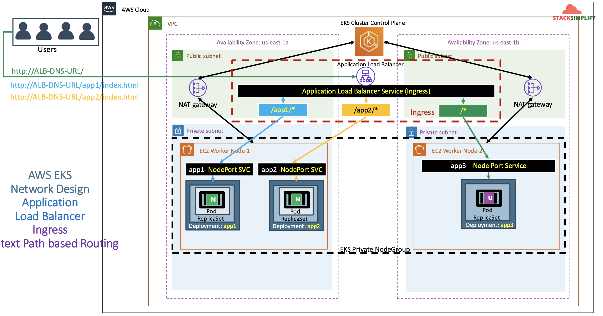
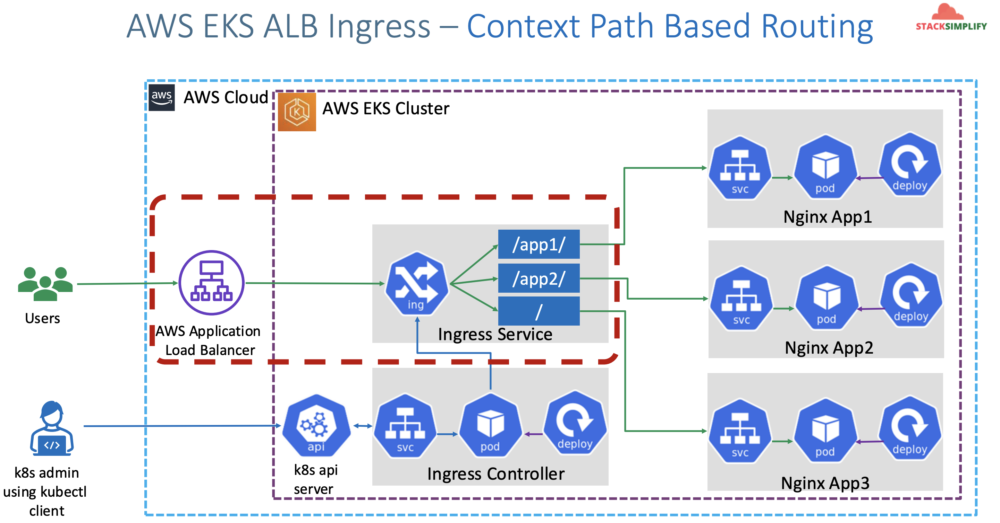

# ALB Ingress - Context Path Routing using AWS Application Load Balancer

## 101. Introduction to Ingress Context Path Based Routing

We are going to deploy 3 apps

- `/app1/*`: will go to the `app1` pod
- `/app2/*`: will go to the `app2` pod
- `/*`: will go to the `app3` pod if the above two don't match



The image below demonstrates how our AWS Application Load Balancer Controller works with our apps:

- Note that the ALB and the ingress are not different objects. The ALB does not proxy to the ingress as the ALB and ingress are one and the same.
  - From the AWS Cloud's perspective, it is an ALB
  - From the AWS EKS Cluster, it is an Ingress



## 102. Review Kubernetes Deployment and NodePort Service manifest for App 1-3

- We are going to deploy all these 3 apps in kubernetes with context path based routing enabled in Ingress Controller
  - `/app1/*` - should go to app1-nginx-nodeport-service
  - `/app2/*` - should go to app1-nginx-nodeport-service
  - `/*` - should go to app3-nginx-nodeport-service
- As part of this process, this respective annotation alb.ingress.kubernetes.io/healthcheck-path: will be moved to respective application NodePort Service.
- Only generic settings will be present in Ingress manifest annotations area

### Review Nginx App1, App2 & App3 Deployment & Service

- Differences for all 3 apps will be only two fields from kubernetes manifests perspective and their naming conventions
  - **Kubernetes Deployment:** Container Image name
  - **Kubernetes Node Port Service:** Health check URL path
- **App1 Nginx: 01-Nginx-App1-Deployment-and-NodePortService.yml**
  - **image:** `stacksimplify/kube-nginxapp1:1.0.0`
  - **Annotation:** `alb.ingress.kubernetes.io/healthcheck-path: /app1/index.html`
- **App2 Nginx: 02-Nginx-App2-Deployment-and-NodePortService.yml**
  - **image:** `stacksimplify/kube-nginxapp2:1.0.0`
  - **Annotation:** `alb.ingress.kubernetes.io/healthcheck-path: /app2/index.html`
- **App3 Nginx: 03-Nginx-App3-Deployment-and-NodePortService.yml**
  - **image:** `stacksimplify/kubenginx:1.0.0`
  - **Annotation:** `alb.ingress.kubernetes.io/healthcheck-path: /index.html`

Sample for `app1`:

```yaml
apiVersion: apps/v1
kind: Deployment
metadata:
  name: app1-nginx-deployment
  labels:
    app: app1-nginx
spec:
  replicas: 1
  selector:
    matchLabels:
      app: app1-nginx
  template:
    metadata:
      labels:
        app: app1-nginx
    spec:
      containers:
        - name: app1-nginx
          image: stacksimplify/kube-nginxapp1:1.0.0
          ports:
            - containerPort: 80
---
apiVersion: v1
kind: Service
metadata:
  name: app1-nginx-nodeport-service
  labels:
    app: app1-nginx
  annotations:
    # Need to add health check path annotations in service level if we are planning to use multiple targets in a load balancer
    alb.ingress.kubernetes.io/healthcheck-path: /app1/index.html
spec:
  type: NodePort
  selector:
    app: app1-nginx
  ports:
    - port: 80
      targetPort: 80
```

## 103. Review Ingress CPR, Deploy and Verify

Create a `04-alb-ingress-context-path.yaml`:

```yaml
# Annotations Reference: https://kubernetes-sigs.github.io/aws-load-balancer-controller/latest/guide/ingress/annotations/
apiVersion: networking.k8s.io/v1
kind: Ingress
metadata:
  name: ingress-cpr-demo
  labels:
    app: app1-nginx
  annotations:
    alb.ingress.kubernetes.io/load-balancer-name: cpr-ingress
    # Ingress Core
    alb.ingress.kubernetes.io/scheme: internet-facing
    # Health Check Settings
    # If you have multiple targets in the ingress, move this health check to the NodePort service
    alb.ingress.kubernetes.io/healthcheck-protocol: HTTP
    alb.ingress.kubernetes.io/healthcheck-port: traffic-port
    alb.ingress.kubernetes.io/healthcheck-interval-seconds: "15"
    alb.ingress.kubernetes.io/healthcheck-timeout-seconds: "5"
    alb.ingress.kubernetes.io/success-codes: "200"
    alb.ingress.kubernetes.io/healthy-threshold-count: "2"
    alb.ingress.kubernetes.io/unhealthy-threshold-count: "2"
spec:
  ingressClassName: my-aws-ingress-class # Ingress class
  rules:
    - http:
        paths:
          - path: /app1
            pathType: Prefix
            backend:
              service:
                name: app1-nginx-nodeport-service
                port:
                  number: 80
          - path: /app2
            pathType: Prefix
            backend:
              service:
                name: app2-nginx-nodeport-service
                port:
                  number: 80
          - path: /
            pathType: Prefix
            backend:
              service:
                name: app3-nginx-nodeport-service
                port:
                  number: 80
```

Deploy all manifests and test:

```shell
# Deploy Kubernetes manifests
kubectl apply -f 102-context-path/

# List Pods
kubectl get pods

# List Services
kubectl get svc

# List Ingress Load Balancers
kubectl get ingress

# Describe Ingress and view Rules
kubectl describe ingress ingress-cpr-demo

# Verify AWS Load Balancer Controller logs
kubectl -n kube-system get pods
kubectl -n kube-system logs -f aws-load-balancer-controller-794b7844dd-8hk7n

# check logs to verify health checker
kubectl get pods
kubectl logs -f pod/app1-nginx-deployment-85d474cfdc-gtp8w
```

Verify Application Load Balancer on AWS Management Console:

- Verify Load Balancer
  - In Listeners Tab, click on **View/Edit Rules** under Rules
- Verify Target Groups
  - GroupD Details
  - Targets: Ensure they are healthy
  - Verify Health check path
  - Verify all 3 targets are healthy)

```t
# Access Application
http://<ALB-DNS-URL>/app1/index.html
http://<ALB-DNS-URL>/app2/index.html
http://<ALB-DNS-URL>/
```

## 104. Discuss Ingress Importance of Rules ordering

Move Root Context Path to top:

```yaml
ingressClassName: my-aws-ingress-class # Ingress Class
rules:
  - http:
      paths:
        - path: /
          pathType: Prefix
          backend:
            service:
              name: app3-nginx-nodeport-service
              port:
                number: 80
        - path: /app1
          pathType: Prefix
          backend:
            service:
              name: app1-nginx-nodeport-service
              port:
                number: 80
        - path: /app2
          pathType: Prefix
          backend:
            service:
              name: app2-nginx-nodeport-service
              port:
                number: 80
```

Deploy Changes and Verify

```shell
# Deploy Changes
kubectl apply -f kube-manifests/

# Access Application (Open in new incognito window)
# http://<ALB-DNS-URL>/app1/index.html  -- SHOULD FAIL
# http://<ALB-DNS-URL>/app2/index.html  -- SHOULD FAIL
# http://<ALB-DNS-URL>/  - SHOULD PASS
```

> Note:  
> **Multiple matches** - In some cases, multiple paths within an Ingress will match a request. In those cases precedence will be given first to the longest matching path. If two paths are still equally matched, precedence will be given to paths with an exact path type over prefix path type.

Roll back changes:

```yaml
spec:
  ingressClassName: my-aws-ingress-class # Ingress Class
  rules:
    - http:
        paths:
          - path: /app1
            pathType: Prefix
            backend:
              service:
                name: app1-nginx-nodeport-service
                port:
                  number: 80
          - path: /app2
            pathType: Prefix
            backend:
              service:
                name: app2-nginx-nodeport-service
                port:
                  number: 80
          - path: / # we can comment out this section and move it to the defaultBackend. it will work the same.
            pathType: Prefix
            backend:
              service:
                name: app3-nginx-nodeport-service
                port:
                  number: 80
```

Clean Up:

```shell
# Clean-Up
kubectl delete -f 102-context-path/
```
