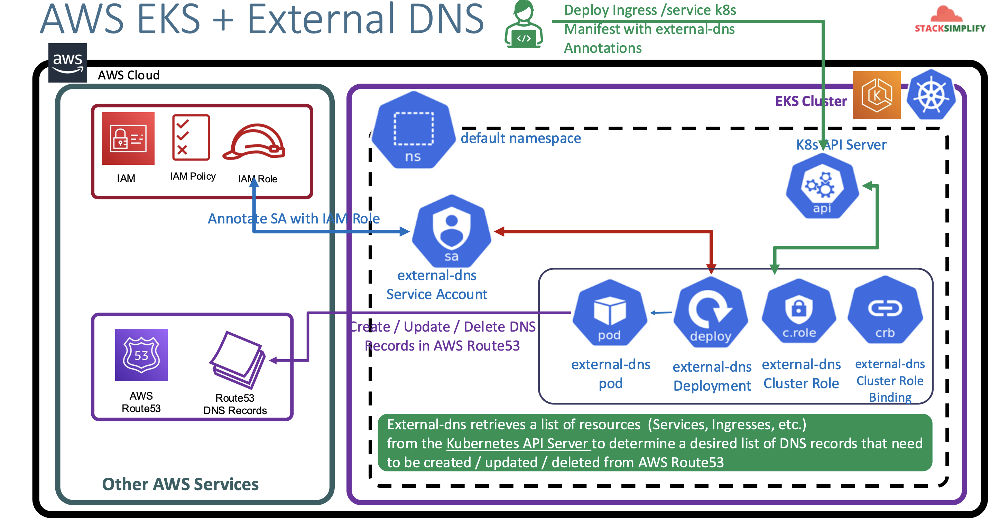

# ALB Ingress - External DNS Install and Implement Ingress & Servic

## 110. Introduction to ALB Ingress External DNS Install

- In previous SSL demos, we added AWS Route53 DNS Records **manually** (ssldemo101.timothykarani.com)
- With External DNS, we can **automatically** add it for a k8s `Ingress` Service or k8s `Service` by defining it as an annotation
- **External DNS**: Used for updating Route53 RecordSets from k8s
- We need to create an IAM Policy, k8s service account, & IAM Role and associate them together for external-dns pod to add or remove entries in AWS Route53 Hosted Zones
- Update External-DNS default manifest to support our needs
- Deploy & Verify logs



## 111. Create IAM Policy, k8s Service Account, IAM Role and Verify

This IAM Policy will allow external-dns pod to add, remove DNS entries (Record Sets in a Hosted Zone) in AWS Route53 service

- Go to Services -> Security, Identity, & Compliance -> IAM -> Policies -> Create Policy
  - Click on **JSON** Tab and copy paste below JSON
  - Click on **Visual editor** tab to validate
  - Click on **Review Policy**
  - **Name:** `AllowExternalDNSUpdates`
  - **Description:** Allow access to Route53 Resources for ExternalDNS
  - Click on **Create Policy**
  - https://github.com/kubernetes-sigs/external-dns/blob/master/docs/tutorials/aws.md#iam-policy

```json
{
  "Version": "2012-10-17",
  "Statement": [
    {
      "Effect": "Allow",
      "Action": [
        "route53:ChangeResourceRecordSets",
        "route53:ListResourceRecordSets",
        "route53:ListTagsForResources"
      ],
      "Resource": ["arn:aws:route53:::hostedzone/*"]
    },
    {
      "Effect": "Allow",
      "Action": ["route53:ListHostedZones"],
      "Resource": ["*"]
    }
  ]
}
```

Make a note of Policy ARN which we will use in next step:

```
# Policy ARN
arn:aws:iam::662513131574:policy/AllowExternalDNSUpdates
```

### Create IAM Role, k8s Service Account & Associate IAM Policy

- We are going to create a k8s service account named `external-dns` an also a AWS IAM role and associate them by annotating the role ARN in Service Account..
- We are also going to associate the AWS IAM Policy `AllowExternalDNSUpdates` to the newly created AWS IAM Role

Create IAM Role, k8s service account & associate IAM Policy

```shell
# Template
eksctl create iamserviceaccount \
              --name service_account_name \
              --namespace service_account_namespace \
              --cluster cluster-name \
              --attach-policy-arn IAM_policy_ARN \
              --approve \
              --override-existing-serviceaccounts

# Replace name, namespace, cluster, IAM Policy arn
eksctl create iamserviceaccount \
              --name external-dns \
              --namespace default \
              --cluster eksdemo1 \
              --attach-policy-arn arn:aws:iam::662513131574:policy/AllowExternalDNSUpdates \
              --approve \
              --override-existing-serviceaccounts
```

Verify the Service Account:

```shell
# list service account
kubectl get sa external-dns

# describe service account
kubectl describe sa external-dns
# Observation:
# 1. Verify the Annotations and you should see the IAM Role is present on the Service Account
# take note of the role-arn
```

Create a pod identity association.

- Prerequisites:
  - Open the `eksdemo` cluster
  - Ensure you have added the `EKS Pod Identity Agent` addon to the cluster

```shell
# template
eksctl create podidentityassociation \
  --cluster <cluster-name> \
  --namespace <service_account_namespace> \
  --service-account-name external-dns \
  --role-name external-dns-pod-identity-role \
  --permission-policy-arns <policy-arn> \
  --approve

# replace cluster name, namespace, service acc and role-arn
# use the role arn from previous step
eksctl create podidentityassociation \
              --cluster eksdemo1 \
              --namespace default \
              --service-account-name external-dns \
              --role-name external-dns-pod-identity-role \
              --permission-policy-arns arn:aws:iam::662513131574:role/eksctl-eksdemo1-addon-iamserviceaccount-defau-Role1-xTATHb1SJZns
```

If not comfortable using CLI, you can use AWS Management Console

- Open IAM -> Roles -> Create
  - Select trusted entity
    - Trusted Entity Type: AWS Service
    - Service or Use Case: EKS
    - Use Case: EKS Pod Identity
  - Add Permissions:
    - Select: `AllowExternalDNSUpdates`
  - Review & Create:
    - Name: `AWSEKSPodIdentityExternalDns`
    - Click create
- Open EKS -> `eksdemo1` -> Access Tab -> Pod Identity Associations -> Create Pod Identity Association
  - IAM Role: `AWSPodIdentityExternalDns`
  - Namespace: `default`
  - Kubernetes Service Account: `external-dns`

Verify CloudFormation Stack

- Go to Services -> Management & Governance -> CloudFormation
- Verify the latest CFN Stack created
- Click on **Resources** tab
- Click on link in **Physical ID** field which will take us to the **IAM Role** directly

Verify IAM Role & IAM Policy

- Once in the **IAM Role**, verify in **Permissions** tab we have a policy names `AllowExternalDNSUpdates`
- Now make a note of that role ARN, we'll need to update the `external-dns` k8s manifest

```shell
# make a note of role arn
arn:aws:iam::662513131574:role/eksctl-eksdemo1-addon-iamserviceaccount-defau-Role1-xTATHb1SJZns
```

Verify IAM Service Accounts using `eksctl`:

- You can also make a note of `External DNS Role ARN` from here too.

```shell
# list IAM service accounts using eksctl
ekscluter get iamserviceaccount --cluster eksdemo1

NAMESPACE       NAME                            ROLE ARN
default         external-dns                    arn:aws:iam::662513131574:role/eksctl-eksdemo1-addon-iamserviceaccount-defau-Role1-xTATHb1SJZns
kube-system     aws-load-balancer-controller    arn:aws:iam::662513131574:role/eksctl-eksdemo1-addon-iamserviceaccount-kube--Role1-W8uBn8azq18c
```

## 112. Review and Update External DNS k8s manifest

Update External DNS k8s manifest `01-deploy-external-dns.yaml`:

- Original template: https://github.com/kubernetes-sigs/external-dns/blob/master/docs/tutorials/aws.md
- Releases: https://github.com/kubernetes-sigs/external-dns/releases

```yaml
apiVersion: v1
kind: ServiceAccount
metadata:
  name: external-dns
  # If you are using Amazon EKS with IAM Roles for Service Accounts, specify the following annotation
  # Otherwise, you may safely omit it
  annotations:
    # Substitute your account ID and IAM service role name below.
    # Change-1: Replace with your IAM Role for extern-dns
    eks.amazonaws.com/role-arn: arn:aws:iam::662513131574:role/eksctl-eksdemo1-addon-iamserviceaccount-defau-Role1-xTATHb1SJZns
---
apiVersion: rbac.authorization.k8s.io/v1
kind: ClusterRole
metadata:
  name: external-dns
rules:
  - apiGroups: [""]
    resources: ["services", "endpoints", "pods"]
    verbs: ["get", "watch", "list"]
  - apiGroups: ["extensions", "networking.k8s.io"]
    resources: ["ingresses"]
    verbs: ["get", "watch", "list"]
  - apiGroups: [""]
    resources: ["nodes"]
    verbs: ["list", "watch"]
---
apiVersion: rbac.authorization.k8s.io/v1
kind: ClusterRoleBinding
metadata:
  name: external-dns-viewer
roleRef:
  apiGroup: rbac.authorization.k8s.io
  kind: ClusterRole
  name: external-dns
subjects:
  - kind: ServiceAccount
    name: external-dns
    namespace: default
---
apiVersion: apps/v1
kind: Deployment
metadata:
  name: external-dns
spec:
  strategy:
    type: Recreate
  selector:
    matchLabels:
      app: external-dns
  template:
    metadata:
      labels:
        app: external-dns
    # If you are using kiam or kube2iam, specify the following annotation
    # Otherwise, you may safely omit it. # Change 2; commeted the next two lines
    # annotations:
    # iam.amazonaws.com/role: arn:aws:iam::ACCOUNT-ID:role/IAM-SERVICE-ROLE-NAME
    spec:
      serviceAccountName: external-dns
      containers:
        - name: external-dns
          image: registry.k8s.io/external-dns/external-dns:v0.20.0 # get the latest release
          args:
            - --source=service
            - --source=ingress
            # - --domain-filter=example.com # will make ExternalDNS see only the hosted zones matching provided domain, omit to process all available hosted zones
            - --provider=aws
            # - --policy=upsert-only # would prevent ExternalDNS from deleting any records, omit to enable full synchronization
            - --aws-zone-type=public # only look at public hosted zones (valid values are public, private or no value for both)
            - --registry=txt
            - --txt-owner-id=my-hostedzone-identifier
          env:
            - name: AWS_DEFAULT_REGION
              value: us-east-1 # change to region where EKS is installed
```

## 113. Deploy External DNS and Verify Logs

Deploy the manifest:

```shell
kubectl apply -f 111-external-dns

# list all resources from default namespace
kbuectl get all

# list pods (external-dns pod should be in running state)
kubectl get pods

# verify deployment by checking logs
kubectl logs -f $(kubectl get po | egrep -o 'external-dns[A-Za-z0-9-]+')
```

References

- https://kubernetes-sigs.github.io/external-dns/latest/docs/tutorials/aws-load-balancer-controller/
- https://github.com/kubernetes-sigs/external-dns/blob/master/docs/tutorials/aws.md
