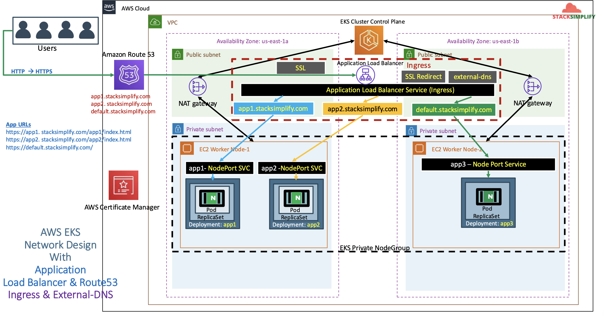

# ALB Ingress - Name based Virtual Host / Host Header Routing

## 116. Introduction to Ingress Name Based Virtual Host Routing

We are going to use our three applications (app1, app2, app3)

- In the ignress, we are going to define rules with Host Header routing (`app1.timothykarani.com`, `app2.timothykarani.com`, `default.timothykarani.com`)



## 117. Implement Ingress NVR Demo

Copy over the manifests from `14-alb-ingress-ssl/108-ssl-redirect`:

```
01-app1-deployment-nodeport.yaml
02-app2-deployment-nodeport.yaml
03-app3-deployment-nodeport.yaml
04-alb-ingress-context-path.yaml
```

Update `04-alb-ingress.yaml`:

```yaml
# Annotations Reference: https://kubernetes-sigs.github.io/aws-load-balancer-controller/latest/guide/ingress/annotations/
apiVersion: networking.k8s.io/v1
kind: Ingress
metadata:
  name: ingress-namebasedvhost-demo
  labels:
    app: ingress-namebasedvhost-demo
  annotations:
    alb.ingress.kubernetes.io/load-balancer-name: namebasedvhost-ingress
    # Ingress Core
    alb.ingress.kubernetes.io/scheme: internet-facing
    # Health Check Settings
    # If you have multiple targets in the ingress, move this health check to the NodePort service
    alb.ingress.kubernetes.io/healthcheck-protocol: HTTP
    alb.ingress.kubernetes.io/healthcheck-port: traffic-port
    alb.ingress.kubernetes.io/healthcheck-interval-seconds: "15"
    alb.ingress.kubernetes.io/healthcheck-timeout-seconds: "5"
    alb.ingress.kubernetes.io/success-codes: "200"
    alb.ingress.kubernetes.io/healthy-threshold-count: "2"
    alb.ingress.kubernetes.io/unhealthy-threshold-count: "2"
    ## SSL Settings
    alb.ingress.kubernetes.io/listen-ports: '[{"HTTPS":443}, {"HTTP":80}]'
    alb.ingress.kubernetes.io/certificate-arn: arn:aws:acm:us-east-1:662513131574:certificate/ba79d928-9650-49a8-acc5-6d7d5f1840f6
    #alb.ingress.kubernetes.io/ssl-policy: ELBSecurityPolicy-TLS-1-1-2017-01 #Optional (Picks default if not used)
    # SSL Redirect Setting
    alb.ingress.kubernetes.io/ssl-redirect: "443"
    # External DNS - For creating a Record Set in Route53
    external-dns.alpha.kubernetes.io/hostname: default101.timothykarani.com
spec:
  ingressClassName: my-aws-ingress-class # Ingress class
  defaultBackend:
    service:
      name: app3-nginx-nodeport-service
      port:
        number: 80
  rules:
    - host: app101.timothykarani.com
      http:
        paths:
          - path: /app1
            pathType: Prefix
            backend:
              service:
                name: app1-nginx-nodeport-service
                port:
                  number: 80
    - host: app201.timothykarani.com
      http:
        paths:
          - path: /app2
            pathType: Prefix
            backend:
              service:
                name: app2-nginx-nodeport-service
                port:
                  number: 80
```

Deploy manifests:

```shell
kubectl apply -f 117-ingress-nvr

# verify ingress resource
kubectl get ingress

# verify apps
kubectl get deploy
kubectl get pods

# verify nodeport services
kubectl get svc
```

Verify Load Balancer & Target Groups

- Load Balancer - Listeneres (Verify both 80 & 443)
- Load Balancer - Rules (Verify both 80 & 443 listeners)
- Target Groups - Group Details (Verify Health check path)
- Target Groups - Targets (Verify all 3 targets are healthy)

Verify External DNS Log

```shell
# Verify External DNS logs
kubectl logs -f $(kubectl get po | egrep -o 'external-dns[A-Za-z0-9-]+')
```

Verify Route53

- Go to Services -> Route53
- You should see **Record Sets** added for
  - default101.timothykarani.com
  - app101.timothykarani.com
  - app201.timothykarani.com

Perform nslookup tests before accessing Application

- Test if our new DNS entries registered and resolving to an IP Address

```shell
# nslookup commands
nslookup default101.timothykarani.com
nslookup app101.timothykarani.com
nslookup app201.timothykarani.com
```

Positive Case: Access Application using DNS domain:

```shell
# Access App1
http://app101.timothykarani.com/app1/index.html

# Access App2
http://app201.timothykarani.com/app2/index.html

# Access Default App (App3)
http://default101.timothykarani.com
```

Negative Case: Access Application using DNS domain:

```shell
# Access App2 using App1 DNS Domain
http://app101.timothykarani.com/app2/index.html  -- SHOULD FAIL

# Access App1 using App2 DNS Domain
http://app201.timothykarani.com/app1/index.html  -- SHOULD FAIL

# Access App1 and App2 using Default Domain
http://default101.timothykarani.com/app1/index.html -- SHOULD FAIL
http://default101.timothykarani.com/app2/index.html -- SHOULD FAIL
```

Clean Up:

```shell
# Delete Manifests
kubectl delete -f kube-manifests/
```

Verify Route53 Record Set to ensure our DNS records got deleted

- Go to Route53 -> Hosted Zones -> Records
- The below records should be deleted automatically
  - default101.timothykarani.com
  - app101.timothykarani.com
  - app201.timothykarani.com
