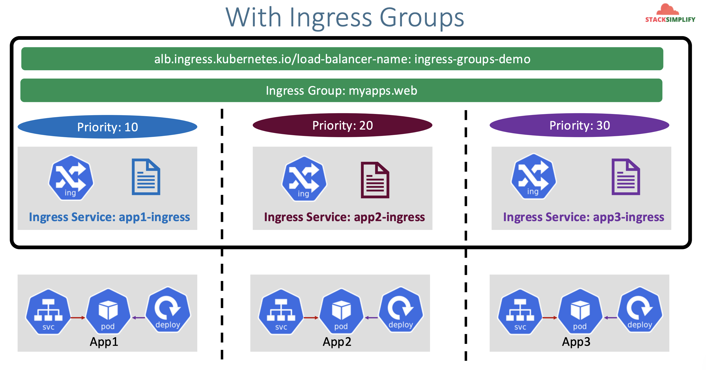

# ALB Ingress - Ingress Groups

## 121. Introduction to Ingress Groups

Without Ingress Groups

- We would have to use a single Ingress resource for all our apps, so as to have them share a single Load Balancer
- Any changes to any of the apps means we have to update the Ingress, which would mean that all apps would be updated
- Example, if we have **50 apps** which ned different rules in them, and all should be part of a **single ALB**, maintaining such huge k8s manifest files with configs becomes **tedious** and **confusing**

With Ingress Groups

- We can simplify our k8s Ingress Manifest when dealing with **multiple apps** requiring a single ALB.
- Each app will have its own dedicated ingress manifest file.
- The three ingress files, in our example, would have an `ingress group` annotation, so that they can share a single ALB.
- We can also assign priorities like `priority: 10`, `priority: 20`, `priority: 30` to maintain some sort of order-based rules across the files (in terms of how ALBC translates the manifests to the NLB/ALB target group rules.)



Ingress groups:

- Enables you to group multiple Ingress resources **together**.
- The controller will automatically **merge Ingress rules** for all ingresses within `IngressGroup` and support them with a `single ALB`
- In addition, most annotations defined on an Ingress only **applies to the paths defined by that ingress**

Sample:

```yaml
alb.ingress.kubernetes.io/group.name: myapps.web
alb.ingress.kubernetes.io/group.order: "10"
```

## 122. Implement Ingress Groups Demo with 3 Apps

Copy over manifests from `17-alb-ingress-ssl-discovery-host/120-ssl-tls`:

```
01-app1-deployment-nodeport.yaml
02-app2-deployment-nodeport.yaml
03-app3-deployment-nodeport.yaml
04-alb-ingress.yaml
```

Structure them as follows:

```
app1/01-app1-deployment-nodeport.yaml
app1/02-alb-ingress.yaml

app2/01-app2-deployment-nodeport.yaml
app2/02-alb-ingress.yaml

app3/01-app3-deployment-nodeport.yaml
app3/02-alb-ingress.yaml
```

Update `app1/02-alb-ingress.yaml` to:

```yaml
# Annotations Reference: https://kubernetes-sigs.github.io/aws-load-balancer-controller/latest/guide/ingress/annotations/
apiVersion: networking.k8s.io/v1
kind: Ingress
metadata:
  name: app1-ingress
  annotations:
    alb.ingress.kubernetes.io/load-balancer-name: ingress-groups-demo
    # Ingress Core
    alb.ingress.kubernetes.io/scheme: internet-facing
    # Health Check Settings
    # If you have multiple targets in the ingress, move this health check to the NodePort service
    alb.ingress.kubernetes.io/healthcheck-protocol: HTTP
    alb.ingress.kubernetes.io/healthcheck-port: traffic-port
    alb.ingress.kubernetes.io/healthcheck-interval-seconds: "15"
    alb.ingress.kubernetes.io/healthcheck-timeout-seconds: "5"
    alb.ingress.kubernetes.io/success-codes: "200"
    alb.ingress.kubernetes.io/healthy-threshold-count: "2"
    alb.ingress.kubernetes.io/unhealthy-threshold-count: "2"
    ## SSL Settings
    alb.ingress.kubernetes.io/listen-ports: '[{"HTTPS":443}, {"HTTP":80}]'
    alb.ingress.kubernetes.io/certificate-arn: arn:aws:acm:us-east-1:662513131574:certificate/ba79d928-9650-49a8-acc5-6d7d5f1840f6
    #alb.ingress.kubernetes.io/ssl-policy: ELBSecurityPolicy-TLS-1-1-2017-01 #Optional (Picks default if not used)
    # SSL Redirect Setting
    alb.ingress.kubernetes.io/ssl-redirect: "443"
    # External DNS - For creating a Record Set in Route53
    external-dns.alpha.kubernetes.io/hostname: demo601.timothykarani.com
    # Ingress groups
    alb.ingress.kubernetes.io/group.name: myapps.web
    alb.ingress.kubernetes.io/group.order: "10"
spec:
  ingressClassName: my-aws-ingress-class # Ingress class
  rules:
    - http:
        paths:
          - path: /app1
            pathType: Prefix
            backend:
              service:
                name: app1-nginx-nodeport-service
                port:
                  number: 80
```

Update `app2/02-alb-ingress.yaml` to:

```yaml
# Annotations Reference: https://kubernetes-sigs.github.io/aws-load-balancer-controller/latest/guide/ingress/annotations/
apiVersion: networking.k8s.io/v1
kind: Ingress
metadata:
  name: app2-ingress
  annotations:
    alb.ingress.kubernetes.io/load-balancer-name: ingress-groups-demo
    # Ingress Core
    alb.ingress.kubernetes.io/scheme: internet-facing
    # Health Check Settings
    # If you have multiple targets in the ingress, move this health check to the NodePort service
    alb.ingress.kubernetes.io/healthcheck-protocol: HTTP
    alb.ingress.kubernetes.io/healthcheck-port: traffic-port
    alb.ingress.kubernetes.io/healthcheck-interval-seconds: "15"
    alb.ingress.kubernetes.io/healthcheck-timeout-seconds: "5"
    alb.ingress.kubernetes.io/success-codes: "200"
    alb.ingress.kubernetes.io/healthy-threshold-count: "2"
    alb.ingress.kubernetes.io/unhealthy-threshold-count: "2"
    ## SSL Settings
    alb.ingress.kubernetes.io/listen-ports: '[{"HTTPS":443}, {"HTTP":80}]'
    alb.ingress.kubernetes.io/certificate-arn: arn:aws:acm:us-east-1:662513131574:certificate/ba79d928-9650-49a8-acc5-6d7d5f1840f6
    #alb.ingress.kubernetes.io/ssl-policy: ELBSecurityPolicy-TLS-1-1-2017-01 #Optional (Picks default if not used)
    # SSL Redirect Setting
    alb.ingress.kubernetes.io/ssl-redirect: "443"
    # External DNS - For creating a Record Set in Route53
    external-dns.alpha.kubernetes.io/hostname: demo601.timothykarani.com
    # Ingress groups
    alb.ingress.kubernetes.io/group.name: myapps.web
    alb.ingress.kubernetes.io/group.order: "20"
spec:
  ingressClassName: my-aws-ingress-class # Ingress class
  rules:
    - http:
        paths:
          - path: /app2
            pathType: Prefix
            backend:
              service:
                name: app2-nginx-nodeport-service
                port:
                  number: 80
```

Update `app3/02-alb-ingress.yaml` to:

```yaml
# Annotations Reference: https://kubernetes-sigs.github.io/aws-load-balancer-controller/latest/guide/ingress/annotations/
apiVersion: networking.k8s.io/v1
kind: Ingress
metadata:
  name: app3-ingress
  annotations:
    alb.ingress.kubernetes.io/load-balancer-name: ingress-groups-demo
    # Ingress Core
    alb.ingress.kubernetes.io/scheme: internet-facing
    # Health Check Settings
    # If you have multiple targets in the ingress, move this health check to the NodePort service
    alb.ingress.kubernetes.io/healthcheck-protocol: HTTP
    alb.ingress.kubernetes.io/healthcheck-port: traffic-port
    alb.ingress.kubernetes.io/healthcheck-interval-seconds: "15"
    alb.ingress.kubernetes.io/healthcheck-timeout-seconds: "5"
    alb.ingress.kubernetes.io/success-codes: "200"
    alb.ingress.kubernetes.io/healthy-threshold-count: "2"
    alb.ingress.kubernetes.io/unhealthy-threshold-count: "2"
    ## SSL Settings
    alb.ingress.kubernetes.io/listen-ports: '[{"HTTPS":443}, {"HTTP":80}]'
    alb.ingress.kubernetes.io/certificate-arn: arn:aws:acm:us-east-1:662513131574:certificate/ba79d928-9650-49a8-acc5-6d7d5f1840f6
    #alb.ingress.kubernetes.io/ssl-policy: ELBSecurityPolicy-TLS-1-1-2017-01 #Optional (Picks default if not used)
    # SSL Redirect Setting
    alb.ingress.kubernetes.io/ssl-redirect: "443"
    # External DNS - For creating a Record Set in Route53
    external-dns.alpha.kubernetes.io/hostname: demo601.timothykarani.com
    # Ingress groups
    alb.ingress.kubernetes.io/group.name: myapps.web
    alb.ingress.kubernetes.io/group.order: "30"
spec:
  ingressClassName: my-aws-ingress-class # Ingress class
  defaultBackend:
    service:
      name: app3-nginx-nodeport-service
      port:
        number: 80
```

Deploy Apps with two Ingress Resources

```shell
# Deploy both Apps
kubectl apply -R -f 122-ingress-groups

# Verify Pods
kubectl get pods

# Verify Ingress
kubectl  get ingress
# Observation:
# 1. Three Ingress resources will be created with same ADDRESS value
# 2. Three Ingress Resources are merged to a single Application Load Balancer as those belong to same Ingress group "myapps.web"
```

Verify on AWS Mgmt Console:

- Go to Services -> EC2 -> Load Balancers
- Verify Routing Rules for `/app1` and `/app2` and `default backend`

Verify by accessing in browser:

- http://demo601.timothykarani.com/app1/index.html
- http://demo601.timothykarani.com/app2/index.html
- http://demo601.timothykarani.com

Clean-Up:

```shell
# Delete Apps from k8s cluster
kubectl delete -R -f 122-ingress-groups
```

Verify Route53 Record Set to ensure our DNS records got deleted

- Go to Route53 -> Hosted Zones -> Records
- The below records should be deleted automatically
  - demo601.timothykarani.com
