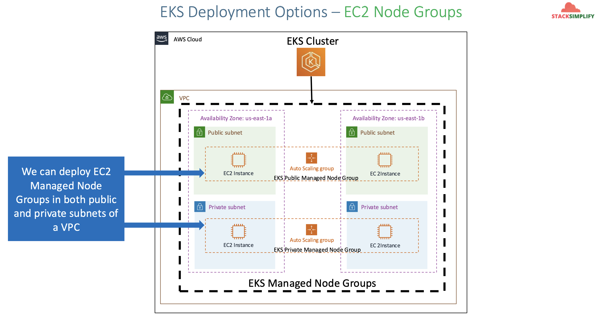
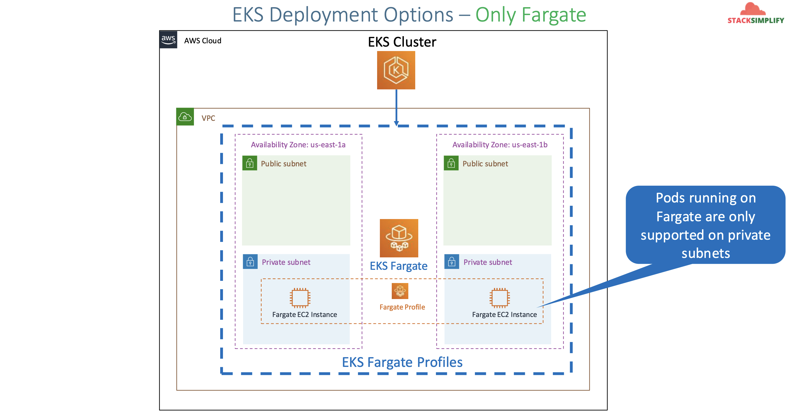
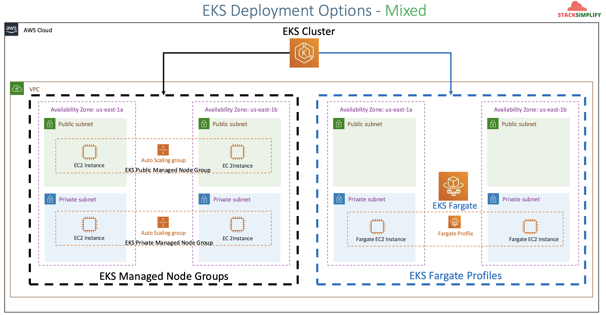
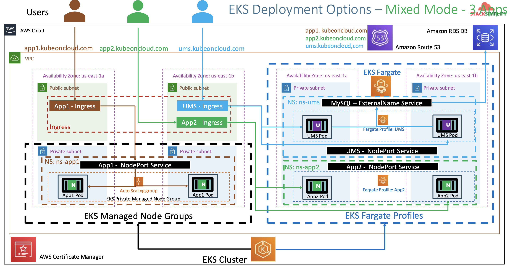
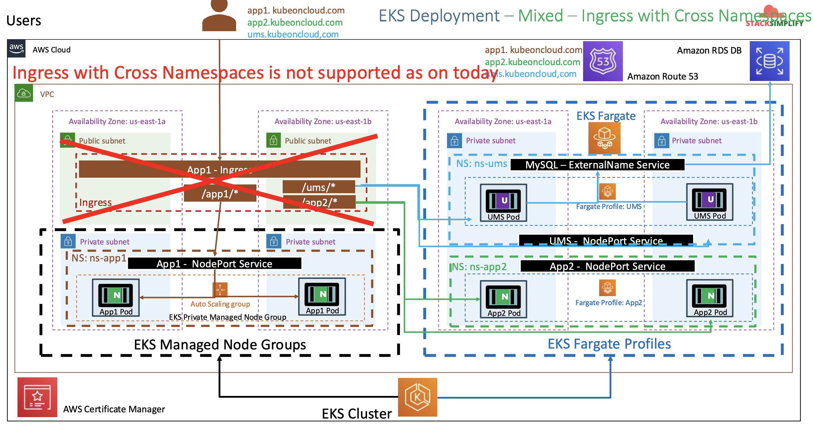

# EKS Fargate - Serverless

## 128. EKS & Fargate Introduction

What is fargate?

- It is a **Serverless compute platform** for containers on AWS
- Provides **on-demand, right-sized compute capacity** for containers.
- EKS integrates k8s with Fargate by using **controllers** that are built by AWS using the **upstream, extensible model** provided by k8s
- These controllers run as part of the **EKS managed k8s control plane** and are responsible for **scheduling** native k8s pods onto Fargate.
- The **Fargate Controllers** include a **new scheduler** that runes alongside the **default k8s scheduler** in addition to several mutating and validating admission controllers.
- When we start a pod that **mets the criteria for runnin on Fargate**, the Fargate controllers runnin the the cluster recognize, update, and **schedule the pod onto Fargate**

AWS EKS on Fargate:

- Bring existing pods
  - We can bring existing pods and deploy to Fargate without any hassle
  - We don't need to change our existing pods
  - Fargate works with **existing workflows and services** that run on k8s.
- Production ready
  - Launch pods **easily**
  - Easily run pods across **AZs for High Availability**
  - Each pod runs in an **isolated compute environment**
- Rightsized and Integrated
  - **Only pay** for resources you need to run your pods
  - Includes \*\*native AWS integrations for networking and security

EKS Depoyment Options:

- Only EC2 Node Groups
  - Managed EC2 Nodes
  - Unmanaged EC2 Nodes
- Mixed
  - Managed Nodes
  - Unmanaged Nodes
  - Fargate Nodes
- Only Fargate
  - Fargate Nodes

Only EC2 Node Groups:


Only Fargate:


Mixed:


EKS Fargate vs Managed vs Unmanaged Nodes

|                | Fargate                  | Managed Nodes        | Unmanaged Nodes |
| :------------- | :----------------------- | :------------------- | :-------------- |
| Unit of work   | Pod                      | Pod and EC2          | Pod and EC2     |
| Unit of charge | Pod                      | EC2                  | EC2             |
| Host lifecycle | There is no visible host | AWS (SSH is allowed) | Customer        |
| Host AMI       | There is no visible host | AWS vetted AMIs      | Customer BYO    |
| Host : Pods    | 1:1                      | 1:many               | 1:many          |

EKS Fargate Considerations

- [Before using Fargate, there are things to be aware of.](https://docs.aws.amazon.com/eks/latest/userguide/fargate.html)

## 129. Fargate Basics Introduction

### Pre-requisites

#### EKS Cluster

Create eks cluster and worker nodes (if not created):

```shell
# Create Cluster (Section-01-02)
eksctl create cluster --name=eksdemo1 \
                      --region=us-east-1 \
                      --zones=us-east-1a,us-east-1b \
                      --without-nodegroup


# Get List of clusters (Section-01-02)
eksctl get cluster

# Template (Section-01-02)
eksctl utils associate-iam-oidc-provider \
    --region region-code \
    --cluster <cluster-name> \
    --approve

# Replace with region & cluster name (Section-01-02)
eksctl utils associate-iam-oidc-provider \
    --region us-east-1 \
    --cluster eksdemo1 \
    --approve

# Create EKS NodeGroup in VPC Private Subnets (Section-07-01)
eksctl create nodegroup --cluster=eksdemo1 \
                        --region=us-east-1 \
                        --name=eksdemo1-ng-private1 \
                        --node-type=t3.medium \
                        --nodes-min=2 \
                        --nodes-max=4 \
                        --node-volume-size=20 \
                        --ssh-access \
                        --ssh-public-key=kube-demo \
                        --managed \
                        --asg-access \
                        --external-dns-access \
                        --full-ecr-access \
                        --appmesh-access \
                        --alb-ingress-access \
                        --node-private-networking
```

Verify cluster, node groups and configure `kubectl` cli if not configured:

```shell
# verify eks cluster
eksctl get cluster

# verify eks node groups
eksctl get nodegroup --cluster=eksdemo1

# verify if any IAM Service Accounts present in EKS Cluster
eksctl get iamserviceaccount --cluster=eksdemo1
# No iamserviceaccounts found

# configure kubeconfig for kubectl
eksctl get cluster # to get cluster name
aws eks --region <region-code> update-kubeconfig --name <cluster-name>
aws eks --region us-east-1 update-kubeconfig --name eksdemo1

# verify eks nodes in eks cluster using kubectl
kubectl get nodes

# verify using AWS Management Console
# 1. EKS EC2 Nodes (verify subnet in networking tab)
# 2. EKS Cluster
```

#### Application Load Balancer Controller

Create IAM policy for the AWS Load Balancer Controller that allows it to make calls to AWS APIs on your behalf:

- Only do this if you don't have the role, otherwise just copy the arn from the AWS Management Console

```shell
# delete files before download
rm iam_policy_latest.json

# download IAM latest Policy
curl -o iam_policy_latest.json https://raw.githubusercontent.com/kubernetes-sigs/aws-load-balancer-controller/refs/heads/main/docs/install/iam_policy.json

## Download specific version
curl -o iam_policy_v2.3.1.json https://raw.githubusercontent.com/kubernetes-sigs/aws-load-balancer-controller/v2.3.1/docs/install/iam_policy.json

# create IAM Policy using policy downloaded
aws iam create-policy \
        --policy-name AwsLoadBalancerControllerIAMPolicy \
        --policy-document file://iam_policy_latest.json

## Sample Output
$ aws iam create-policy \
>     --policy-name AWSLoadBalancerControllerIAMPolicy \
>     --policy-document file://iam_policy_latest.json
{
    "Policy": {
        "PolicyName": "AwsLoadBalancerControllerIAMPolicy",
        "PolicyId": "ANPAZUQG4EA3KOGZJO2XV",
        "Arn": "arn:aws:iam::662513131574:policy/AwsLoadBalancerControllerIAMPolicy",
        "Path": "/",
        "DefaultVersionId": "v1",
        "AttachmentCount": 0,
        "PermissionsBoundaryUsageCount": 0,
        "IsAttachable": true,
        "CreateDate": "2026-01-29T11:04:57+00:00",
        "UpdateDate": "2026-01-29T11:04:57+00:00"
    }
}
```

Create IAM Role using eksctl

```shell
# verify if there's any existing service account
kubectl get sa -n kube-system
kubectl get sa aws-load-balancer-controller -n kube-system
# Observation: nothing with name `aws-load-balancer-controller` should exist

# Template
eksctl create iamserviceaccount \
              --cluster=eksdemo1 \
              --namespace=kube-system \
              --name=aws-load-balancer-controller \
              --attach-policy-arn=arn:aws:iam::662513131574:policy/AwsLoadBalancerControllerIAMPolicy \
              --override-existing-serviceaccounts \
              --approve
```

Verify using `eksctl` cli:

```shell
# get IAM Service Account
eksctl get iamserviceaccount --cluster eksdemo1

# sample output
NAMESPACE       NAME                            ROLE ARN
kube-system     aws-load-balancer-controller    arn:aws:iam::662513131574:role/eksctl-eksdemo1-addon-iamserviceaccount-kube--Role1-W8uBn8azq18c
```

Verify k8s service account using `kubectl`:

```shell
# verify if any existing service account exists
kubectl get sa -n kube-system
kubectl get sa aws-load-balancer-controller -n kube-system
# observation: we should see a new service account created

kubectl describe sa aws-load-balancer-controller -n kube-system
```

Install AWS Load Balancer Controller using HELM:

```shell
# add the eks-charts repository
helm repo add eks https://aws.github.io/eks-charts

# update your local repo to make sure you have the most recent charts
helm repo update

# install the AWS Load Balancer Controller
helm install aws-load-balancer-controller eks/aws-load-balancer-controller \
             -n kube-system \
             --set clusterName=eksdemo1 \
             --set serviceAccount.create=false \
             --set serviceAccount.name=aws-load-balancer-controller \
             --set region=us-east-1 \
             --set vpcId=vpc-07eedc73f5d0b8b8c \
             --set image.repository=public.ecr.aws/eks/aws-load-balancer-controller
```

Verify that the controller is installed:

Run:

```shell
kubectl -n kube-system get deployment
kubectl -n kube-system get deployment aws-load-balancer-controller
kubectl -n kube-system describe deployment aws-load-balancer-controller
```

Sample Output:

```shell
$ kubectl get deployment -n kube-system aws-load-balancer-controller
NAME                           READY   UP-TO-DATE   AVAILABLE   AGE
aws-load-balancer-controller   2/2     2            2           27s
```

Verify AWS Load Balancer Controller Webhook service created:

```shell
kubectl -n kube-system get svc
kubectl -n kube-system get svc aws-load-balancer-webhook-service
kubectl -n kube-system describe svc aws-load-balancer-webhook-service
```

Sample output:

```shell
$ kubectl -n kube-system get svc aws-load-balancer-webhook-service
NAME                                TYPE        CLUSTER-IP     EXTERNAL-IP   PORT(S)   AGE
aws-load-balancer-webhook-service   ClusterIP   10.100.53.52   <none>        443/TCP   61m
```

Verify labels in service and selector labels in deployment:

```shell
kubectl -n kube-system get svc aws-load-balancer-webhook-service -o yaml
kubectl -n kube-system get deployment aws-load-balancer-controller -o yaml
```

#### External DNS

Update External DNS k8s manifest `130-1-helm/external-dns-values.yaml`:

- Original template: https://kubernetes-sigs.github.io/external-dns/latest/docs/tutorials/aws/#when-using-clusters-with-rbac-enabled
- External DNS: https://artifacthub.io/packages/helm/external-dns/external-dns

```yaml
provider:
  name: aws
serviceAccount:
  eks.amazonaws.com/role-arn: arn:aws:iam::662513131574:role/AWSPodIdentityExternalDns
policy: sync
env:
  - name: AWS_DEFAULT_REGION
    value: us-east-1 # change to region where EKS is installed
```

Deploy the manifest:

```shell
# install external-dns
helm repo add --force-update external-dns https://kubernetes-sigs.github.io/external-dns/
helm upgrade --install external-dns external-dns/external-dns --values 111-helm/external-dns-values.yaml

# list all resources from default namespace
kubectl get all

# list pods (external-dns pod should be in running state)
kubectl get pods

# verify deployment by checking logs
kubectl logs -f $(kubectl get po | egrep -o 'external-dns[A-Za-z0-9-]+')
```

Deploy the Ingress Class Resource:

We can have ingresses such as:

- AWS **EKS** ALB Ingress Controller
- **NGINX** Ingress Controller
- **AKS** Application Gateway Ingress Controller

```yaml
apiVersion: networking.k8s.io/v1
kind: IngressClass
metadata:
  name: my-aws-ingress-class
  annotations:
    ingressclass.kubernetes.io/is-default-class: "true"
spec:
  controller: ingress.k8s.aws/alb
```

Apply it:

```shell
kubectl apply -f 130-2-ingress-class
```

## 130. Create EKS Profile using eksctl & Review k8s manifests to be deployed

### Create Fargate Profile on cluster `eksdemo`

Create fargate profile

```shell
eksctl get fargateprofile --cluster eksdemo1

# Template
eksctl create fargateprofile --cluster <cluster_name> \
                             --name <fargate_profile_name> \
                             --namespace <kubernetes_namespace>

# Replace values
eksctl create fargateprofile --cluster eksdemo1 \
                             --name fp-demo \
                             --namespace fp-dev
```

Output:

```
[ℹ]  deploying stack "eksctl-eksdemo1-fargate"
[ℹ]  waiting for CloudFormation stack "eksctl-eksdemo1-fargate"
[ℹ]  waiting for CloudFormation stack "eksctl-eksdemo1-fargate"
[ℹ]  creating Fargate profile "fp-demo" on EKS cluster "eksdemo1"
[ℹ]  created Fargate profile "fp-demo" on EKS cluster "eksdemo1"
```

## 131. EKS Fargate - Deploy to Fargate & Test & Clean-Up

### Review Nginx `app1` and ingress manifests

- We are going to deploy a simple Nginx app1 with Ingress Load Balancer
- We cannot use Node ports for fargate pods for two reasons
  - Fargate pds are created in Private Subnets, so no access to internet
  - Fargate Pods are created on random worker nodes whose information is uknown to us to use NodePort service
  - But in our case, we are in mixed environment with Node Groups and Fargate, if we create a NodePort service, it will create the service with Node Group for an EC@ worker node, and it will work but when we delete those Node Groups, we will have an issue
  - Always recommended to use `alb.ingress.kubernetes.io/target-type: ip` in ingress manifest for Fargate workloads.

Create Namespace Manifest `01-namespace.yaml`:

```yaml
apiVersion: v1
kind: Namespace
metadata:
  name: fp-dev
```

Create a deployment/nodeport for nginx `02-app1-deployment-nodeport.yaml`:

```yaml
apiVersion: apps/v1
kind: Deployment
metadata:
  name: app1-nginx-deployment
  labels:
    app: app1-nginx
  namespace: fp-dev
spec:
  replicas: 2
  selector:
    matchLabels:
      app: app1-nginx
  template:
    metadata:
      labels:
        app: app1-nginx
    spec:
      containers:
        - name: app1-nginx
          image: stacksimplify/kube-nginxapp1:1.0.0
          ports:
            - containerPort: 80
          resources:
            requests:
              memory: "128Mi"
              cpu: "500m"
            limits:
              memory: "500Mi"
              cpu: "1000m"
---
apiVersion: v1
kind: Service
metadata:
  name: app1-nginx-nodeport-service
  labels:
    app: app1-nginx
  namespace: fp-dev
  annotations:
    #Important Note:  Need to add health check path annotations in service level if we are planning to use multiple targets in a load balancer
    alb.ingress.kubernetes.io/healthcheck-path: /app1/index.html
spec:
  type: NodePort
  selector:
    app: app1-nginx
  ports:
    - port: 80
      targetPort: 80
```

Resource limits:

- In Fargate, it is highly recommended to provide `resources.requests` na `resources.limits` about `cpu` and `memory`. We should even make it mandatory all things considered.
- This will help Fargate to schedule a Fargate Host accordingly
- As Fargate allows `1:1` `Host:Pod` ratio, one pod per host concept, thus defining `resources` section in the pod template (Dpeloyment Pod Template Spec) should be our mandatory option
- Even if we forget to define `resources` in our Dployment Pod Template, low memory using pods like Nginx will come up, high memory using apps like Spring Boot REST APIs will keep restarting continuously due to unavailable resources.

```yaml
resources:
  requests:
    memory: "128Mi"
    cpu: "500m"
  limits:
    memory: "500Mi"
    cpu: "1000m"
```

Create an ingresss manifest with `target-type: ip` - `03-alb-ingress`:

```yaml
# Annotations Reference: https://kubernetes-sigs.github.io/aws-load-balancer-controller/latest/guide/ingress/annotations/
apiVersion: networking.k8s.io/v1
kind: Ingress
metadata:
  name: app1-ingress-service
  namespace: fp-dev
  annotations:
    # Load Balancer Name
    alb.ingress.kubernetes.io/load-balancer-name: ingress-fargatedemo
    # Ingress Core Settings
    alb.ingress.kubernetes.io/scheme: internet-facing
    # Health Check Settings
    alb.ingress.kubernetes.io/healthcheck-protocol: HTTP
    alb.ingress.kubernetes.io/healthcheck-port: traffic-port
    alb.ingress.kubernetes.io/healthcheck-interval-seconds: "15"
    alb.ingress.kubernetes.io/healthcheck-timeout-seconds: "5"
    alb.ingress.kubernetes.io/success-codes: "200"
    alb.ingress.kubernetes.io/healthy-threshold-count: "2"
    alb.ingress.kubernetes.io/unhealthy-threshold-count: "2"
    ## SSL Settings
    alb.ingress.kubernetes.io/listen-ports: '[{"HTTPS":443}, {"HTTP":80}]'
    alb.ingress.kubernetes.io/certificate-arn: arn:aws:acm:us-east-1:662513131574:certificate/ba79d928-9650-49a8-acc5-6d7d5f1840f6
    #alb.ingress.kubernetes.io/ssl-policy: ELBSecurityPolicy-TLS-1-1-2017-01 #Optional (Picks default if not used)
    # SSL Redirect Setting
    alb.ingress.kubernetes.io/ssl-redirect: "443"
    # External DNS - For creating a Record Set in Route53
    external-dns.alpha.kubernetes.io/hostname: fpdev101.timothykarani.com
    # For Fargate
    alb.ingress.kubernetes.io/target-type: ip
spec:
  ingressClassName: my-aws-ingress-class # Ingress class
  rules:
    - http:
        paths:
          - path: /app1
            pathType: Prefix
            backend:
              service:
                name: app1-nginx-nodeport-service
                port:
                  number: 80
```

Deploy Workload to Fargate:

```yaml
# deploy
kubectl apply -f 130-fargate-basics

# list namespaces
kubectl get ns

# list pods from fpdev namespace
kubectl get pods -n fp-dev -o wide

# list worker nodes
kubectl get nodes -o wide

# list ingress
kubectl get ingress -n fp-dev
```

Access Application & Test:

- http://fpdev101.timothykarani.com/app1/index.html

Delete Fargate Profile

```shell
# get a list of fargate profile in cluster
eksctl get fargateprofile --cluster eksdemo1

# delete fargate profile
eksctl delete fargateprofile --cluster <cluster-name> --name <fargate-profile-name> --wait
eksctl delete fargateprofile --cluster eksdemo1 --name fp-demo --wait
```

Verify Nginx app1 got scheduled on managed node group

- After fargate profile deletions, apps running on fargate will be scheduled on node groups if they exist. If not, they'll be in pending state

```shell
kubectl get pods -n fp-dev -o wide
```

Clean-Up:

```shell
kubectl delete -f 130-fargate-basics
```

References:

- https://eksctl.io/usage/fargate-support/
- https://docs.aws.amazon.com/eks/latest/userguide/fargate.html
- https://kubernetes-sigs.github.io/aws-alb-ingress-controller/guide/ingress/annotation/#annotations
- https://kubernetes-sigs.github.io/aws-alb-ingress-controller/guide/ingress/annotation/#traffic-routing

## 132. EKS Fargate - Mixed Mode Introduction

Reference:

- https://github.com/stacksimplify/aws-eks-kubernetes-masterclass/tree/master/09-EKS-Workloads-on-Fargate/09-02-Fargate-Profiles-Advanced-YAML

We are going to learn:

- How to write Fargate Profiles using YAML which will allow us to create multiple fargate profiles at a time
- Understand about `namespaces` and `labels` in `fargate profiles`
- We'll deploy 3 apps in mixed mode
  - 2 apss to 2 different fargate profiles
  - 1 app to EKS EC2 managed node group
- Test and clean up



- Note that each app gets its own ingress. This is by design. You can't have one ingress serving apps across multiple namespaces (as of today)



## 133. EKS Fargate - Create Profiles using YAML

### Create Advanced Fargate Profile with yml

Create a Fargate Profile manifest `133-1-eksctl/01-fargate.yaml`:

- https://docs.aws.amazon.com/eks/latest/eksctl/fargate.html

```yaml
apiVersion: eksctl.io/v1alpha5
kind: ClusterConfig
metadata:
  name: eksdemo1 # name of the EKS Cluster
  region: us-east-1
fargateProfiles:
  - name: fp-app2
    selectors:
      # All workloads in the "ns-app2" k8s namespace will be scheduled into fargate
      - namespace: ns-app2
  - name: fp-app2
    selectors:
      # All workloads in the "ns-ums" k8s namespace matching the following
      # label selectors will be scheduled onto Fargate
      - namespace: ns-ums
        labels:
          runon: fargate
```

Create fargate profile using the yaml file:

```shell
eksctl create fargateprofile -f 133-eksctl/01-fargate.yaml
```

Get list of fargate profiles:

```shell
eksctl get fargateprofile --cluster eksdemo1

# view in yaml format
eksctl get fargateprofile --cluster eksdemo1 -o yaml
```

## 134. EKS Fargate - Deploy 3 Apps & Test, 2 On Fargate, 1 on EC2Node Group

### Review App1, App2, and UMS Manifests

- Ensure you have an RDS instance running (`09-eks-hosted-app-storage/README.md`), this will be required by the UMS.
- Review Namespaces
  - `ns-app1`: Will run on EC2
  - `ns-app2`: Will run on Fargate `fp-app2`
  - `ns-ums`: Will run on Fargate `fp-ums`

Discuss about label present in `ns-ums` namespace:

- The below means that workloads in the `ns-ums` workspace that have these labels, will be scheduled onto Fargate

```yaml
- namespace: ns-ums
  labels:
    runon: fargate
```

Discuss about `target-type`:

- Fargate profiles require the ingress to have a `target-type: ip`. This annotation can be:
  - in the service (`133-2-profiles/02-ns-app2/02-app2-deployment-and-nodeport.yaml`)
  - or the ingress (`133-2-profiles/03-ns-ums/06-alb-ingress.yaml`)

```yaml
# for fargate
alb.ingress.kubernetes.io/target-type: ip
```

### Deploy and verify apps:

Ensure the RDS DB is up and running, then deploy the apps:

```yaml
kubectl apply -R -f 133-2-profiles
```

Verify using kubectl:

```shell
# verify ingress
kubectl get ingress --all-namespaces

# verify pods
kubectl get pods --all-namespaces -o wide

# verify fargate ndoes
kubectl get nodes -o wide
```

Verify ALB & Target Groups:

- Verify ALB Listeners, Rules
- Verify Target Groups
  - App1: Should use Target Type as `instance`
  - App2, UMS: Should use Target Type as `ip`

Access Applications:

- App1: http://app01.timothykarani.com/app1/index.html
- App2: http://app02.timothykarani.com/app2/index.html
- UMS Health Status Page: http://ums02.timothykarani.com/usermgmt/health-status
- UMS List Users: http://ums02.timothykarani.com/usermgmt/users

Delete Fargate Profile:

```shell
# get list of fargate profiles
eksctl get fargateprofile --cluster eksdemo1

# delete fargate profile
eksctl delete fargateprofile --cluster <cluster-name> --name <fargate-profile-name> --wait
eksctl delete fargateprofile --cluster eksdemo1 --name fp-app2 --wait
eksctl delete fargateprofile --cluster eksdemo1 --name fp-ums --wait
```

Reference:

- [Github issue for ALB cross-namespace ingress](https://github.com/kubernetes/kubernetes/issues/17088)
