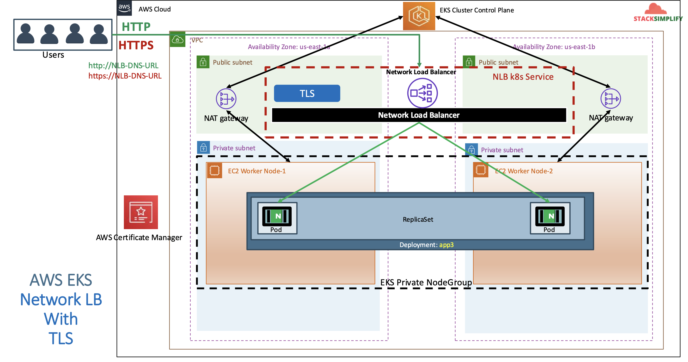
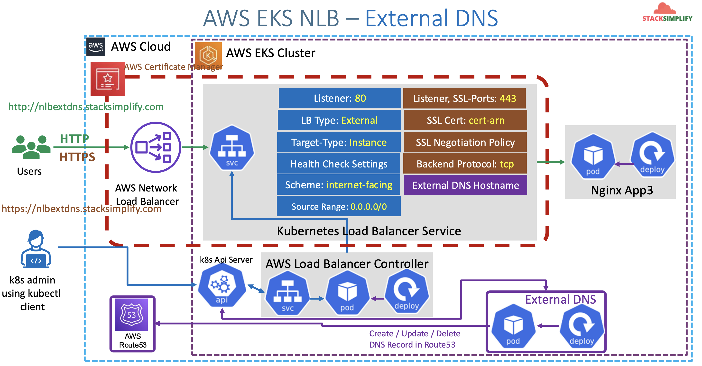
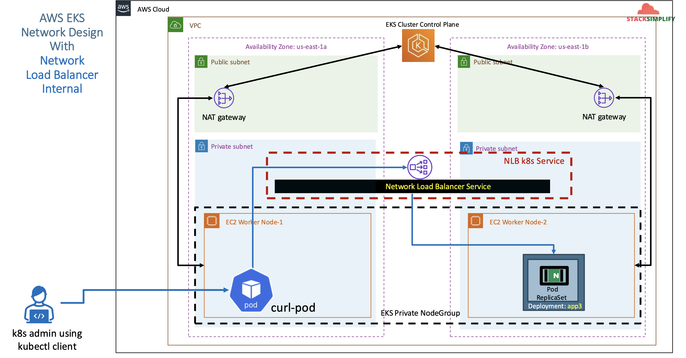
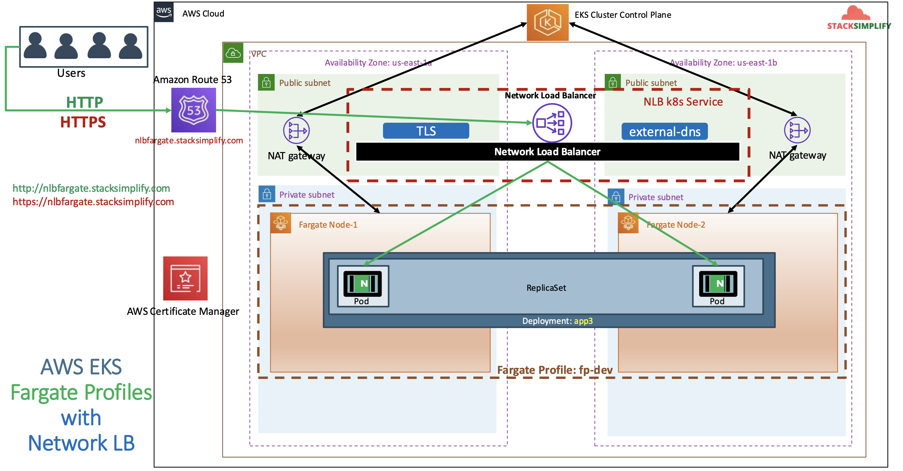

# AWS Network Load Balancer with AWS Load Balancer Controller

## 135. Introduction to AWS NLB 6 Demos

- We can create an AWS Network Load Balancer via the ALB Controller whenever we create a k8s service

We are going to explore 6 Demos

1. NLB Basics
2. NLB TLS SSL
3. NLB & External DNS
4. NLB & External IP
5. Internal NLB
6. NLB & Fargate

## 136. Introduction to Network Load Balancer with k8s Service

What is a Network Load Balancer?

- Network traffic is load balanced at L4 of the OSI model
- Supports TCP, UDP and TLS protocols
- https://aws.amazon.com/compare/the-difference-between-the-difference-between-application-network-and-gateway-load-balancing/#when-to-use-alb-vs-nlb-vs-glb--16u8drs

Options for creating a Network Load Balancer using k8s on an EKS Cluster:

- AWS cloud provider load balancer controller
  - **Legacy** Controller which can create AWS Classic LB and Network LB
  - Creates very **basic** Network Load Balancer
  - This controller will only receive **critical bug fixes** and in the long run, it will be depreated
  - This controlle will **not have any new features** added to it
  - Comes automatically in an EKS Cluster
- AWS Load Balancer Controller
  - **Latest** and greatest which can create AWS ALB and NLB
  - Supports protocols such as TCP, UDP & TLS(SSL) and for **Health Checks**, it supports TCP, HTTP & HTTPS
  - Supports **Instance** and **IP Mode** (For Fargate)
  - Supports **Internal, External NLB** and Customer **Subnet Discovery**
  - Supports **Static Elastic IP** and Access Control.
  - Supports **25+ new** annotations - https://kubernetes-sigs.github.io/aws-load-balancer-controller/v3.0/guide/service/annotations/
  - Has to be installed manually

How to ensure our Network LB created using a k8s service will be associated with only the latest AWS Load Balancer Controller:

- AWS cloud provider load balancer controller uses the annotation:
  - `service.beta.kubernetes.io/aws-load-balancer-type: nlb`
- AWS Load Balancer Controller uses the annotation:
  - `service.beta.kubernetes.io/aws-load-balancer-type: nlb-ip` (Deprecated)
  - `service.beta.kubernetes.io/aws-load-balancer-type: external`

> **Note 1**:
> If the values of **aws-load-balancer-type** annotation is `nlb-ip` or `external`, the legacy controller **ignores** that k8s service so that AWS Load Balancer Controller can take over

> **Note 2**:  
> Only EKS Cluster Versions `v1.18.18`+ are supported

A basic YAML file would look like:

```yaml
apiVersion: v1
kind: Service
metadata:
  name: lbc-network-lb-demo
  annotations:
    # traffic routing
    service.beta.kubernetes.io/aws-load-balancer-name: lbc-network-lb-demo
    service.beta.kubernetes.io/aws-load-balancer-type: external
    # ...
spec:
  type: LoadBalancer
  # ...
```

Course Reference:

- https://github.com/stacksimplify/aws-eks-kubernetes-masterclass/tree/master/19-ELB-Network-LoadBalancers-with-LBC

## 137. Review kubernetes manifest-Deployment and Service with NLB Annotation

Review `01-deployment-nodeport.yaml`:

```yaml
apiVersion: apps/v1
kind: Deployment
metadata:
  name: app3-nginx-deployment
  labels:
    app: app3-nginx
spec:
  replicas: 1
  selector:
    matchLabels:
      app: app3-nginx
  template:
    metadata:
      labels:
        app: app3-nginx
    spec:
      containers:
        - name: app2-nginx
          image: stacksimplify/kubenginx:1.0.0
          ports:
            - containerPort: 80
```

Review `02-loadbalancer-service.yaml`:

```yaml
apiVersion: v1
kind: Service
metadata:
  name: basics-lbc-network-lb
  annotations:
    # Traffic routing
    service.beta.kubernetes.io/aws-load-balancer-name: basics-lbc-network-lb
    service.beta.kubernetes.io/aws-load-balancer-type: external
    service.beta.kubernetes.io/aws-load-balancer-nlb-target-type: instance # you can choose between this and `ip`
    #service.beta.kubernetes.io/aws-load-balancer-subnets: subnet-xxx, mySubnet ## Subnets are auto-discovered if this annotation is not specified

    # health check settings
    service.beta.kubernetes.io/aws-load-balancer-healthcheck-protocol: http
    service.beta.kubernetes.io/aws-load-balancer-healthcheck-port: traffic-port
    service.beta.kubernetes.io/aws-load-balancer-healthcheck-path: /index.html
    service.beta.kubernetes.io/aws-load-balancer-healthcheck-health-threshold: "3"
    service.beta.kubernetes.io/aws-load-balancer-healthcheck-unhealthy-threshold: "3"
    service.beta.kubernetes.io/aws-load-balancer-healthcheck-interval: "10" # The controller currently ignores the timeout configuration due to the limitations on the AWS NLB, the default timeout for TCP is 10s and HTTP is 6s.

    # access control
    service.beta.kubernetes.io/load-balancer-source-ranges: 0.0.0.0/0 # specifies the CIDRs that are allowed to access the NLB
    service.beta.kubernetes.io/aws-load-balancer-scheme: "internet-facing" # specifies whether the NLB will be internet-facing or internal

    # AWS Resource Tags
    service.beta.kubernetes.io/aws-load-balancer-additional-resource-tags: Environment=dev, Team=test
spec:
  type: LoadBalancer
  selector:
    app: app3-nginx
  ports:
    - port: 80
      targetPort: 80
```

## 138. Deploy NLB Basics k8s manifests,

Deploy all manifests:

```shell
# Deploy 137-nlb-basics
kubectl apply -f 137-nlb-basics/

# Verify Pods
kubectl get pods

# Verify Services
kubectl get svc
# Observation:
# 1. Verify the network lb DNS name

# Verify AWS Load Balancer Controller pod logs
kubectl -n kube-system get pods
kubectl -n kube-system logs -f <aws-load-balancer-controller-POD-NAME>

# Verify using AWS Mgmt Console
# Go to Services -> EC2 -> Load Balancing -> Load Balancers
# 1. Verify Description Tab - DNS Name matching output of "kubectl get svc" External IP
# 2. Verify Listeners Tab

# Go to Services -> EC2 -> Load Balancing -> Target Groups
# 1. Verify Registered targets
# 2. Verify Health Check path

# Access Application
# http://<NLB-DNS-NAME>
```

Clean-Up:

```shell
kubectl delete -f 137-nlb-basics/
```

Verify if NLB deleted

- In AWS Mgmt Console,
- Go to Services -> EC2 -> Load Balancing -> Load Balancers

References

- [Network Load Balancer](https://docs.aws.amazon.com/eks/latest/userguide/network-load-balancing.html)
- [NLB Service](https://kubernetes-sigs.github.io/aws-load-balancer-controller/v2.4/guide/service/nlb/)
- [NLB Service Annotations](https://kubernetes-sigs.github.io/aws-load-balancer-controller/v2.4/guide/service/annotations/)

## 139. Introduction to NLB TLS with k8s Service

We are going to understand the 4 TLS Annotations for Network Load Balancers.

- `aws-load-balancer-ssl-cert`
- `aws-load-balancer-ssl-ports`
- `aws-load-balancer-ssl-negotiation-policy`
- `aws-load-balancer-ssl-backend-protocol`



If we have a service that looks like:

```yaml
#...
ports:
  - name: http
    port: 80 # Creates NLB Port 80 Listener
    targetPort: 80 # Creates NLB Port 80 Target Group-1
  - name: https
    port: 443 # Creates NLB Port 443 Listener
    targetPort: 80 # Creates NLB Port 80 Target Group-2
  - name: http81
    port: 81 # Creates NLB Port 81 Listener
    targetPort: 80 # Creates NLB Port 80 Target Group-3
  - name: http82
    port: 82 # Creates NLB Port 82 Listener
    targetPort: 80 # Creates NLB Port 80 Target Group-4
```

- Note-1: Listener to Target Group is a one to one mapping
- Note-2: Every listener will have its own new Target Gropu created with that port mentioned
- Note-3: This might not be a effective way but unfortunately, wehn you create via a k8s service, that's the behavior.

## 140. NLB TLS Demo Deploy, Verify and Clean-Up

Update `02-loadbalancer-service.yaml` to have:

```yaml
# TLS
service.beta.kubernetes.io/aws-load-balancer-ssl-cert: arn:aws:acm:us-east-1:662513131574:certificate/ba79d928-9650-49a8-acc5-6d7d5f1840f6 # specifies the ARN of one or more certificates managed by the AWS Certificate Manager.
service.beta.kubernetes.io/aws-load-balancer-ssl-ports: 443 # Specify this annotation if you need both TLS and non-TLS listeners on the same load balancer
service.beta.kubernetes.io/aws-load-balancer-ssl-negotiation-policy: ELBSecurityPolicy-TLS13-1-2-2021-06 # specifies the Security Policy for NLB frontend connections, allowing you to control the protocol and ciphers.
service.beta.kubernetes.io/aws-load-balancer-backend-porotocol: tcp # specifies whether to use TLS or TCP for the backend traffic between the load balancer and the kubernetes pods.
```

Deploy all manifests:

```shell
# Deploy kube-manifests
kubectl apply -f 140-nlb-tls/

# Verify Pods
kubectl get pods

# Verify Services
kubectl get svc
# Observation:
# 1. Verify the network lb DNS name

# Verify AWS Load Balancer Controller pod logs
kubectl -n kube-system get pods
kubectl -n kube-system logs -f <aws-load-balancer-controller-POD-NAME>

# Verify using AWS Mgmt Console
# Go to Services -> EC2 -> Load Balancing -> Load Balancers
# 1. Verify Description Tab - DNS Name matching output of "kubectl get svc" External IP
# 2. Verify Listeners Tab
# Observation:  Should see two listeners Port 80 and 443

# Go to Services -> EC2 -> Load Balancing -> Target Groups
# 1. Verify Registered targets
# 2. Verify Health Check path
# Observation: Should see two target groups. 1 Target group for 1 listener

# Access Application
# Test HTTP URL
# http://<NLB-DNS-NAME>
# http://lbc-network-lb-tls-demo-a956479ba85953f8.elb.us-east-1.amazonaws.com

# Test HTTPS URL
# https://<NLB-DNS-NAME>
# https://lbc-network-lb-tls-demo-a956479ba85953f8.elb.us-east-1.amazonaws.com
```

Clean-Up:

```shell
kubectl delete -f 140-nlb-tls/
```

Verify if NLB deleted

- In AWS Mgmt Console,
- Go to Services -> EC2 -> Load Balancing -> Load Balancers

References

- [Network Load Balancer](https://docs.aws.amazon.com/eks/latest/userguide/network-load-balancing.html)
- [NLB Service](https://kubernetes-sigs.github.io/aws-load-balancer-controller/v2.4/guide/service/nlb/)
- [NLB Service Annotations](https://kubernetes-sigs.github.io/aws-load-balancer-controller/v2.4/guide/service/annotations/)

## 141. NLB External DNS Demo using k8s Service

- We are going to build on our previous section by adding an external dns hostname



- We are going to add this annotation to use Route53:

```yaml
# External DNS - For creating a Record Set in Route53
external-dns.alpha.kubernetes.io/hostname: nlbdns101.timothykarani.com
```

Update `02-loadbalancer-service.yaml`:

```yaml
# external dns - for creating a record set in route 53
external-dns.alpha.kubernetes.io/hostname: nlbdns101.timothykarani.com
```

Deploy all kube-manifests:

```shell
# Verify if External DNS Pod exists and Running
kubectl get pods
# Observation:
# external-dns pod should be running

# Deploy kube-manifests
kubectl apply -f 141-nlb-external-dns/

# Verify Pods
kubectl get pods

# Verify Services
kubectl get svc
# Observation:
# 1. Verify the network lb DNS name

# Verify AWS Load Balancer Controller pod logs
kubectl -n kube-system get pods
kubectl -n kube-system logs -f <aws-load-balancer-controller-POD-NAME>

# Verify using AWS Mgmt Console
# Go to Services -> EC2 -> Load Balancing -> Load Balancers
# 1. Verify Description Tab - DNS Name matching output of "kubectl get svc" External IP
# 2. Verify Listeners Tab
# Observation:  Should see two listeners Port 80 and 443

#Go to Services -> EC2 -> Load Balancing -> Target Groups
#1. Verify Registered targets
#2. Verify Health Check path
#Observation: Should see two target groups. 1 Target group for 1 listener

# Verify External DNS logs
kubectl logs -f $(kubectl get po | egrep -o 'external-dns[A-Za-z0-9-]+')

# Perform nslookup Test
nslookup nlbdns101.timothykarani.com

# Access Application
# Test HTTP URL
# http://nlbdns101.timothykarani.com

# Test HTTPS URL
# https://nlbdns101.timothykarani.com
```

Clean-Up:

```shell
kubectl delete -f 141-nlb-external-dns/
```

Verify if NLB deleted

- In AWS Mgmt Console,
- Go to Services -> EC2 -> Load Balancing -> Load Balancers

References

- [Network Load Balancer](https://docs.aws.amazon.com/eks/latest/userguide/network-load-balancing.html)
- [NLB Service](https://kubernetes-sigs.github.io/aws-load-balancer-controller/v2.4/guide/service/nlb/)
- [NLB Service Annotations](https://kubernetes-sigs.github.io/aws-load-balancer-controller/v2.4/guide/service/annotations/)
- [External DNS](https://kubernetes-sigs.github.io/external-dns/latest/docs/tutorials/aws/#verify-externaldns-works-service-example)

## 142. NLB Elastic IPs Demo using k8s Service

We are going to use the annotation:

```yaml
# Elastic IPs
service.beta.kubernetes.io/aws-load-balancer-eip-allocations: eipalloc-07daf60991cfd21f0, eipalloc-0a8e8f70a6c735d16
```

Note 1:

- You must specify the same number of **eip allocations** as load balancer subnet annotation
- If you specified subnets, you shoudl also specify the same number of **eip**s

Note 2:

- The NLB must be **internet-facing**

### Create Elastic IPs in AWS Management Console

This configuraiton is optional and you can use it to assign static IP addresses to your NLB

- Go to Services -> Compute -> EC2 -> Network & Security -> Elastic IPs -> Allocate Elastic IP Address (twice)
  - First EIP
    - **Network border group**: `us-east-1`
    - edit the name in the table to `eip-1`
  - Second EIP
    - **Network border group**: `us-east-1`
    - edit the name in the table to `eip-2`

Take note of the allocation IDs:

```
eipalloc-0d9a401ca83b0f7fa
eipalloc-0211bd733dc73f29e
```

Review Elstic IP Annotations:

```yaml
# Elastic IPs
service.beta.kubernetes.io/aws-load-balancer-eip-allocations: eipalloc-0d9a401ca83b0f7fa, eipalloc-0211bd733dc73f29e
```

Deploy all kube-manifests:

```shell
# Verify if External DNS Pod exists and Running
kubectl get pods
# Observation:
# external-dns pod should be running

# Deploy kube-manifests
kubectl apply -f 142-nlb-eip/

# Verify Pods
kubectl get pods

# Verify Services
kubectl get svc
# Observation:
# 1. Verify the network lb DNS name

# Verify AWS Load Balancer Controller pod logs
kubectl -n kube-system get pods
kubectl -n kube-system logs -f <aws-load-balancer-controller-POD-NAME>

# Verify using AWS Mgmt Console
# Go to Services -> EC2 -> Load Balancing -> Load Balancers
# 1. Verify Description Tab - DNS Name matching output of "kubectl get svc" External IP
# 2. Verify Listeners Tab
# Observation:  Should see two listeners Port 80 and 443

#Go to Services -> EC2 -> Load Balancing -> Target Groups
#1. Verify Registered targets
#2. Verify Health Check path
#Observation: Should see two target groups. 1 Target group for 1 listener

# Verify External DNS logs
kubectl logs -f $(kubectl get po | egrep -o 'external-dns[A-Za-z0-9-]+')

# Perform nslookup Test
nslookup nlbeip201.timothykarani.com

# Access Application
# Test HTTP URL
# http://nlbeip201.timothykarani.com

# Test HTTPS URL
# https://nlbeip201.timothykarani.com
```

Clean-Up:

```shell
kubectl delete -f 142-nlb-eip/
```

Delete Elastic IPs created:

- In AWS Mgmt Console,
- Go to Services -> EC2 -> Network & Security -> Elastic IPs
- Delete two EIPs created

Verify if NLB deleted:

- In AWS Mgmt Console,
- Go to Services -> EC2 -> Load Balancing -> Load Balancers

References

- [Network Load Balancer](https://docs.aws.amazon.com/eks/latest/userguide/network-load-balancing.html)
- [NLB Service](https://kubernetes-sigs.github.io/aws-load-balancer-controller/v2.4/guide/service/nlb/)
- [NLB Service Annotations](https://kubernetes-sigs.github.io/aws-load-balancer-controller/v2.4/guide/service/annotations/)
- [External DNS](https://kubernetes-sigs.github.io/external-dns/latest/docs/tutorials/aws/#verify-externaldns-works-service-example)

## 143. NLB InternalLB Demo using k8s Service

- We are going to change the `scheme` from `external` to `internal`.
- We are also going to remove all unrelated things not needed for an internal LB
- We are going to test this using a `curl-pod`



Review LB Scheme Annotation

- **File Name:** `03-load-balancer-service.yml`

```yaml
# Access Control
service.beta.kubernetes.io/aws-load-balancer-scheme: "internal"
```

Deploy all kube-manifests:

```shell
# Deploy kube-manifests
kubectl apply -f 143-nlb-internal/

# Verify Pods
kubectl get pods

# Verify Services
kubectl get svc
# Observation:
# 1. Verify the network lb DNS name

# Verify AWS Load Balancer Controller pod logs
kubectl -n kube-system get pods
kubectl -n kube-system logs -f <aws-load-balancer-controller-POD-NAME>

# Verify using AWS Mgmt Console
# Go to Services -> EC2 -> Load Balancing -> Load Balancers
# 1. Verify Description Tab - DNS Name matching output of "kubectl get svc" External IP
# 2. Verify Listeners Tab
# Observation:  Should see two listeners Port 80

Go to Services -> EC2 -> Load Balancing -> Target Groups
# 1. Verify Registered targets
# 2. Verify Health Check path
```

Deploy curl pod and test Internal NLB:

```shell
# Will open up a terminal session into the container
kubectl exec -it curl-pod -- sh

# We can now curl external addresses or internal services:
curl http://google.com/
curl <INTERNAL-NETWORK-LB-DNS>

# Internal Network LB Curl Test
curl lbc-internal-network-lb-d4ab4a20dca803ef.elb.us-east-1.amazonaws.com
```

Clean-Up:

```shell
# Delete or Undeploy kube-manifests
kubectl delete -f 143-nlb-internal/

```

Verify if NLB deleted:

- In AWS Mgmt Console,
- Go to Services -> EC2 -> Load Balancing -> Load Balancers

## 144. NLB Fargate Demo with Target Type IP

- For this, we need to change the `target-type` annotation to `ip`, as this is a necessity for Fargate



The annotation change will be:

- The Pod IP Address will be directly registered as targets in NBL Load Balancer Target Groups when we use Target Type as **IP Mode**

```yaml
service.beta.kubernetes.io/aws-load-balancer-nlb-target-type: ip
```

### Create Fargate Profile

We are going to create a fargate profile `144-1-eksctl/01-fargate-profiles.yaml`:

```yaml
apiVersion: eksctl.io/v1alpha5
kind: ClusterConfig
metadata:
  name: eksdemo1 # name of the eks cluster
  region: us-east-1
fargateProfiles:
  - name: fp-app3
    selectors:
      # all workloads in the "ns-app3" k8s namespace will be scheduled onto fargate
      - namespace: ns-app3
```

Create fargate profile:

```shell
eksctl create fargateprofile -f 144-1-eksctl/01-fargate-profiles.yaml

# check if it's been created
watch -n 5 -x eksctl get fargateprofile --cluster eksdemo1
```

### Update, Deploy and Verify k8s Manifests

Update `02-deployment-nodeport.yaml` to use `target-type: ip`:

```yaml
service.beta.kubernetes.io/aws-load-balancer-nlb-target-type: ip # For Fargate Workloads we should use target-type as ip
```

Review the k8s deployment metadata for namespace:

```yaml
apiVersion: apps/v1
kind: Deployment
metadata:
  name: app3-nginx-deployment
  labels:
    app: app3-nginx
  namespace: ns-app3 # Update Namespace given in Fargate Profile 01-fargate-profiles.yml
spec:
  replicas: 1
  selector:
    matchLabels:
      app: app3-nginx
  template:
    metadata:
      labels:
        app: app3-nginx
    spec:
      containers:
        - name: app2-nginx
          image: stacksimplify/kubenginx:1.0.0
          ports:
            - containerPort: 80
          resources:
            requests:
              memory: "128Mi"
              cpu: "500m"
            limits:
              memory: "500Mi"
              cpu: "1000m"
```

Deploy all kube-manifests:

```shell
# Deploy kube-manifests
kubectl apply -f 144-2-fargate/

# Verify Pods
kubectl -n ns-app3 get pods -o wide
# Observation:
# 1. It will take couple of minutes to get the pod from pending to running state due to Fargate Mode.

# Verify Worker Nodes
kubectl -n ns-app3 get nodes -o wide
# Obseravtion:
# 1. wait for Fargate worker node to create

# Verify Services
kubectl -n ns-app3 get svc
# Observation:
# 1. Verify the network lb DNS name

# Verify AWS Load Balancer Controller pod logs
kubectl -n kube-system get pods
kubectl -n kube-system logs -f <aws-load-balancer-controller-POD-NAME>

# Verify using AWS Mgmt Console
# Go to Services -> EC2 -> Load Balancing -> Load Balancers
# 1. Verify Description Tab - DNS Name matching output of "kubectl get svc" External IP
# 2. Verify Listeners Tab

# Go to Services -> EC2 -> Load Balancing -> Target Groups
# 1. Verify Registered targets
# 2. Verify Health Check path

# Perform nslookup Test
nslookup nlbfargate901.timothykarani.com

# Access Application
# Test HTTP URL
# http://nlbfargate901.timothykarani.com

# Test HTTPS URL
# https://nlbfargate901.timothykarani.com
```

Clean-Up:

```shell
kubectl delete -f 144-2-fargate/

## delete fargate profiles
# List Fargate Profiles
eksctl get fargateprofile --cluster eksdemo1

# Delete Fargate Profile
eksctl delete fargateprofile --cluster eksdemo1 --name <fargate-profile-name> --wait

eksctl delete fargateprofile --cluster eksdemo1 --name  fp-app3 --wait
```

Delete Elastic IPs created:

- In AWS Mgmt Console,
- Go to Services -> EC2 -> Network & Security -> Elastic IPs
- Delete two EIPs created

Verify if NLB deleted:

- In AWS Mgmt Console,
- Go to Services -> EC2 -> Load Balancing -> Load Balancers
