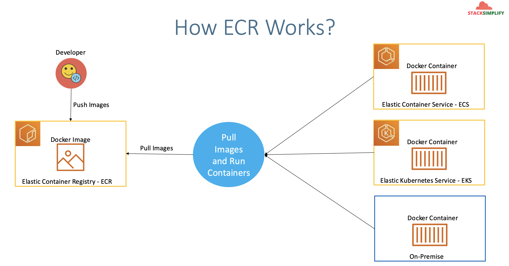
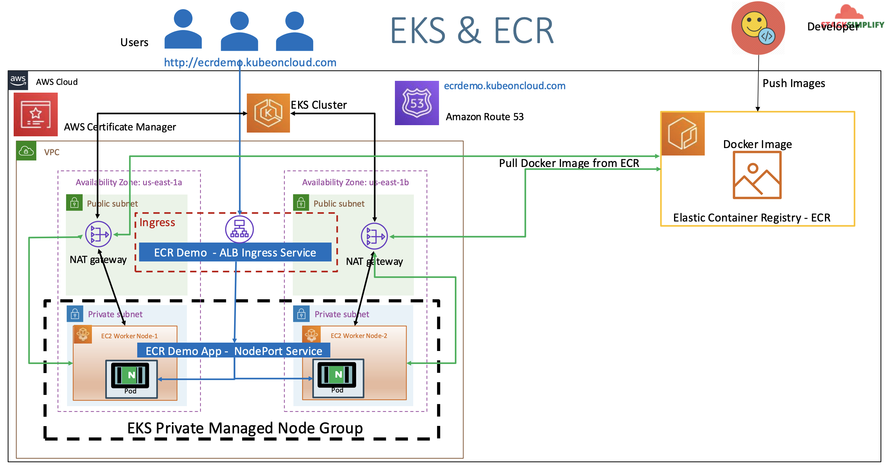

## EKS & ECR - Elastic Container Registry

## 145. EKS & ECR - Introduction

- Elastic Container Registry (ECR) is a **fully managed** docker container registry that makes it easy for developers to store, manage, and deploy docker container images.
- ECR is integrated with Elastic Kubernetes Service (EKS), simplyfying our development to production workflow.
- ECR **eliminates** the need to operate our own container repositories or worry about scaling the underlying infrastructure.
- ECR hosts our images in a **highly available** and scalable architecture, allowing us to reliably deploy containers for our applications
- Integration with **AWS Identity and Access Management (IAM)** provides resource-level control of each repository.
- With Amazon ECR, there are **no upfront fees** or commitments. We pay only for the amount of data you store in your repositories and data transferred to the internet.

Reference:

- https://github.com/stacksimplify/aws-eks-kubernetes-masterclass/tree/master/10-ECR-Elastic-Container-Registry-and-EKS



What are we going to learn?

- We are going build a Docker image
- Push to ECR Repository
- Update that ECR Image Repository URL in our Kubernetes Deployment manifest
- Deploy to EKS
- Kubernetes Deployment, NodePort Service, Ingress Service and External-DNS will be used to depict a full-on deployment
- We will access the ECR Demo Application using registered dns http://ecrdemo.timothykarani.com



## 146. ECR Terminology & Pre-Requisites

Terminology:

- **Registry** - Is provided to each AWS account. We can create image repositories in our registry and store images in them
- **Repository** - Contains our Docker Images
- **Repository Policy** - We can control access to our repositories and the images within them with repository policies
- **Authorization token** - Our Docker client must authenticate to Amazon ECR registries as an AWS user before it can push and pul images. The AWS CLI get-login command provides us with authentication credentials to pass to docker
- **Image** - We can push and pull container images to our repositories. We can use these images locally on your development system, or we can use them in Amazon ECS task definitions.

Pre-requisistes:

- Install AWS CLI v2
- Install Docker CLI
- Install AWS Console and configure it

## 147. Create ECR Repository on AWS, Build Docker Image Locally & Push to ECR

- Create simple ECR Repository via AWS Console
  - Go to Services -> Containers -> Elastic Container Registry
  - Repository name: `aws-ecr-kubenginx`
  - Tag immutability: Enable
  - Scan on Push: Enable
  - In the listing, select the `ecr`, then `View Push Commands`. Take note of them.
- Explore ECR console

To create an ECR Repository using AWS CLI:

```shell
aws ecr create-repository --repository-name <your-repo-name> --region <your-region>
aws ecr create-repository --repository-name aws-ecr-kubenginx --region us-east-1
```

In `View Push Commands` you should see something like. We'll need them later:

- Retrieve an authentication token and authenticate your Docker client to your registry using the AWS CLI:

  ```bash
  aws ecr get-login-password --region us-east-1 | docker login --username AWS --password-stdin 662513131574.dkr.ecr.us-east-1.amazonaws.com
  ```

- Build your Docker image using the following command:

  ```bash
  docker build -t aws-ecr-kubenginx .
  ```

- After the build is completed, tag your image so you can push the image to this repository:

  ```bash
  docker tag aws-ecr-kubenginx:latest 662513131574.dkr.ecr.us-east-1.amazonaws.com/aws-ecr-kubenginx:latest
  ```

- Run the following command to push this image to your newly created AWS repository:

  ```bash
  docker push 662513131574.dkr.ecr.us-east-1.amazonaws.com/aws-ecr-kubenginx:latest
  ```

### Create Docker Image Locally

Navigate to the `147-1-docker` and build the docker image:

```shell
# build docker image
docker build --platform linux/amd64,linux/arm64 -t <ecr-repository-uri>:<tag> .
docker build --platform linux/amd64,linux/arm64 -t 662513131574.dkr.ecr.us-east-1.amazonaws.com/aws-ecr-kubenginx:1.0.0 .

# run docker iamge locally & test
docker run --name <name-of-container> -p 8010:80 --rm -d <ecr-repository-uri>:<tag>
docker run --name aws-ecr-kubenginx -p 8010:80 --rm -d 662513131574.dkr.ecr.us-east-1.amazonaws.com/aws-ecr-kubenginx:1.0.0

# access application locally
# http://localhost:8010

# stop docker container
docker ps
docker stop aws-ecr-kubenginx
docker ps -a -q
```

### Push Docker Image to AWS ECR

- Firstly, login to ECR Repository
- Push the docker image to ECR

```shell
# Get Login Password
aws ecr get-login-password --region <your-region> | docker login --username AWS --password-stdin <ecr-repository-uri>
aws ecr get-login-password --region us-east-1 | docker login --username AWS --password-stdin 662513131574.dkr.ecr.us-east-1.amazonaws.com

# Push the Docker Image
docker push <ECR-REPOSITORY-URI>:<TAG>
docker push 662513131574.dkr.ecr.us-east-1.amazonaws.com/aws-ecr-kubenginx:1.0.0
```

- Verify the newly pushed docker image on AWS ECR.
- Verify the vulnerability scan results.

## 148. Review k8s Manifests & Node Group Role

View `01-ecr-deployment.yaml`; you should add the image url we just created:

```yaml
containers:
  - name: kubeapp-ecr
    image: 662513131574.dkr.ecr.us-east-1.amazonaws.com/aws-ecr-kubenginx:1.0.0
```

Verify ECR Access to EKS Worker Nodes:

- Remember we added nodegroups to our cluster with `--full-ecr-access`
- Go to Services -> Compute -> EC2 -> Click on an instance
- Click on IAM Role: `eksctl-eksdemo1-nodegroup-eksdemo1-NodeInstanceRole-bigPhteOlW0`
- Under Permissions, you should see `AmazonEC2ContainerRegistryPullOnly` and `AmazonEC2ContainerRegistryPowerUser`

## 149. Deploy k8s Manifests & Test & Clean-Up

Deploy the kubernetes manifests

```shell
# Deploy
kubectl apply -f 147-2-nginx/

# Verify
kubectl get deploy
kubectl get svc
kubectl get po
kubectl get ingress
```

Access Application

- Wait for ALB Ingress to be provisioned
- Verify Route 53 DNS registration `ecrdemo.timothykarani.com`

```shell
# Get external ip of EKS Cluster Kubernetes worker nodes
kubectl get nodes -o wide

# Access Application
#http://ecrdemo.timothykarani.com/index.html
```

## Step-08: Clean Up

```shell
# Clean-Up
kubectl delete -f 147-2-nginx/
```
