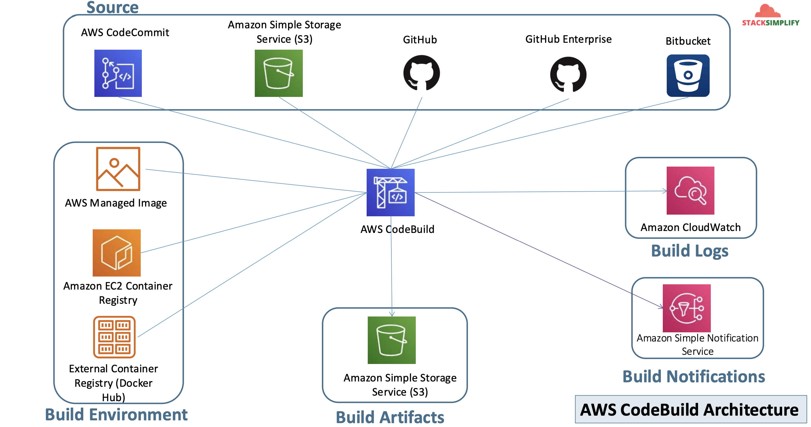

# EKS DevOps with AWS Developer Tools - CodeCommit, CodeBuild and CodePipeline

## 151. EKS DevOps - Introduction

- We are going to use GitHub instead of CodeCommit, but don't worry, the theory is transferrable

### Stages in Releast Process

1. Source
   - Check in source code
   - Peer review new code
   - Pull Request process
2. Build
   - Compile Code & build artifacts (war, jar, container images, k8s manifest files)
   - Unit Tests
3. Test
   - Integration tests with other systems
   - Load testing
   - UI Tests
   - Security Tests
   - Test Environments (Dev, QA, and Staging)
4. Production
   - Deployment to production environments
   - Monitor code in production to quickly detect errors

Continuous Integration

- `Source -> Build`
- Automatically kick off a new release when new code is checked in
- Continually have an artifact ready for deployment

Continuous Delivery

- `Source -> Build -> Test`
- Automatically deploy new changes to staging environments for tsting
- Deploy to production safely without affecting customers
- Deliver to customers faster
- Increase deployment frequency, and reduce change lead time and change failure rate

Continuous Deploymet

- `Source -> Build -> Test -> Production`

Infrastructure as code

- `Source -> Build -> Test -> Production`


## 152. What are we going to learn?

Understand DevOps concepts:

- CI - Continuous Integration
- CD - Continuous Deployment or Delivery
  Understand more about AWS tools that helps us to implement DevOps
- GitHub
- AWS CodeBuild
- AWS CodePipeline

What are we going to learn?

- We are going to create a AWS Elastic Container Registry (ECR) for our Docker Images
- We are going to create GitHub Repository and check-in the below to Github Repo
  - **Application code**:
    - `app1/index.html`
  - **Docker File**
    - `Dockerfile`
  - **Kubernetes Manifests**
    - `kube-manifests/01-devops-nginx-deployment.yml`
    - `kube-manifests/02-devops-nginx-nodeport-service.yml`
    - `kube-manifests/03-devops-nginx-alb-ingressservice.yml`
  - **Build Spec files**:
    - `buildspec-build.yml`
    - `buildspec-deploy.yml`
- We are gong to have two `buildspec.yml` files for build and deploy stages:
  - **Phase-1**: Build Container Image and Push to ECR - `buildspec.yaml`
  - **Phase-2**: Authenticate to EKS using STS Assume Role (Secure EKS interaction) and deploy kube-manifests to EKS - `buildspec-deploy.yml`

## 153. Pre-requisite check before implementing EKS DevOps Pipeline

AWS Load Balancer Controller and External DNS:

- We are going to deploy an application which will also have a 'AWS Load Balancer Controller' and also will register its DNS name in Route53 using `External DNS`.
- Which means, we should have both related pods running in our cluster.

```yaml
# verify aws-load-balancer-controller pod running in namespace kube-system
kubectl get pods -n kube-system

# verify external-dns pod running in default namespace
kubectl get pods
```

Verify K8s Manifests working as expected before implementing DevOps Pipelines:

```shell
# Verify if all templates are working
## Step-01: Update 01-DEVOPS-Nginx-Deployment.yml - "image"
image: ghcr.io/stacksimplify/kube-nginxapp1:1.0.0 # FOR TESTING

## Step-02: Verify and Update Ingress manifest (03-DEVOPS-Nginx-ALB-IngressService.yml) with DNS Names and SSL Cert
alb.ingress.kubernetes.io/certificate-arn: arn:aws:acm:us-east-1:662513131574:certificate/ba79d928-9650-49a8-acc5-6d7d5f1840f6
external-dns.alpha.kubernetes.io/hostname: eksdevops1.timothykarani.com, eksdevops2.timothykarani.com

## Step-03: DEPLOY AND VERIFY
cd github-files
kubectl apply -f kube-manifets/

## Step-04: Verify Pods, Deployment, svc, ingress
kubectl get pods
kubectl get deploy
kubectl get svc
kubectl get ingress

## Step-05: Verify External DNS Logs and Route53 Records
kubectl logs -f $(kubectl get po | egrep -o 'external-dns[A-Za-z0-9-]+')
Go to Route53 -> Hosted Zones -> stacksimplify.com -> Verify DNS records "eksdevops1.stacksimplify.com, eksdevops2.stacksimplify.com"

## Step-06: Access Application
http://eksdevops1.timothykarani.com/app1/index.html

## Step-07: Clean-up
kubectl delete -f kube-manifets/

## Step-08: Update 01-DEVOPS-Nginx-Deployment.yml - "image"
image: CONTAINER_IMAGE # FOR DEVOPS Pipeline
```

## 154. Create AWS ECR Registry and GitHub Repo

### Create ECR Repository for our Application Docker Images

- Go to Services -> Elastic Container Registry -> Create Repository
- Name: `eks-devops`
- Tag Immutability: Enable
- Scan On Push: Enable
- Click on **Create Repository**
- Make a note of Repository name

```
# Sample ECR Repository URI
180789647333.dkr.ecr.us-east-1.amazonaws.com/eks-devops-app1
```

### Create GitHub Repository

- Create GitHub Repository with name as `aws-eks-devops`
- Create git credentials from IAM Service and make a note of those credentials
- Clone the git repository from GitHub to local repository, during the process provide your git credentials to login to git repo

```
git clone git@github.com:stacksimplify/aws-eks-devops.git
```

- Copy all files from course section **11-NEW-DevOps-with-AWS-Developer-Tools-and-GitHub/Application-Manifests** to local repository
  - buildspec-build.yml
  - buildspec-deploy.yml
  - Dockerfile
  - app1
    - index.html
  - kube-manifests
    - 01-DEVOPS-Nginx-Deployment.yml
    - 02-DEVOPS-Nginx-NodePortService.yml
    - 03-DEVOPS-Nginx-ALB-IngressService.yml
- Commit code and Push to GitHub Repo

```shell
# Change to Git Repo Directory
cd aws-eks-devops

# Git Commands
git status
git add .
git commit -am "Base Commit"
git push
git status
```

- Verify the same on GitHub Repository [aws-eks-devops](https://github.com/stacksimplify/aws-eks-devops)

## 155. Build Stage: AWS CodeBuild Introduction

CodeBuild - Introduction

- CodeBuild is a **fully managed** build service in the cloud.
- Compiles our **source code**, runs **unit tests**, and produces **artifacts** that are ready to deploy.
- Eliminates the need to provision, manage, and scale **our own build servers**.
- It provides **prepackaged build environments** for the most popular programming languages and build tools such as Apache Maven, Gradle, and many more.
- We can also customize build environments in CodeBuilds to use our **own build tools**.
- **Scales automatically** to meet peak build requests.

How to run CodeBuild? We can do it from

- AWS Management Console
- AWS CLI
- AWS SDKs
- **AWS CodePipeline** -> We'll use this


CodeBuild Steps

- You push your code to Github
- Github triggers a CodeBuild via CodePipeline
- The artefacts are pushed to your destination of choice (S3, ECR)

## 156. Build Stage: Review buildspec-build.yml file

```yaml
# buildspec-build.yml
version: 0.2

# Environment variables and values used across phases
env:
  variables:
    # ECR URI where the Docker image will be pushed
    IMAGE_URI: "662513131574.dkr.ecr.us-east-1.amazonaws.com/eks-devops"
  exported-variables:
    # Variables that will be shared with downstream phases or pipelines
    - IMAGE_URI
    - IMAGE_TAG

phases:
  install:
    commands:
      # Install phase (empty here since the CodeBuild image has necessary tools)
      - echo "Install Phase - Nothing to do using latest Amazon Linux Docker Image"

  pre_build:
    commands:
      # Generate a short Docker image tag using GitHub commit SHA (7 characters)
      - IMAGE_TAG="$(echo $CODEBUILD_RESOLVED_SOURCE_VERSION | cut -c1-7)"
      - export IMAGE_TAG
      # Authenticate Docker with ECR using AWS CLI
      - echo "Logging into Amazon ECR at $IMAGE_URI..."
      - aws ecr get-login-password | docker login --username AWS --password-stdin $IMAGE_URI

  build:
    commands:
      # Build Docker image using Dockerfile in root directory
      - echo "Building Docker image..."
      - docker build -t $IMAGE_URI:$IMAGE_TAG .

  post_build:
    commands:
      # Push the built Docker image to ECR repository
      - echo "Pushing Docker image to ECR..."
      - docker push $IMAGE_URI:$IMAGE_TAG
      # Export image metadata to be used in the deploy stage
      - echo "Exporting variables for downstream stages..."
      - echo "IMAGE_URI=$IMAGE_URI" >> $CODEBUILD_SRC_DIR/exported-vars.env
      - echo "IMAGE_TAG=$IMAGE_TAG" >> $CODEBUILD_SRC_DIR/exported-vars.env

# Files that will be included as artifacts for the next stage
artifacts:
  files:
    - exported-vars.env
    - buildspec-deploy.yml
    - "**/kube-manifests/**/*"
```

## 157. Build Stage: Create GitHub Connection from AWS Developer Tools

- Go to Developer Tools -> CodePipeline ->
- Go to Settings -> Connections -> Create Connection
- **Provider**: Github
- **Connection name**: `eks-devops-github-connection`
- WILL BE REDIRECTED TO GITHUB WEBSITE
- Provide **GitHub Authentication Code**
- In AWS Connector for GitHub
  - **Repository Accesss**: Only Select Repositories
  - Select `aws-eks-devops`
  - Click on **Save**
- WILL BE REDIRECTED BACK TO AWS DEVELOPER TOOLS (AWS Console)
- Click on **Connect**

## 158. AWS CodePipeline Introduction

Introduction:

- AWS Code Pipeline is a **continuous delivery service** to **model, visualize, and automate** the steps required to releae your software.
- Benefits:
  - We can \*_automate_ our release processes.
  - We can establish a **consistent** release process.
  - We can **speed** up delivery while improving quality.
  - Supports **external tools** integration for source, build and deploy.
  - View **progress** at a glance.
  - View pipeline **history details**.

## 159. Build Stage: Create CodePipeline for build stage

**CodePipeline Introduction**

- Get a high level overview about CodePipeline Service

**Create CodePipeline**

- Create CodePipeline
- Go to Services -> CodePipeline -> Create Pipeline

**Choose creation option**

- **Category**: Build custom pipeline
- Click NEXT

**Choose Pipeline Settings**

- Pipeline name: `eks-devops-pipeline`
- Execution mode: Queued
- Service Role: New Service Role (leave to defaults)
- Role Name: leave default or append `eks-devops-codepipeline-service-role`
- Rest all leavel to defaults and click Next

**Add Source Stage**

- Source Provider: GitHub (via GitHub App)
- Connection: `eks-devops-github-connection`
- Default Branch: main
- REST ALL LEAVE TO DEFAULTS and Click NEXT

**Add Build Stage**:

- Build Provider: Other Build Provider
- Build Provider Name: AWS CodeBuild
- Project Name: Click on **Create Project**

**_Create Build Project_**:

- **Project Configuration**
  - Project Name: `build-eks-devops`
  - Project Type: Default Project
- **Environment**
  - Provisioning Model: OnDemand
  - Environment Image: Managed Image
  - Compute: EC2
  - Running Mode: Container
  - Operating System: Amazon Linux
  - Runtime(s): Standard
  - Image: `aws/codebuild/amazonlinux-x86_64-standard:50`
  - Image version: Always use the latest image for this runtime
  - Service Role: New Service Role
  - Role Name: `buildphase-codebuild-eks-devops-service-role`
  - REST ALL LEAVE TO DEFAULTS
- **Buildspec**
  - Build specifications: Use a buildspec file
  - Buildspec name: `buildspec-build.yml`
- **Logs**:
  - Group Name: `buildphase-cb-eks-devops-group`
  - Stream Name: `buildphase-cb-eks-devops-stream`
- Click on **Continue** to **CodePipeline**
- We should see a message **Successfully created `build-eks-devops`** in CodeBuild.
- Click Next

**_Add Test Stage_**

- Click on **Skip Test Stage**

**_Add Deploy Stage_**

- Click on **Skip Deploy Stage**

**_Review_**

- Review and click on **Create Pipeline\***

### 160. Build Stage: Update CodeBuild Role and Run pipeline and verify

- First pipeline run will fail as Codebuild is not able to upload or push newly created Docker Image to ECR Repository
- Update the CodeBuild Role to have access to ECR and to upload images built by codeBuild
  - Role Name: `buildphase-codebuild-eks-devops-service-role`
  - Policy Name: `AmazonEC2ContainerRegistryFullAccess`
  - Policy Name: `CloudWatchLogsFulAccess`
- Make changes to index.html (Update as V2), and push change to CodeCommit

```shell
# Git Commands
git status
git commit -am "V2 Deployment"
git push
```

- Verify CodeBuild Logs
- New image should be uploaded to ECR, verify the ECR with new docker image tag
- BUILD PHASE SHOULD BE SUCCESSFUL

## 161. Deploy Stage: Review buildspec-deploy.yml

Review `buildspec-deploy.yml`:

```yaml
# buildspec-deploy.yml
version: 0.2

# Environment variables required for EKS authentication
env:
  variables:
    # Name of the EKS cluster
    EKS_CLUSTER_NAME: "eksdemo1"
    # IAM Role ARN used to assume access to EKS for kubectl (we'll create this later)
    EKS_KUBECTL_ROLE_ARN: "arn:aws:iam::662513131574:role/EksCodeBuildKubectlRole"

phases:
  install:
    commands:
      # Install dependencies/tools (if any)
      - echo "Install Phase - Installing tools and dependencies"

  pre_build:
    commands:
      # Print info about environment setup
      - echo "Setting up IMAGE_URI and IMAGE_TAG from previous stage..."
      # List files to verify presence of artifacts
      - echo "Listing all files in workspace for debugging:"
      - ls -R .
      # Source exported variables (IMAGE_URI and IMAGE_TAG)
      - echo "Sourcing env variables from file"
      - source ./exported-vars.env
      - echo "IMAGE_URI=$IMAGE_URI"
      - echo "IMAGE_TAG=$IMAGE_TAG"
      # Replace placeholder in Kubernetes YAML with actual image URI and tag
      - echo "Updating container image in the Kubernetes Deployment YAML file..."
      - sed -i 's@CONTAINER_IMAGE@'"$IMAGE_URI:$IMAGE_TAG"'@' kube-manifests/01-devops-nginx-deployment.yml
      - echo "Updated deployment manifest content:"
      - cat kube-manifests/01-devops-nginx-deployment.yml

  build:
    commands:
      # Assume IAM role to gain temporary credentials for kubectl access
      - echo "Assuming IAM Role to access EKS cluster..."
      - CREDENTIALS=$(aws sts assume-role --role-arn $EKS_KUBECTL_ROLE_ARN --role-session-name codebuild-kubectl --duration-seconds 900)
      - export AWS_ACCESS_KEY_ID=$(echo $CREDENTIALS | jq -r '.Credentials.AccessKeyId')
      - export AWS_SECRET_ACCESS_KEY=$(echo $CREDENTIALS | jq -r '.Credentials.SecretAccessKey')
      - export AWS_SESSION_TOKEN=$(echo $CREDENTIALS | jq -r '.Credentials.SessionToken')
      # Setup kubeconfig to interact with the EKS cluster
      - echo "Updating kubeconfig with EKS cluster credentials..."
      - aws eks update-kubeconfig --name $EKS_CLUSTER_NAME
      # Deploy application manifests to EKS
      - echo "Applying Kubernetes manifests..."
      - kubectl apply -f kube-manifests/
      # Wait for deployment rollout to complete
      - echo "Waiting for deployment rollout to complete..."
      - kubectl rollout status deployment/eks-devops-deployment --timeout=180s

  post_build:
    commands:
      # Verification steps to ensure everything is deployed correctly
      - echo "Verifying Kubernetes resources created:"
      - echo "Pods Status:"
      - kubectl get pods -o wide
      - echo "Services Status:"
      - kubectl get svc -o wide
      - echo "Ingress Status:"
      - kubectl get ingress -o wide
```

## 162. Deploy Stage: Create Deploy stage in pipeline

#### EDIT CodePipeline

- EDIT CodePipeline
- Go to Services -> CodePipeline -> eks-devops -> EDIT

#### ADD Stage

- After the "Build" stage click "Add Stage"
- **Stage Name:** `Deploy`
- Click on **Add Stage**"
- Click on **Add Action group**

#### Edit Action

- Action Name: `DeployToEKSCluster`
- Action Provider: AWS CodeBuild
- Region: United Stages (N.Virginia)
- Input Artifacts: Build Artifacts
- Project Name: Click on **CREATE PROJECT**

#### Create Build Project

- **Project Configuration**
  - Project Name: `deploy-eks-devops`
  - Project Type: Default Project
- **Environment**
  - Provisioning Model: OnDemamd
  - Environment Image: Managed Image
  - Compute: EC2
  - Running Mode: Container
  - Operating System: Amazon Linux
  - Runtime(s): Standard
  - Image: `aws/codebuild/amazonlinux-x86_64-standard:5.0`
  - Image version: Always use the latest image for this runtime
  - Service Role: New Service Role
  - Role Name: `deployphase-codebuild-eks-devops-service-role`
  - REST ALL LEAVE TO DEFAULTS
- **Buildspec**
  - Build specifications: Use a buildspec file
  - Buildspec name: `buildspec-deploy.yml`
- **Logs**
  - Group Name: `deployphase-cb-eks-devops-group`
  - Stream Name: `deployphase-cb-eks-devops-stream`
- Click on **Continue to CodePipeline**
- We should see a message `Successfully created build-eks-devops in CodeBuild.`
- Click **Next**

#### Build Type

- Build Type: Single Build
- Click on **Done**
- Click on **Save**

### Update CodePipeline Role with CodeBuild Full Access

- Go to Pipelines -> eks-devops -> Settings -> Click on **Service role ARN**

#### IAM CodePipeline Service Role Update

- Role Name: eks-devops-codepipeline-service-role
- Add Policy **AWSCodeBuildAdminAccess** to this role

## 163. Deploy Stage: Create STS Assume IAM Role

- In an AWS CodePipeline, we are going to use AWS CodeBuild to deploy Kubernetes manifests to EKS Cluster.
- This requires an AWS IAM role capable of interacting with the EKS cluster.
- In this step, we are going to create an IAM role and add an inline policy `EKS:Describe` that we will use in the CodeBuild DEPLOY stage to interact with the EKS cluster via kubectl.

#### Option 1: **macOS / Linux / Windows Git Bash / WSL**

##### ⚠️ Note:

> ✅ This script is designed for **Bash-compatible environments**, such as **macOS Terminal**, **Linux shell**, **Windows Git Bash**, or **Windows Subsystem for Linux (WSL)**.
> ❌ It **will not work in Windows PowerShell or Command Prompt** due to syntax differences.

##### 💻 Script:

```bash
# Set variables
ACCOUNT_ID=$(aws sts get-caller-identity --query Account --output text)
ROLE_NAME=EksCodeBuildKubectlRole

# Create IAM Role with trust policy
aws iam create-role \
  --role-name $ROLE_NAME \
  --assume-role-policy-document "{
    \"Version\": \"2012-10-17\",
    \"Statement\": [
      {
        \"Effect\": \"Allow\",
        \"Principal\": { \"AWS\": \"arn:aws:iam::${ACCOUNT_ID}:root\" },
        \"Action\": \"sts:AssumeRole\"
      }
    ]
  }"

# Attach inline policy to allow EKS describe actions
aws iam put-role-policy \
  --role-name $ROLE_NAME \
  --policy-name eks-describe \
  --policy-document "{
    \"Version\": \"2012-10-17\",
    \"Statement\": [
      {
        \"Effect\": \"Allow\",
        \"Action\": \"eks:Describe*\",
        \"Resource\": \"*\"
      }
    ]
  }"
```

#### Option 2: **Windows PowerShell**

##### ⚠️ Note:

> ✅ This script is designed for **Windows PowerShell**.
> ❌ Do not use it in Git Bash, WSL, macOS, or Linux — it will fail due to syntax and escaping differences.

##### Script:

```powershell
# Set variables
$ACCOUNT_ID = (aws sts get-caller-identity --query Account --output text)
$ROLE_NAME = "EksCodeBuildKubectlRole"

# Create IAM Role with trust policy
aws iam create-role `
  --role-name $ROLE_NAME `
  --assume-role-policy-document "{
    `"Version`": `"2012-10-17`",
    `"Statement`": [
      {
        `"Effect`": `"Allow`",
        `"Principal`": { `"AWS`": `"arn:aws:iam::${ACCOUNT_ID}:root`" },
        `"Action`": `"sts:AssumeRole`"
      }
    ]
  }"

# Attach inline policy to allow EKS Describe actions
aws iam put-role-policy `
  --role-name $ROLE_NAME `
  --policy-name "eks-describe" `
  --policy-document "{
    `"Version`": `"2012-10-17`",
    `"Statement`": [
      {
        `"Effect`": `"Allow`",
        `"Action`": `"eks:Describe*`",
        `"Resource`": `"*`"
      }
    ]
  }"
```

## 164. Deploy Stage: Update `aws-auth` configmap and create STS policy

In this step, we will automatically update the EKS cluster's `aws-auth` ConfigMap to include the IAM role created in the previous step (`EksCodeBuildKubectlRole`). This grants the role access to the cluster, which is required for `kubectl` commands in the CodeBuild deployment stage.

- Make sure you're in the project root, and there's the folder (`aws-auth/`):

### Step-by-step Commands

#### MacOS/Linux/Git Bash/WSL (Bash Shell)

```shell
# Set variables
ACCOUNT_ID=$(aws sts get-caller-identity --query Account --output text)
echo $ACCOUNT_ID
ROLE_ARN="arn:aws:iam::${ACCOUNT_ID}:role/EksCodeBuildKubectlRole"
echo $ROLE_ARN

# Backup current aws-auth ConfigMap
kubectl get configmap aws-auth -n kube-system -o yaml > aws-auth/aws-auth-backup.yml

# Generate patched configmap YAML
kubectl get configmap aws-auth -n kube-system -o yaml | \
  awk -v role="    - rolearn: $ROLE_ARN\n      username: build\n      groups:\n        - system:masters" \
  '/mapRoles: \|/ {print; print role; next} 1' > aws-auth/aws-auth-patch.yml

# Apply updated configmap
kubectl apply -f aws-auth/aws-auth-patch.yml

# Verify updated config
kubectl get configmap aws-auth -n kube-system -o yaml
```

#### Windows Powershell

```powershell
# Set variables
$ACCOUNT_ID = (aws sts get-caller-identity --query Account --output text)
$ROLE_ARN = "arn:aws:iam::$ACCOUNT_ID:role/EksCodeBuildKubectlRole"
$BackupPath = "aws-auth\aws-auth-backup.yml"
$PatchPath = "aws-auth\aws-auth-patch.yml"

# Backup current config
kubectl get configmap aws-auth -n kube-system -o yaml > $BackupPath

# Inject new role into mapRoles
(Get-Content $BackupPath) | ForEach-Object {
    if ($_ -match "mapRoles: \|") {
        $_
        "    - rolearn: $ROLE_ARN"
        "      username: build"
        "      groups:"
        "        - system:masters"
    } else {
        $_
    }
} > $PatchPath

# Apply updated configmap
kubectl apply -f $PatchPath

# Verify update
kubectl get configmap aws-auth -n kube-system -o yaml
```

#### Outcome

- The IAM role `EksCodeBuildKubectlRole` is now authorized to access the EKS cluster with `system:masters` permissions. This enables `kubectl` to be used in the CodeBuild stage of your pipeline.

### Update CodeBuild Role to have access to STS Assume Role we have created using STS Assume Role Policy

- DEPLOY PHASE Build should be failed due to CodeBuild dont have access to perform updates in EKS Cluster.
- It even cannot assume the STS Assume role whatever we created.
- Create STS Assume Policy and Associate that to DEPLOY PHASE CodeBuild Role `deployphase-codebuild-eks-devops-service-role`

#### Create STS Assume Role Policy

- Go to Services IAM -> Policies -> Create Policy
- In **Visual Editor Tab**
- Service: STS
- Actions -> Under Write - Select `AssumeRole`
- Resources: Specific
  - Add ARN
  - Specify ARN for Role: arn:aws:iam::662513131574:role/EksCodeBuildKubectlRole
  - Click Add

```
# For Role ARN, replace your account id here, refer step-07 environment variable EKS_KUBECTL_ROLE_ARN for more details
arn:aws:iam::<your-account-id>:role/EksCodeBuildKubectlRole
```

- Click on Review Policy
- Name: `eks-codebuild-sts-assume-role`
- Description: CodeBuild to interact with EKS cluster to perform changes
- Click on **Create Policy**

#### Associate Policy to CodeBuild Role

- Go to Developer Tools -> CodeBuild -> Build Projects -> `deploy-eks-projects` -> Click on Service Role
- Role Name: `deployphase-codebuild-eks-devops-service-role`
- Policy to be associated: `eks-codebuild-sts-assume-role`

## 165. Deploy Stage: Test end to end Pipeline (Source, Build and Deploy)

- Commit the changes to local git repository and push to GitHub Repository
- Monitor the codePipeline Build and Deploy projects
- Test by accessing the static html page

```sh
# Update app1/index.html
      <h1>Welcome to Stack Simplify - App Version - V3 </h1>
# Git Commands
git status
git commit -am "V3"
git push
```

- Verify Build Stage - CodeBuild Logs
- Verify Deploy Stage - CodeBuild Logs
- Verify CodePipeline - eks-devops
- Test by accessing the static html page

```shell
# Access Application
http://eksdevops1.timothykarani.com/app1/index.html
http://eksdevops2.timothykarani.com/app1/index.html
```

## 166. Approval Stage: Create and Test Deployment Approval Stage

### 01: Create SNS Topic

- Go to Application Integration -> Amazon SNS
- Go to Amazon SNS -> Create Topic
- Type: Standard
- Name: `eks-devops-topic1`
- Display Name: `eks-devops-topic1`
- REST ALL LEAVE TO DEFAULTS and
- Click on **Create topic**

### 02: Create SNS Subscription

- Go to Amazon SNS -> eks-devops-topic1
- Click on **Create Subscription**
- Topic ARN: Auto-populated (ARN of Topic: eks-devops-topic1 )
- Protocol: Email
- Endpoint: stacksimplify@gmail.com
- Click on **Create subscription**
- Go to email id and click on **Confirm Subscription**

### 03: APPROVAL STAGE: Add new state in CodePipeline

#### EDIT CodePipeline

- EDIT CodePipeline
- Go to Services -> CodePipeline -> eks-devops -> EDIT
- In between the build and deploy stage, do the below

#### ADD Stage

- **Stage Name:** `DeploymentApproval`
- Click on **Add Stage**
- Click on **Add Action group**

#### Edit Action

- Action Name: `DeploymentApproval`
- Action Provider: Manual Approval
- SNS Topic ARN: `arn:aws:sns:us-east-1:662513131574:eks-devops-topic1`
- REST ALL LEAVE TO DEFAULTS
- Click on **DONE**
- Click on **SAVE** to save pipeline

### 04: Give SNS Full access to AWS CodePipeline Role

- Go to AWS CodePipeline -> eks-devops -> Settings -> Service role ARN
- In IAM for ROLE: **AWSCodePipelineServiceRole-us-east-1-eks-devops-pipeline-551**
- Attach Permissions: **AmazonSNSFullAccess**

### 05: END TO END FLOW (Build, Approval and Deploy Stages)

- Commit the changes to local git repository and push to GitHub Repository

```shell
# Update app1/index.html
      <h1>Welcome to Stack Simplify - App Version - V5 </h1>
# Git Commands
git status
git commit -am "V5"
git push
```

- Monitor the codePipeline BUILD project logs
- Verify email and Approve the Deployment request after **BUILD STAGE** to move to next step which is **DEPLOY STAGE**
- Monitor the codePipeline DEPLOY project logs
- Verify CodePipeline - eks-devops
- Test by accessing the static html page

```t
# Access Application
http://myapp1.timothykarani.com/app1/index.html
```

## 167. Fix for alternate build stage failures

### Why does every alternate build fail in the Build Phase?

- This happens because the Docker base image (`nginx:latest`) is being pulled from Docker Hub, which has rate limits for anonymous users. The first build fails due to hitting this limit (`429 Too Many Requests`), but the second one might pass if the image gets cached.

#### ✅ Fix: Use Amazon ECR Public image instead of Docker Hub

- Update your `Dockerfile` like this:

```Dockerfile
#FROM nginx
FROM public.ecr.aws/nginx/nginx:latest
COPY app1 /usr/share/nginx/html/app1
```

- This uses AWS's public registry, which has no rate limits in CodeBuild.

### Clean-Up

- Delete All kubernetes Objects in EKS Cluster

```sh
# Delete all Kubernetes Resources created as part of this demo
kubectl delete -f kube-manifests/
```

- Delete Pipeline
- Delete CodeBuild Project
- Make GitHub Repository public for students to access it
- Delete Roles and Policies created
- Delete SNS Subscription
- Delete SNS Topic
- Delete AWS Elastic Container Registry (ECR)

### Additional References

- https://docs.aws.amazon.com/codebuild/latest/userguide/build-env-ref-available.html
- **STS Assume Role:** https://docs.aws.amazon.com/cli/latest/reference/sts/assume-role.html
- https://docs.aws.amazon.com/IAM/latest/UserGuide/troubleshoot_roles.html
