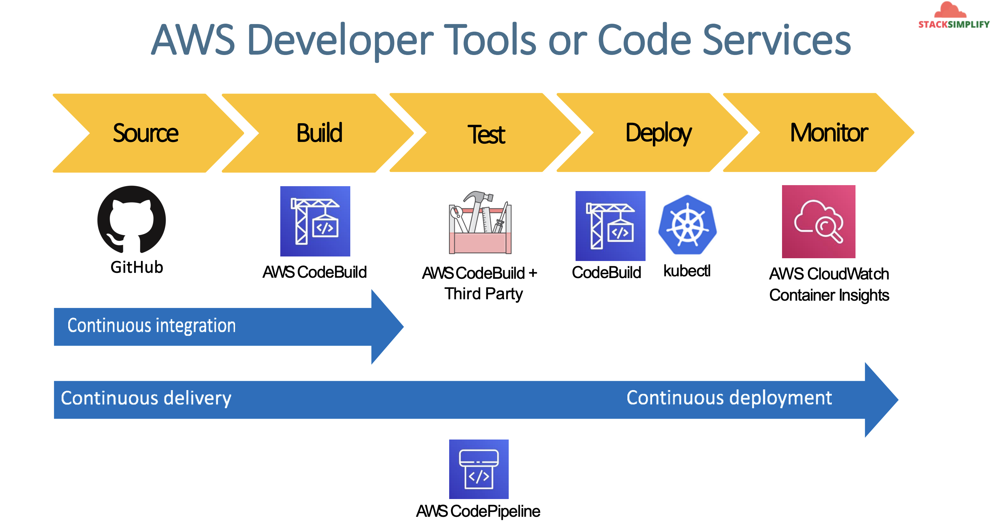

# EKS DevOps with AWS Developer Tools - CodeCommit, CodeBuild and CodePipeline

## 151. EKS DevOps - Introduction

- We are going to use GitHub instead of CodeCommit, but don't worry, the theory is transferrable

### Stages in Releast Process

1. Source
   - Check in source code
   - Peer review new code
   - Pull Request process
2. Build
   - Compile Code & build artifacts (war, jar, container images, k8s manifest files)
   - Unit Tests
3. Test
   - Integration tests with other systems
   - Load testing
   - UI Tests
   - Security Tests
   - Test Environments (Dev, QA, and Staging)
4. Production
   - Deployment to production environments
   - Monitor code in production to quickly detect errors

Continuous Integration

- `Source -> Build`
- Automatically kick off a new release when new code is checked in
- Continually have an artifact ready for deployment

Continuous Delivery

- `Source -> Build -> Test`
- Automatically deploy new changes to staging environments for tsting
- Deploy to production safely without affecting customers
- Deliver to customers faster
- Increase deployment frequency, and reduce change lead time and change failure rate

Continuous Deploymet

- `Source -> Build -> Test -> Production`

Infrastructure as code

- `Source -> Build -> Test -> Production`

## 152. What are we going to learn?
