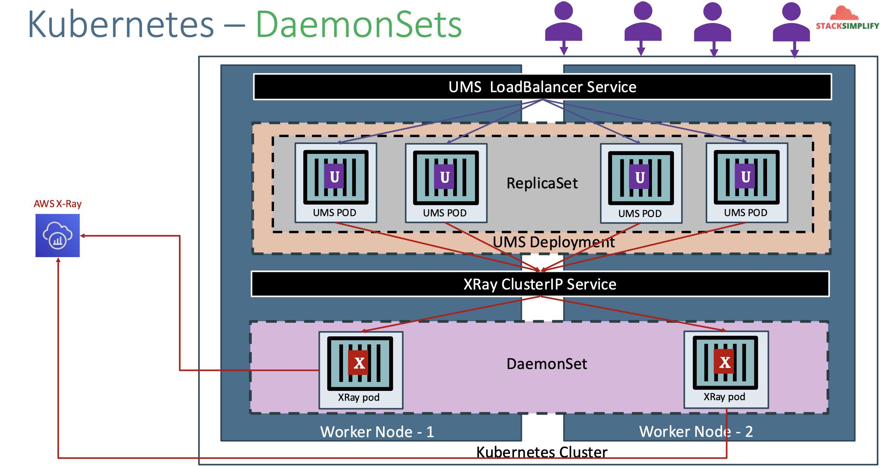
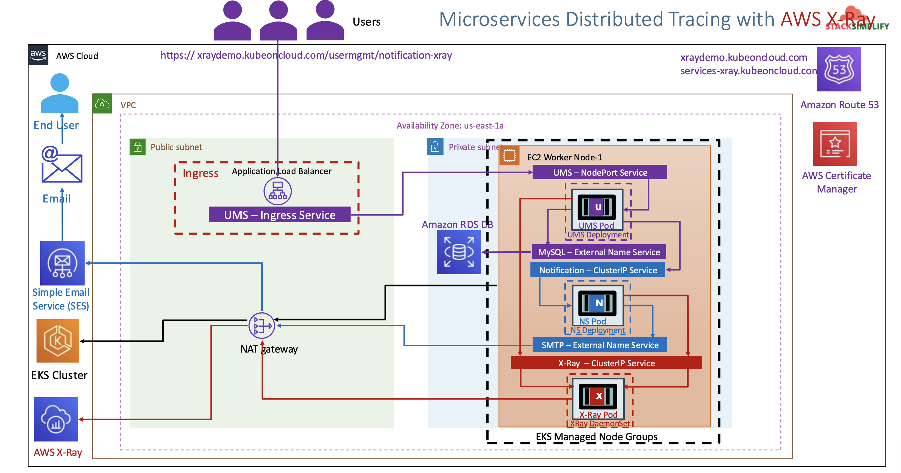
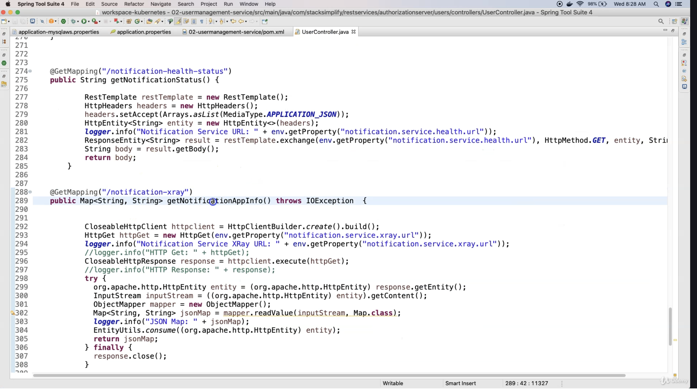
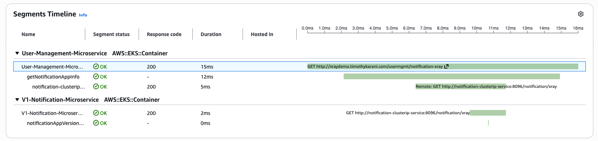

# Microservices Distributed Tracing using AWS X-Ray

## 176. Introduction to Microservices Distributed Tracing using AWS X-Ray

Introduction:

- AWS X-Ray helps **analyse and debug** distributed applications built using **microservices architecture**.
- With X-Ray, we can **understand** how our application and its underlying services are performing to **identify and troubleshoot** the root caues of performance issues and errors.
- X-Ray provides an **end-to-end** view of requests as they travel through our application and **shows a map** of our application's underlying components.
- We can also use X-Ray to analyse applications in **development and in production**, from **simple** three-tier applications to **complex** microservice applications consisting of thousands of services.

Benefits; it allows us to:

- Review request behavior
- Discover application issues
- Improve application performance
- Ready to use with AWS
- Designed for a variety of applications

## 177. Introduction to Kubernetes DaemonSets

- A `DaemonSet` ensures that all (or some) Nodes run a copy of a Pod.
  - As nodes are **added** to the cluster, Pods are added to them.
  - As nodes are **removed** from the cluster, those Pods are garbage collected.
  - **Deleting** a DaemonSet will clean up the Pods it created.
- Some typical uses of a DaemonSet are:
  - running a **logs collection daemon** on every node (Example: `fluentd`)
  - running a **node monitoring daemon** on every node (Example: `cloudwatchagent`)
  - running an **application trace collection daemon** on every node (Example: AWS X-Ray)
- In a simple case, one DaemonSet, covering all nodes, would be used for each type of daemon.
- A more complex setup might use multiple DaemonSets for a single type of daemon, but with different flags and/or different memory and cpu requests for different hardware types.



## 178. AWS EKS and X-Ray Network Design



The `HttpClientBuilder` is imported from `xray` spring package:

- There's a bit of coding to do apparently, if you'll roll this out on your own.
- https://medium.com/@itssp1998/integrating-aws-x-ray-in-multi-threaded-spring-boot-application-510c41cd1d5d



## 179. Pre-requisites

- Copy over the manifests from [25-eks-microservices](../25-eks-microservices/kube-manifests)

#### AWS RDS Database

- We have created AWS RDS Database as part of section [09-eks-hosted-app-storage](../09-eks-hosted-app-storage/README.md)
- We even created a `externalName service: 01-MySQL-externalName-Service.yml` in our Kubernetes manifests to point to that RDS Database.

#### ALB Ingress Controller & External DNS

- We are going to deploy a application which will also have a `ALB Ingress Service` and also will register its DNS name in Route53 using `External DNS`
- Which means we should have both related pods running in our EKS cluster.
- We have installed **ALB Ingress Controller** as part of section [alb ingress install](../11-alb-ingress-install-aws-elb/README.md)
- We have installed **External DNS** as part of section [external dns installation](../15-alb-ingress-external-dns/README.md)

```
# Verify alb-ingress-controller pod running in namespace kube-system
kubectl get pods -n kube-system

# Verify external-dns pod running in default namespace
kubectl get pods
```

## 180. AWS X-Ray Deploy on EKS Cluster as DaemonSet

### Create IAM permissions for AWS X-Ray daemon

Create the service account:

```shell
# Template
eksctl create iamserviceaccount \
    --name service_account_name \
    --namespace service_account_namespace \
    --cluster cluster_name \
    --attach-policy-arn arn:aws:iam::aws:policy/AWSXRayDaemonWriteAccess \
    --approve \
    --override-existing-serviceaccounts

# Replace Name, Namespace, Cluster Info (if any changes)
eksctl create iamserviceaccount \
    --name xray-daemon \
    --namespace default \
    --cluster eksdemo1 \
    --attach-policy-arn arn:aws:iam::aws:policy/AWSXRayDaemonWriteAccess \
    --approve \
    --override-existing-serviceaccounts
```

Verify Service Account and AWS IAM Role:

```shell
# List k8s Service Accounts
kubectl get sa

# Describe Service Account (Verify IAM Role annotated)
kubectl describe sa xray-daemon

# List IAM Roles on eksdemo1 Cluster created with eksctl
eksctl  get iamserviceaccount --cluster eksdemo1
```

Update `xray-k8s-daemonset.yml`:

```yml
apiVersion: v1
kind: ServiceAccount
metadata:
  labels:
    app: xray-daemon
  name: xray-daemon
  namespace: default
  # Update IAM Role ARN created for X-Ray access
  annotations:
    eks.amazonaws.com/role-arn: arn:aws:iam::180789647333:role/eksctl-eksdemo1-addon-iamserviceaccount-defa-Role1-20F5AWU2J61F
```

Deploy X-Ray DaemonSet on our EKS Cluster:

```shell
# Deploy
kubectl apply -f kube-manifests/01-xray-daemonset/xray-k8s-daemonset.yml

# Verify Deployment, Service & Pod
kubectl get deploy,svc,pod

# Verify X-Ray Logs
kubectl logs -f <X-Ray Pod Name>
kubectl logs -f xray-daemon-phszp

# List & Describe DaemonSet
kubectl get daemonset
kubectl describe daemonset xray-daemon
```

## 181. Review Kubernetes Manifests with AWS X-Ray Environment Variables

`kube-manifests/02-applications/02-user-management-deployment.yml`:

```yml
# Change-1: Image Tag is 3.0.0-AWS-XRay-MySQLDB
      containers:
        - name: usermgmt-restapp
          image: stacksimplify/kube-usermanagement-microservice:3.0.0-AWS-XRay-MySQLDB

# Change-2: New Environment Variables related to AWS X-Ray
            - name: AWS_XRAY_TRACING_NAME
              value: "User-Management-Microservice"
            - name: AWS_XRAY_DAEMON_ADDRESS
              value: "xray-service.default:2000"
            - name: AWS_XRAY_CONTEXT_MISSING
              value: "LOG_ERROR"  # Log an error and continue, Ideally RUNTIME_ERROR – Throw a runtime exception which is default option if not configured
```

`kube-manifests/02-applications/04-notification-microservice-deployment.yml`:

```yml
# Change-1: Image Tag is 3.0.0-AWS-XRay
    spec:
      containers:
        - name: notification-service
          image: stacksimplify/kube-notifications-microservice:3.0.0-AWS-XRay

# Change-2: New Environment Variables related to AWS X-Ray
            - name: AWS_XRAY_TRACING_NAME
              value: "V1-Notification-Microservice"
            - name: AWS_XRAY_DAEMON_ADDRESS
              value: "xray-service.default:2000"
            - name: AWS_XRAY_CONTEXT_MISSING
              value: "LOG_ERROR"  # Log an error and continue, Ideally RUNTIME_ERROR – Throw a runtime exception which is default option if not configured

```

`kube-manifests/02-applications/07-alb-ingress.yml`:

```yml
# Change-1-For-You: Update with your SSL Cert ARN when using template
alb.ingress.kubernetes.io/certificate-arn: arn:aws:acm:us-east-1:180789647333:certificate/9f042b5d-86fd-4fad-96d0-c81c5abc71e1

# Change-2-For-You: Update with your "yourdomainname.com"
# External DNS - For creating a Record Set in Route53
external-dns.alpha.kubernetes.io/hostname: services-xray.timothykarani.com, xraydemo.timothykarani.com
```

## 182. AWS EKS and X-Ray - Deploy and Test

Deploy Manifests:

```
# Deploy
kubectl apply -f kube-manifests/02-applications

# Verify
kubectl get pods
```

Test:

- https://xraydemo.timothykarani.com/usermgmt/notification-xray
- https://xraydemo.timothykarani.com/usermgmt/notification-xray

Verify the reports on X-Ray:

- Go to Services -> Developer Tools -> X-Ray
- Open **Application Signals (APM)** -> Traces
- Find a trace with the url `http://xraydemo.timothykarani.com/usermgmt/notification-xray`, then click on the hash
- You should see the trace report


When we open the path `notificaction-xray`, we can see that:

- The client called `notification-xray`
- The UMS took 15ms and called the notification service
- The NMS took 12ms
- The xray call took 5ms

For experiment's sake, open the links below and refresh the report to see the difference:

- https://xraydemo.timothykarani.com/usermgmt/notification-health-status
- https://xraydemo.timothykarani.com/usermgmt/notification-service-info

## 183. Clean-Up

lean-Up

- We are going to delete applications created as part of this section
- We are going to leave the xray daemon set running which we will leverage in our next section canary deployments in Kubernetes on EKS.

```
# Delete Apps
kubectl delete -f kube-manifests/02-applications
```

## References

- https://github.com/aws-samples/aws-xray-kubernetes/
- https://github.com/aws-samples/aws-xray-kubernetes/blob/master/xray-daemon/xray-k8s-daemonset.yaml
- https://aws.amazon.com/blogs/compute/application-tracing-on-kubernetes-with-aws-x-ray/
- https://docs.aws.amazon.com/xray/latest/devguide/xray-sdk-java-configuration.html
- https://docs.aws.amazon.com/xray/latest/devguide/xray-sdk-java-configuration.html#xray-sdk-java-configuration-plugins
- https://docs.aws.amazon.com/xray/latest/devguide/xray-sdk-java-httpclients.html
- https://docs.aws.amazon.com/xray/latest/devguide/xray-sdk-java-filters.html
- https://docs.aws.amazon.com/xray/latest/devguide/xray-sdk-java-sqlclients.html
