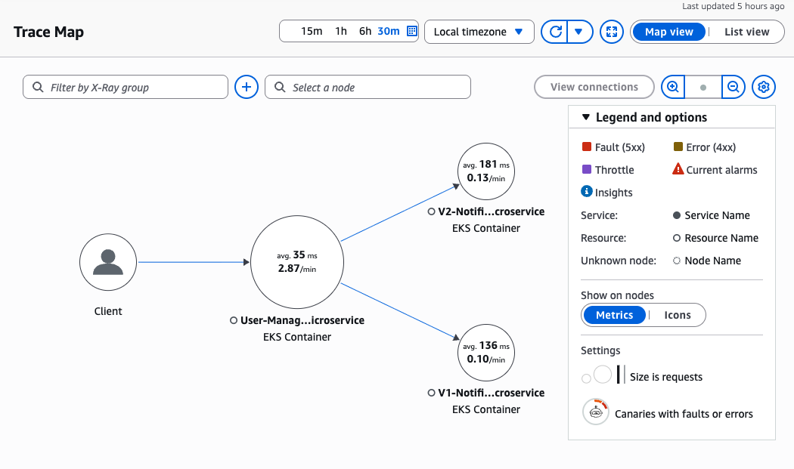
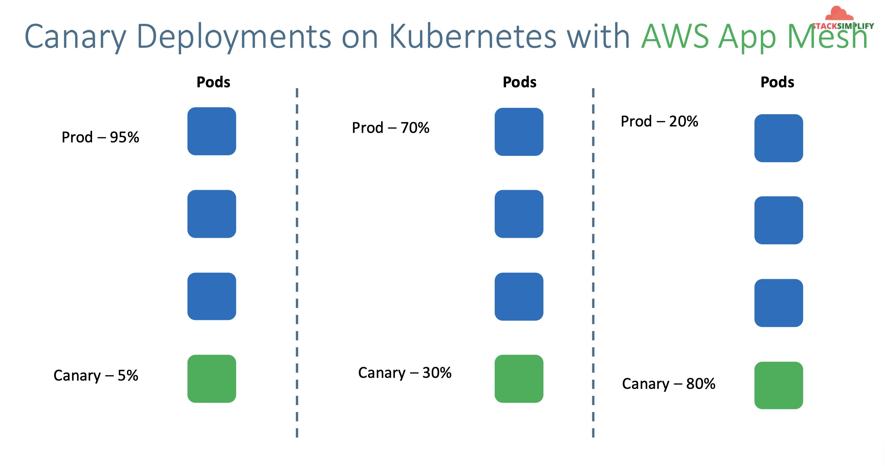

# Microservices Canary Deployments on AWS EKS with AWS X-Ray

Reference:

- https://github.com/stacksimplify/aws-eks-kubernetes-masterclass/tree/master/14-Microservices-Canary-Deployments

## 184. Microservices Canary Deployment - Introduction

- Canaries mean incremental rollouts
- With canaries, the new version of the application is slowly deployed to the k8s cluster while gettiing a very small amount of live traffic.
- In short, a subset of live users are connecting to the new version while the rest are still using the previous version
- Using canaries, we can detect deployment issues very early while they effect only a small subset of users
- IF we encounter any issues with a canary, the production version is still present, and all traffic can simply be reverted to it.

Usecase Description

- User Management **getNotificationAppInfo** will call Notification service V1 and V2 versions.
- We will distribute traffic between V1 and V2 versions of Notification service as per our choice based on Replicas

| NS V1 Replicas | NS V2 Replicas | Traffic Distribution          |
| -------------- | -------------- | ----------------------------- |
| 4              | 0              | 100% traffic to NS V1 Version |
| 3              | 1              | 25% traffic to NS V2 Version  |
| 2              | 2              | 50% traffic to NS V2 Version  |
| 1              | 3              | 75% traffic to NS V2 Version  |
| 0              | 4              | 100% traffic to NS V2 Version |

- In our demo, we are going to distribute 50% traffic to each version (V1 and V2).
- NS V1 - 2 replicas and NS V2 - 2 replicas
- We are going to depict one Microservice calling other Microservices with different versions in AWS X-Ray

## 185. Pre-requisites Check

#### AWS RDS Database

- We have created AWS RDS Database as part of section [09-eks-hosted-app-storage](../09-eks-hosted-app-storage/README.md)
- We even created a `externalName service: 01-MySQL-externalName-Service.yml` in our Kubernetes manifests to point to that RDS Database.

#### ALB Ingress Controller & External DNS

- We are going to deploy a application which will also have a `ALB Ingress Service` and also will register its DNS name in Route53 using `External DNS`
- Which means we should have both related pods running in our EKS cluster.
- We have installed **ALB Ingress Controller** as part of section [alb ingress install](../11-alb-ingress-install-aws-elb/README.md)
- We have installed **External DNS** as part of section [external dns installation](../15-alb-ingress-external-dns/README.md)

```
# Verify alb-ingress-controller pod running in namespace kube-system
kubectl get pods -n kube-system

# Verify external-dns pod running in default namespace
kubectl get pods
```

#### XRay Daemon

- We are going to view the application traces in AWS X-Ray.
- We need XRay Daemon running as Daemonset for that.

```
# Verify alb-ingress-controller pod running in namespace kube-system
kubectl get pods -n kube-system

# Verify external-dns & xray-daemon pod running in default namespace
kubectl get pods
```

## 186. Review Kubernetes Manifests - Notification Microservice V2

- We are going to distribute 50% traffic to each of the V1 and V2 version of application

| NS V1 Replicas | NS V2 Replicas | Traffic Distribution         |
| -------------- | -------------- | ---------------------------- |
| 2              | 2              | 50% traffic to NS V2 Version |

`08-v2-notification-microservice-deployment.yml`:

```yml
# Change-1: Image Tag is 4.0.0-AWS-XRay
    spec:
      containers:
        - name: notification-service
          image: stacksimplify/kube-notifications-microservice:4.0.0-AWS-XRay

# Change-2: New Environment Variables related to AWS X-Ray
            - name: AWS_XRAY_TRACING_NAME
              value: "V2-Notification-Microservice"
            - name: AWS_XRAY_DAEMON_ADDRESS
              value: "xray-service.default:2000"
            - name: AWS_XRAY_CONTEXT_MISSING
              value: "LOG_ERROR"  # Log an error and continue, Ideally RUNTIME_ERROR – Throw a runtime exception which is default option if not configured
```

`07-alb-ingress.yml`:

```yml
# Change-1-For-You: Update with your SSL Cert ARN when using template
alb.ingress.kubernetes.io/certificate-arn: arn:aws:acm:us-east-1:180789647333:certificate/9f042b5d-86fd-4fad-96d0-c81c5abc71e1

# Change-2-For-You: Update with your "yourdomainname.com"
# External DNS - For creating a Record Set in Route53
external-dns.alpha.kubernetes.io/hostname: canarydemo.timothykarani.com
```

## 187. Deploy & Test Kubernetes Manifests for Microservices Canary Deployments

Deploy Manifests

```
# Deploy
kubectl apply -f kube-manifests/

# Verify
kubectl get deploy,svc,pod
```

Test

```
# Test
https://canarydemo.timothykarani.com/usermgmt/notification-xray

# Your Domain Name
https://<Replace-your-domain-name>/usermgmt/notification-xray
```

When you refresh the browser, you'll see the appVersion alternating between `v1` and `v2`.

- `v1`
- `v2`
- `v1`
- `v2`
- etc

Verify in X-Ray to see what's happening.

- Open the trace map
- In the top right -> `Legend and Options` -> `Show On Nodes` -> `Metrics`
  

#### What is happening in the background?

- As far as `Notification Cluster IP Service` selector label matches to `Notification V1 and V2 Deployment manifests selector.matchLables` those respective pods are picked to send traffic.

```yml
# Notification Cluster IP Service - Selector Label
  selector:
    app: notification-restapp

# Notification V1 and V2 Deployment - Selector Match Labels
  selector:
    matchLabels:
      app: notification-restapp
```

Clean-Up

- We are going to delete applications created as part of this section

```
# Delete Apps
kubectl delete -f kube-manifests/
```

## 188. Downside & Best Approaches

If you want 50/50 distribution between prod and canary

- 1:1 replica ratio between prod and canary pods. e.g 2 pods for prod, 2 pods for canary

If you want 75%/25% prod/canary distribution

- 3:1 replica ration between prod and canary

Problem?

- We might run out of resources, maybe.
- The only way to control the distribution is via replicas

### Canary Deployments on Kubernetes with AWS App Mesh (AWS version of Istio)

- Istio is opensource, App Mesh builds on this.
- Canary deployments are easier that App Mesh as currently, App Mesh is not straight-forward
- App Mesh allows us to control how traffic will be distributed without having to change the number of replicas. The configured percentage of traffic is sent to the pods regardless of the number of replicas.


