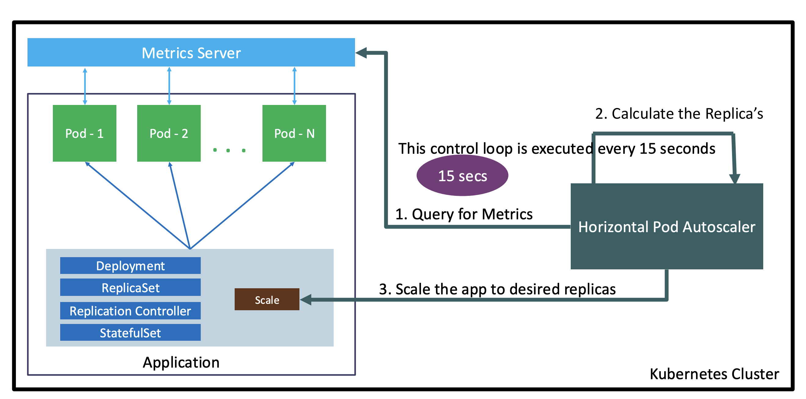

# EKS Autoscaling - Horizontal Pod Autoscaler

Reference:

- https://github.com/stacksimplify/aws-eks-kubernetes-masterclass/tree/master/15-EKS-HPA-Horizontal-Pod-Autoscaler

## 189. Horizontal Pod Autoscaler (HPA) - Introduction

- HPA basically means increasing and decreasing the number of Replicas (Pods)
- HPA automatically scales the number of pods in a deployment, replication controller, or replica set, stateful set based on that resource's CPU utilization
- This can help our applications scale out to meet increased demand or scale in when resources are not needed, thus freeing up. your worker nodes for other applications
- When we set a **target CPU utilization percentage**, the HPA scales our application in or out to try to meet that target.
- HPA needs k8s metrics server to verify CPU metrics of a pod
- We do not need to deploy or install the HPA on our cluster to begin scaling our applications, its out of the box available as a default k8s API resource.



How is HPA configured?

- Scaling metric: CPU Utilization
- Target - CPU = 50%
- Min Replicas = 2
- Max Replicas = 10

The command looks like:

```yaml
kubectl autoscale deployment demo-deployment --cpu-percent=50 --min=1 --max=10
```

## 190. Deploy Metrics Server and Sample Application

### Install Metrics Server

Reference:

- https://kubernetes-sigs.github.io/metrics-server/
- https://artifacthub.io/packages/helm/metrics-server/metrics-server

```shell
# Verify if Metrics Server already Installed
kubectl -n kube-system get deployment/metrics-server

# If you face issues, do this then retry to install
kubectl delete deployment metrics-server -n kube-system

# Install Metrics Server from the internet
helm repo add metrics-server https://kubernetes-sigs.github.io/metrics-server/

helm upgrade --install metrics-server metrics-server/metrics-server -n kube-system

# Verify
kubectl get deployment metrics-server -n kube-system

# Test to see if we're in business
kubectl top nodes
```

### Review Deploy our Application

Create a deployment file `01-hpa-demo.yml`:

```yaml
apiVersion: apps/v1
kind: Deployment
metadata:
  name: hpa-demo-deployment
  labels:
    app: hpa-nginx
spec:
  replicas: 1
  selector:
    matchLabels:
      app: hpa-nginx
  template:
    metadata:
      labels:
        app: hpa-nginx
    spec:
      containers:
        - name: hpa-nginx
          image: stacksimplify/kubenginx:1.0.0
          ports:
            - containerPort: 80
          resources:
            requests:
              memory: "128Mi"
              cpu: "100m"
            limits:
              memory: "500Mi"
              cpu: "200m"
---
apiVersion: v1
kind: Service
metadata:
  name: hpa-demo-service-nginx
  labels:
    app: hpa-nginx
spec:
  type: NodePort
  selector:
    app: hpa-nginx
  ports:
    - port: 80
      targetPort: 80
      nodePort: 31231
```

Deploy our application:

```
# Deploy
kubectl apply -f kube-manifests/

# List Pods, Deploy & Service
kubectl get pod,svc,deploy

# Access Application (Only if our Cluster is Public Subnet)
kubectl get nodes -o wide
http://192.168.108.34:31231
http://192.168.85.150:31231
```

## 191. Enable HPA, Load Test, Verify and Clean-Up

Create a Horizontal Pod Autoscaler resource for the "hpa-demo-deployment":

- This command creates an autoscaler that targets 50 percent CPU utilization for the deployment, with a minimum of one pod and a maximum of ten pods.
- When the average CPU load is below 50 percent, the autoscaler tries to reduce the number of pods in the deployment, to a minimum of one.
- When the load is greater than 50 percent, the autoscaler tries to increase the number of pods in the deployment, up to a maximum of ten

```
# Template
kubectl autoscale deployment <deployment-name> --cpu-percent=50 --min=1 --max=10

# Replace
kubectl autoscale deployment hpa-demo-deployment --cpu-percent=50 --min=1 --max=10

# Describe HPA
kubectl describe hpa/hpa-demo-deployment

# List HPA
kubectl get horizontalpodautoscaler.autoscaling/hpa-demo-deployment --watch
```

Create the load & Verify how HPA is working:

```
# Generate Load
kubectl -it --rm --restart=Never run apache-bench --image=httpd -- ab -n 1000000 -c 1000 http://hpa-demo-service-nginx.default.svc.cluster.local/

# List all HPA
kubectl get hpa

# List specific HPA
kubectl get hpa hpa-demo-deployment

# Describe HPA
kubectl describe hpa/hpa-demo-deployment

# List Pods
kubectl get
```

Cooldown / Scaledown

- Default cooldown period is 5 minutes.
- Once CPU utilization of pods is less than 50%, it will starting terminating pods and will reach to minimum 1 pod as configured.

Clean-Up

```
# Delete HPA
kubectl delete hpa hpa-demo-deployment

# Delete Deployment & Service
kubectl delete -f kube-manifests/
```

### Imperative vs Declarative for HPA

- From Kubernetes v1.18 onwards, we have a declarative way of defining HPA policies using `behavior` object in yaml.
- **Support for configurable scaling behavior**
  - Starting from v1.18 the v2beta2 API allows scaling behavior to be configured through the HPA behavior field.
  - Behaviors are specified separately for scaling up and down in scaleUp or scaleDown section under the behavior field

```yml
behavior:
  scaleDown:
    stabilizationWindowSeconds: 300
    policies:
      - type: Percent
        value: 100
        periodSeconds: 15
  scaleUp:
    stabilizationWindowSeconds: 0
    policies:
      - type: Percent
        value: 100
        periodSeconds: 15
      - type: Pods
        value: 4
        periodSeconds: 15
    selectPolicy: Max
```

- **Reference:** Select V1.18 from top right corner on Kubernetes website for V1.18 documentation
  - https://kubernetes.io/docs/tasks/run-application/horizontal-pod-autoscale/

### Referencess

Metrics Server Releases

- https://github.com/kubernetes-sigs/metrics-server/releases

Horizontal Pod Autoscaling - Scale based on many type of metrics

- https://v1-16.docs.kubernetes.io/docs/tasks/run-application/horizontal-pod-autoscale-walkthrough/
