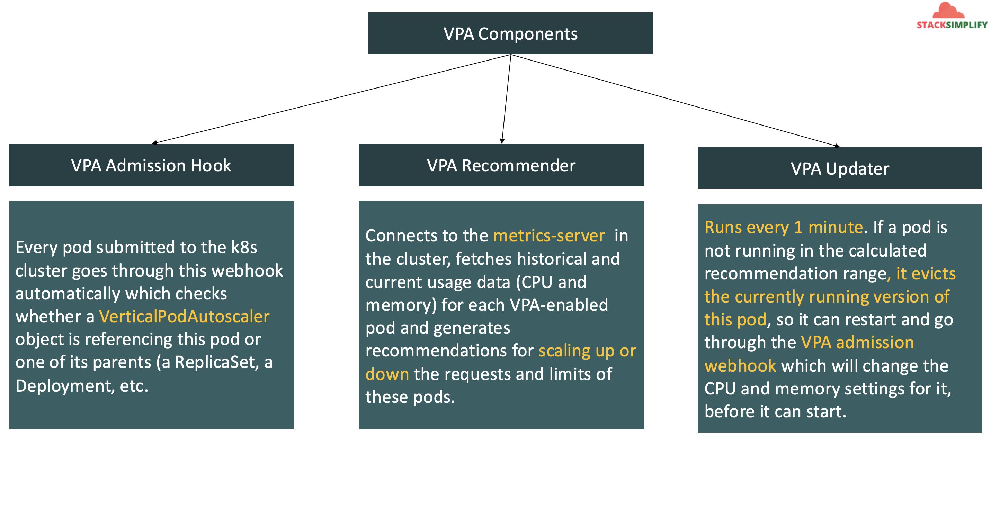

# EKS Autoscaling - Vertical Pod Autoscaler

## 192. Vertical Pod Autoscaler - Introduction

- VPA automatically adjusts the **CPU and memory reservations** for our pods to help **right size** our applications.
- This adjustment can **improve cluster resource utilization** and **free up** CUP and memory for other pods.

Benefits:

- Cluster nodes are used efficiently, because Pods use exactly what htey need.
- Pods are scheduled onto nodes that have the appropriate resources available.
- We **don't have** to run **time-consuming benchmarking tasks** to determine the correct values for CPU and memory requests.
- **Maintenance time is reduced**, because the autoscaler can adjust CPU and memory requests over time without any action on your part.



## 193. Install VPA Components & Sample Demo Application

Pre-requisite - Metric server

- Metric server should be installed & ready, we have done that as part of HPA

Deploy the Vertical Pod Autoscaler (VPA):

- Reference: https://docs.aws.amazon.com/eks/latest/userguide/vertical-pod-autoscaler.html

```shell
rm -r autoscaler
# Clone Repo
git clone https://github.com/kubernetes/autoscaler.git --depth=1

# Navigate to VPA
cd autoscaler/vertical-pod-autoscaler/

# Uninstall VPA (if we are using old one)
./hack/vpa-down.sh

# Install new version of VPA
./hack/vpa-up.sh

# Verify VPA Pods
kubectl get pods -n kube-system

# Clean up
rm -rf autoscaler
```

### Review & Deploy our Application Manifests (Deployment & Service)

- Make a note of resources we have defined `spec.containers.resources.requests`. They are very low resource specs, so we can demonstrate the vertical scaling.
- `limits` we define in VPA definition

```yml
resources:
  requests:
    cpu: "5m"
    memory: "5Mi"
```

- **Deploy**

```shell
# Deploy Application
kubectl apply -f kube-manifests/01-vpa-demo-application.yml

# List Pods, Deploy & Service
kubectl get pod,svc,deploy

# Describe Pod
kubectl describe pod <pod-name>

# Access Application (If our NodeGroup is in Public Subnet, if not ignore)
kubectl get nodes -o wide
http://<Worker-Node-Public-IP>:31232
```

## 194. Create VPA Manifest, Deploy, Load Test, Analyze and Clean-Up

Create a VPA manifest for our above Application which we deployed just now:

```yml
apiVersion: "autoscaling.k8s.io/v1"
kind: VerticalPodAutoscaler
metadata:
  name: kubenginx-vpa
spec:
  targetRef:
    apiVersion: "apps/v1"
    kind: Deployment
    name: vpa-demo-deployment
  resourcePolicy:
    containerPolicies:
      - containerName: "*"
        minAllowed:
          cpu: 5m
          memory: 5Mi
        maxAllowed:
          cpu: 1
          memory: 500Mi
        controlledResources: ["cpu", "memory"]
```

Deploy VPA Manifest

```shell
# Deploy
kubectl apply -f kube-manifests/02-vpa-manifest.yml

# List VPA
kubectl get vpa

# Describe VPA
kubectl describe vpa kubenginx-vpa
```

Generate Load:

- Open 3 more new terminals and execute below 3 load generation commands

```shell
# Terminal 1 - List and watch pods
kubectl get pods -w

# Terminal 2 - Generate Load
kubectl run -it --rm apache-bench --image=httpd -- ab -n 500000 -c 1000 http://vpa-demo-service-nginx.default.svc.cluster.local/

# Terminal 3 - Generate Load
kubectl run -it --rm apache-bench2 --image=httpd -- ab -n 500000 -c 1000 http://vpa-demo-service-nginx.default.svc.cluster.local/

# Terminal 4 - Generate Load
kubectl run -it --rm apache-bench3 --image=httpd -- ab -n 500000 -c 1000 http://vpa-demo-service-nginx.default.svc.cluster.local/
```

## Step-07: Describe pods which were re-launched by VPA Updater

```shell
# List Pods
kubectl get pods

# Describe pods
kubectl describe pod <recently-relaunched-pod>
```

## Step-08: Important Nodes about VPA:

1. VPA Updater can re-launch new pod with updated CPU and Memory when you atleast have 2 pods in a deployment.
2. If we have only one pod, unless we manually delete that pod, it will not launch new pod with VPA recommended CPU and memory considering the application availability scenario.

## Step-09: Clean-Up

```
kubectl delete -f kube-manifests/
```
