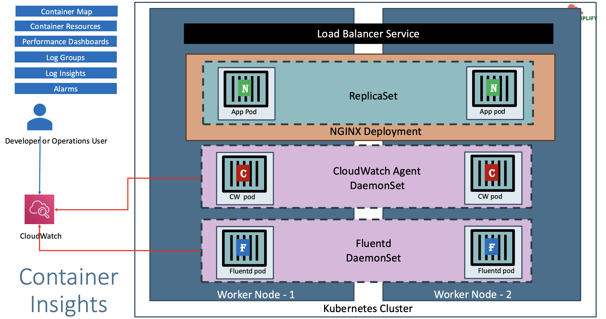
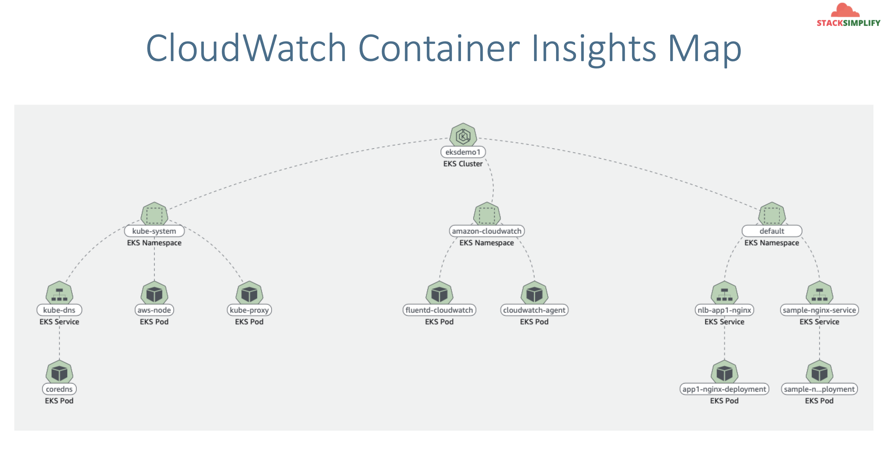
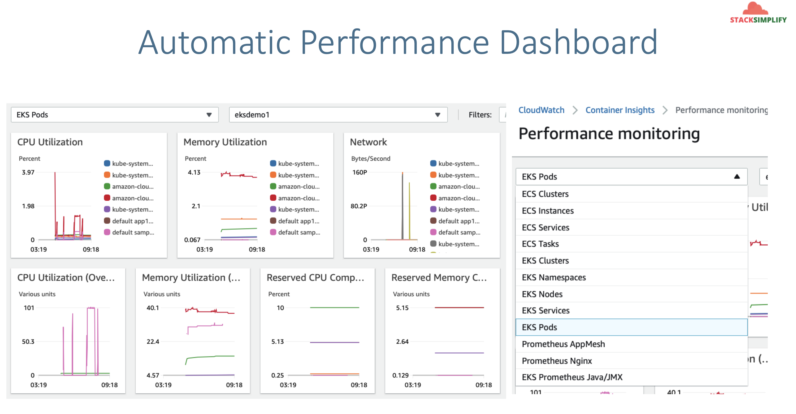

# AWS CloudWatch Container Insights with EKS

## 198. CloudWatch Container Insights - Introduction

- A fully managed observability service for monitoring, troubleshooting and alarming on our containerized applications.
- Container Insights to collect, aggregate, and summarize metrics and logs from our containerized applications and microservices.
- The metrics include **utilization for resoures** such as CPU, memory, disk and network.
- It also provides diagnostic information, such as container restart failures to help us isolate issues and resolve them quickly.
- We can also set **CloudWatch alarms** on metrics that Container Insights collects.
- The metrics that Container Insights collects are available in **CloudWatch** automatic dashboards.
- We can analyze and troubleshoot container performance and logs data with **CloudWatch Logs Insights**.



- `fluentd` is going to collect all logs from our pods, nodes, etc.

Cloudwatch Container Insights:


Automatic Performance Dashboard


## 199. Install Container Insights as Daemonsets on EKS Cluster

Install Container Insights

### Deploy CloudWatch Agent and Fluentd as DaemonSets

- This command will
  - Creates the Namespace amazon-cloudwatch.
  - Creates all the necessary security objects for both DaemonSet:
    - SecurityAccount
    - ClusterRole
    - ClusterRoleBinding
  - Deploys `Cloudwatch-Agent` (responsible for sending the metrics to CloudWatch) as a DaemonSet.
  - Deploys fluentd (responsible for sending the logs to Cloudwatch) as a DaemonSet.
  - Deploys ConfigMap configurations for both DaemonSets.

Reference:

- https://docs.aws.amazon.com/AmazonCloudWatch/latest/monitoring/Container-Insights-setup-EKS-quickstart.html

```shell
# Template
curl -s https://raw.githubusercontent.com/aws-samples/amazon-cloudwatch-container-insights/latest/k8s-deployment-manifest-templates/deployment-mode/daemonset/container-insights-monitoring/quickstart/cwagent-fluentd-quickstart.yaml | sed "s/{{cluster_name}}/<REPLACE_CLUSTER_NAME>/;s/{{region_name}}/<REPLACE-AWS_REGION>/" | kubectl apply -f -

# Replaced Cluster Name and Region
curl -s https://raw.githubusercontent.com/aws-samples/amazon-cloudwatch-container-insights/latest/k8s-deployment-manifest-templates/deployment-mode/daemonset/container-insights-monitoring/quickstart/cwagent-fluentd-quickstart.yaml | sed "s/{{cluster_name}}/eksdemo1/;s/{{region_name}}/us-east-1/" | kubectl apply -f -
```

Verify:

```shell
# List Daemonsets
kubectl -n amazon-cloudwatch get daemonsets
```

## 200. Deploy Sample App, Load Test and Verify Container Insights Dashboard

Deploy Sample Nginx Application:

```shell
kubectl apply -f kube-manifests
```

Generate load on our Sample Nginx Application:

```shell
# Generate Load
kubectl run -it apache-bench --rm --image=httpd -- ab -n 500000 -c 1000 http://sample-nginx-service.default.svc.cluster.local/
```

### Access CloudWatch Dashboard

Access CloudWatch Container Insights Dashboard

- Go to Services -> Management & Governance -> Cloudwatch -> Infrastructure Monitoring -> Container Insights
  - Scroll down to **Clusters** and click on **eksdemo1**
    - Click on **Map View** in top right
  - From Container Insights, click on **View Performance Dashboard**

#### CloudWatch Log Insights

View Container logs:

- Go to Services -> Management & Governance -> Cloudwatch -> Infrastructure Monitoring -> Container Insights
  - Scroll down to **Clusters** and click on **eksdemo1**
  - Click on **View Performance Dashboard**
  - In the left, filter by **Workloads**
  - Scroll down to **Container performance**
  - Select the checkbox for `sample-nginx`, then in top right: actions -> view application logs
  - You will be taken to Log Insights
    - Click on **Run Query**
    - Click on any log entry to see more about it

View Container Performance Logs:

- Go to Services -> Management & Governance -> Cloudwatch -> Infrastructure Monitoring -> Container Insights
  - Scroll down to **Clusters** and click on **eksdemo1**
  - Click on **View Performance Dashboard**
  - In the left, filter by **Workloads**
  - Scroll down to **Container performance**
  - Select the checkbox for `sample-nginx`, then in top right: actions -> view performance logs
  - You will be taken to Log Insights
    - Click on **Run Query**
    - Click on any log entry to see more about it

## 201. CloudWatch Log Insights in Depth

#### Container Insights - Log Insights in depth

Go to Services -> Management & Governance -> Cloudwatch -> Logs -> Log Management -> Log Groups

- Log Groups
- Log Insights
- Create Dashboard

#### Create Graph for Avg Node CPU Utlization

Navigate to log insights:

- Go to Services -> Management & Governance -> Cloudwatch -> Logs -> Log Insights
  - Log Group: `/aws/containerinsights/eksdemo1/performance`
  - Run Query

```
STATS avg(node_cpu_utilization) as avg_node_cpu_utilization by NodeName
| SORT avg_node_cpu_utilization DESC
```

To have this as a dashboard:

- Top right -> Add to dashboard -> Create New
- DashBoard Name: `EKS-Performance`
- Click "Create"
- Widget Type: `Bar`
- Log Group: `/aws/containerinsights/eksdemo1/performance`
- In dashboard, click "Save"

To view the dashboard:

- Go to Services -> Management & Governance -> Cloudwatch -> Dashboard -> EKS-Performance

#### Container Restarts

Navigate to log insights:

- Go to Services -> Management & Governance -> Cloudwatch -> Logs -> Log Insights
  - Log Group: `/aws/containerinsights/eksdemo1/performance`
  - Run Query

```
STATS avg(number_of_container_restarts) as avg_number_of_container_restarts by PodName
| SORT avg_number_of_container_restarts DESC
```

To have this as a dashboard:

- DashBoard Name: EKS-Performance
- Widget Type: Table
- Log Group: `/aws/containerinsights/eksdemo1/performance`
- In dashboard, click "Save"

#### Cluster Node Failures

- DashBoard Name: EKS-Performance
- Widget Type: Table
- Log Group: `/aws/containerinsights/eksdemo1/performance`

```
stats avg(cluster_failed_node_count) as CountOfNodeFailures
| filter Type="Cluster"
| sort @timestamp desc
```

#### CPU Usage By Container

- DashBoard Name: EKS-Performance
- Widget Type: Bar
- Log Group: `/aws/containerinsights/eksdemo1/performance`

```
stats pct(container_cpu_usage_total, 50) as CPUPercMedian by kubernetes.container_name
| filter Type="Container"
```

#### Pods Requested vs Pods Running

- DashBoard Name: EKS-Performance
- Widget Type: Bar
- Log Group: `/aws/containerinsights/eksdemo1/performance`

```
fields @timestamp, @message
| sort @timestamp desc
| filter Type="Pod"
| stats min(pod_number_of_containers) as requested, min(pod_number_of_running_containers) as running, ceil(avg(pod_number_of_containers-pod_number_of_running_containers)) as pods_missing by kubernetes.pod_name
| sort pods_missing desc
```

#### Application log errors by container name

- DashBoard Name: EKS-Performance
- Widget Type: Bar
- Log Group: `/aws/containerinsights/eksdemo1/application`

```
stats count() as countoferrors by kubernetes.container_name
| filter stream="stderr"
| sort countoferrors desc
```

- **Reference**: https://docs.aws.amazon.com/AmazonCloudWatch/latest/monitoring/Container-Insights-view-metrics.html

## 202. CloudWatch Alarms for Container Insights Metrics

### Create Alarms - Node CPU Usage

- Go to Services -> Management & Governance -> Cloudwatch -> Alarms -> All Alarms -> Create

- **Specify metric and conditions**
  - **Select Metric:** Container Insights -> ClusterName -> `node_cpu_utilization`
  - **Metric Name:** `eksdemo1_node_cpu_utilization`
  - **Threshold Value:** 4
  - **Important Note:** Anything above 4% of CPU it will send a notification email, ideally it should 80% or 90% CPU but we are giving 4% CPU just for load simulation testing
- **Configure Actions**
  - **Alarm state trigger** in-alarm
  - **Create New Topic:** `eks-alerts`
  - **Email:** dkalyanreddy@gmail.com
  - Click on **Create Topic**
  - **Important Note:\*\*** Complete Email subscription sent to your email id. Click on the topic, then subscriptions, refresh to verify subscribed.
- **Add name and description**
  - **Name:** EKS-Nodes-CPU-Alert
  - **Descritption:** EKS Nodes CPU alert notification
  - Click Next
- **Preview**
  - Preview and Create Alarm
- **Add Alarm to our custom Dashboard**
  - Click on the alarm (from all alarms)
  - Top right (Action) -> Add to dashboard
  - Save dashboard
- Generate Load & Verify Alarm

```shell
# Generate Load
kubectl run -it apache-bench --rm --image=httpd -- ab -n 500000 -c 1000 http://sample-nginx-service.default.svc.cluster.local/
```

## Step-10: Clean-Up Container Insights

```
# Template
curl https://raw.githubusercontent.com/aws-samples/amazon-cloudwatch-container-insights/latest/k8s-deployment-manifest-templates/deployment-mode/daemonset/container-insights-monitoring/quickstart/cwagent-fluentd-quickstart.yaml | sed "s/{{cluster_name}}/cluster-name/;s/{{region_name}}/cluster-region/" | kubectl delete -f -

# Replace Cluster Name & Region Name
curl https://raw.githubusercontent.com/aws-samples/amazon-cloudwatch-container-insights/latest/k8s-deployment-manifest-templates/deployment-mode/daemonset/container-insights-monitoring/quickstart/cwagent-fluentd-quickstart.yaml | sed "s/{{cluster_name}}/eksdemo1/;s/{{region_name}}/us-east-1/" | kubectl delete -f -
```

## Step-11: Clean-Up Application

```
# Delete Apps
kubectl delete -f  kube-manifests/
```

## References

- https://docs.aws.amazon.com/AmazonCloudWatch/latest/monitoring/deploy-container-insights-EKS.html
- https://docs.aws.amazon.com/AmazonCloudWatch/latest/monitoring/ContainerInsights-Prometheus-Setup.html
- https://docs.aws.amazon.com/AmazonCloudWatch/latest/monitoring/Container-Insights-reference-performance-entries-EKS.html
